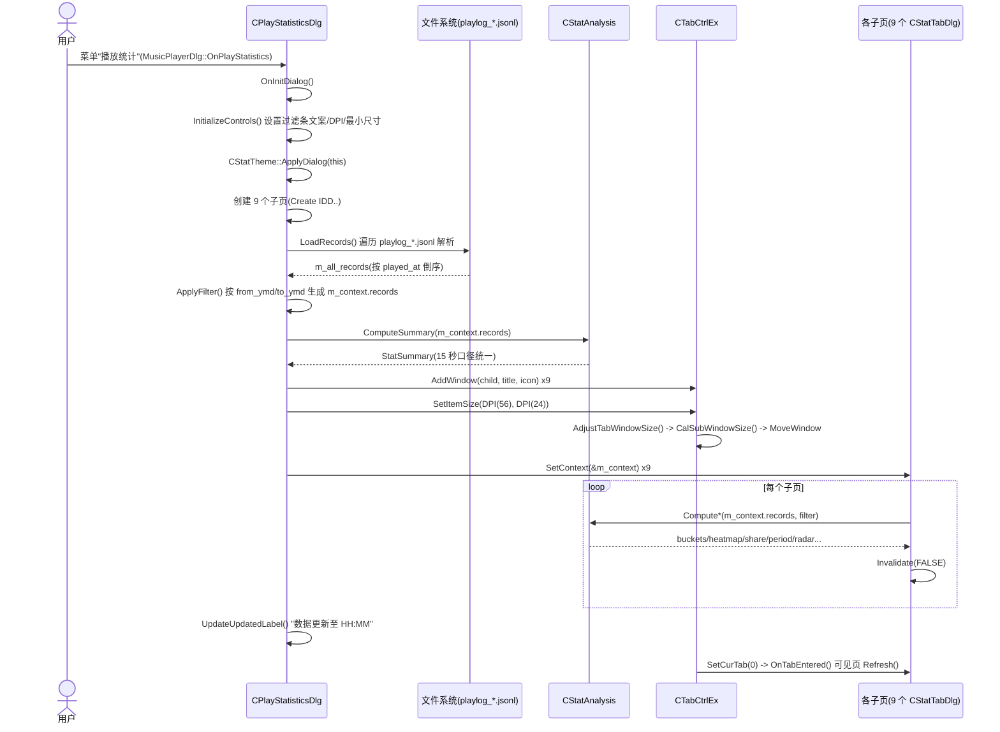
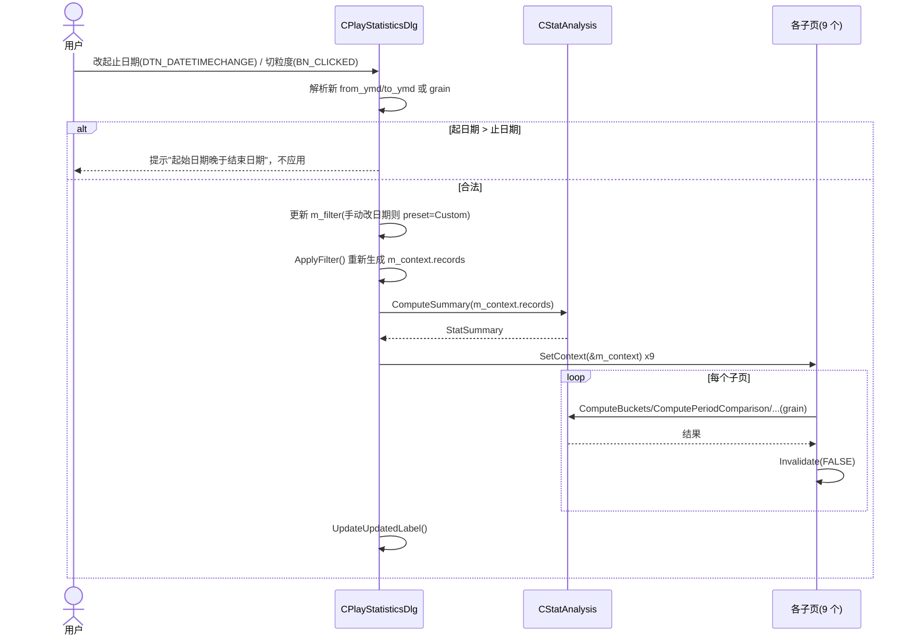
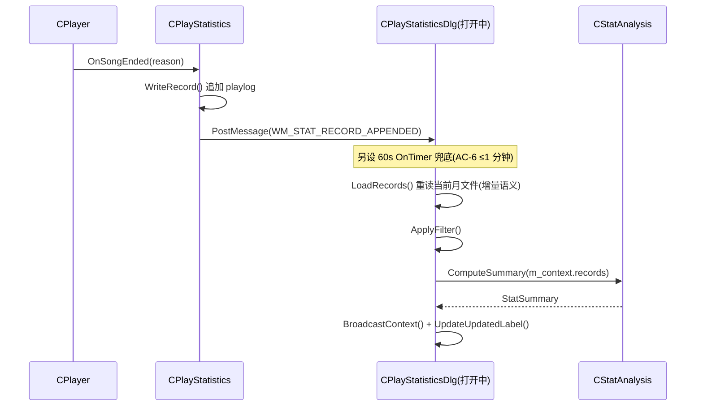

# 播放统计数据分析功能优化 — 增量架构设计与任务分解

> 架构师：高见远　日期：2026-09-16
> 项目：MusicPlayer2-gw（Windows 桌面，MFC + GDI 自绘，VS2022，x64/x86）
> 需求依据：`Documents/statistics-optimization/01-PRD-增量.md`（42 条，P0 6 / P1 20 / P2 16）
> 文档性质：**增量设计**。只描述本次变更，沿用现有 MFC + GDI 体系，不重写既有功能。
> 说明：文中引用的源码行号均基于当前 `MusicPlayer2/` 目录快照（2026-09-16）。

---

## 0. 阅读指引

- 本文档分 Part A（系统设计：决策 D1~D7 + 数据结构 + 调用流程）与 Part B（任务分解、共享知识、已拍板结论）。
- 所有接口签名写到「可直接照着写代码」的程度；所有架构决策均给出源码行号或 PRD 条目号作为依据。
- 全文简体中文，无 emoji。

---

# Part A：系统设计

## A1. 实现方案总览与框架选型结论

### A1.1 框架选型结论

| 项 | 结论 |
|---|---|
| UI 框架 | **沿用 MFC + GDI 自绘**，不引入 Qt/Web/CEF 等任何 UI 框架 |
| 图表绘制 | **沿用「`SS_OWNERDRAW` 静态控件 + `OnDrawItem` + `CDC` 手工绘制」**（现有 `StatTrendTabDlg`/`StatArtistRankTabDlg`/`StatSongRankTabDlg`/`StatProfileTabDlg` 全部如此） |
| 数据解析 | **沿用手写 JSONL 字段提取**（`CPlayStatisticsDlg::LoadRecords` 的 `extract_string/extract_int/extract_bool`），不引入 nlohmann/json 等 |
| 缓存/存储 | **不落盘聚合缓存**（见 D2）；新增数据一律**开放文本格式**（jsonl/txt/ini） |
| 主题 | **复用 `theApp.m_app_setting_data.dark_mode` + `CPlayerUIHelper::GetUIColors` + `theme_color`**，新增一层 `CStatTheme` 做语义化取色 |
| 第三方依赖 | **无新增**（PRD NFR-3，硬约束） |

### A1.2 为什么不引入第三方库（依据 + 理由）

1. **PRD NFR-3 是硬约束**：「不引入第三方图表库/JSON 库；沿用现有手写 JSONL 解析与 GDI 自绘」。
2. **工程上下文**：项目已在 `dll/x64/{Debug,Release}` 双份维护若干动态库（PRD 风险 R4），任何新增 DLL 都要处理 Debug/Release STL 跨边界配对，成本远高于自绘。
3. **规模可控**：playlog 为单行 jsonl，字段固定 16 个，手写提取的最坏复杂度是「每行 × 16 次 `find`」。实测（见 D2）2 万条规模的解析 + 聚合总耗时在**几十毫秒量级**，引入 JSON 库无收益。
4. **图表形态简单**：柱/折线/环形/热力图/雷达/条形，都是 GDI 基础图元（`Rectangle`/`Ellipse`/`Polyline`/`FillSolidRect`/`RoundRect`）可覆盖，现有四个自绘页已证明该路线可行。
5. **可解释 / 零依赖**：AI 洞察走本地规则模板（`CStatAiInsight`），零网络、微秒级，符合 NFR-2/NFR-3。

### A1.3 架构分层（增量）

```
┌──────────────────────────────────────────────────────────────┐
│ 表现层 CPlayStatisticsDlg（主对话框：过滤条 + 9 Tab + 底部按钮） │
│   ├─ 持有 StatFilter / m_all_records / StatContext             │
│   ├─ ApplyFilter()：按时间范围取数（唯一时间过滤点）           │
│   └─ BroadcastContext()：向 9 个子页投递 const StatContext*    │
├──────────────────────────────────────────────────────────────┤
│ 子页层 CStatTabDlg 派生（概览/趋势/热力图/歌手/专辑/歌曲/流派/明细/洞察）│
│   └─ 只做「与自身维度相关的聚合 + 自绘」，不再各自过滤时间/15 秒 │
├──────────────────────────────────────────────────────────────┤
│ 聚合层 CStatAnalysis（纯函数、无 UI 依赖，可被子页与 AI 共用）  │
│   ├─ IsCounted()：15 秒口径唯一判定（新增）                     │
│   ├─ ComputeSummary / ComputeBuckets / ComputeHeatmapGrid ...  │
│   └─ ComputeCosineSimilarity / ComputeRadar / ComputeDiamond...│
├──────────────────────────────────────────────────────────────┤
│ 规则引擎层 CStatAiInsight（模板 + 数据插槽，本地生成自然语言）   │
├──────────────────────────────────────────────────────────────┤
│ 数据层 CPlayStatistics（写入）+ 主对话框 LoadRecords（读取）    │
│   └─ playlog_YYYY-MM.jsonl / favourite_log.jsonl / 各 txt 日志  │
└──────────────────────────────────────────────────────────────┘
```

---

## A2. 架构决策（D1 ~ D7）

### D1　全局时间过滤器（REQ-001，地基）

#### 结论

1. **结构定义**（新增 `StatCommon.h`，主对话框与全部子页共用）：

```cpp
// StatCommon.h
#pragma once
#include "PlayStatistics.h"
#include <string>
#include <vector>

enum class Grain { Day = 0, Week = 1, Month = 2, Year = 3 };
enum class RangePreset { Last7, Last30, Last90, ThisYear, LastYear, All, Custom };

// 时间范围用 YYYYMMDD 整数表示（与现有 year*100+month 的写法同族，便于比较与排序）
struct StatFilter
{
    int  from_ymd{ 0 };                     // 含；0 = 无下界
    int  to_ymd{ 0 };                       // 含；0 = 无上界
    Grain        grain{ Grain::Day };
    RangePreset  preset{ RangePreset::Last30 };
};

// 全局统计上下文：唯一数据源，主对话框构造一次，子页只读
struct StatContext
{
    const std::vector<PlayRecord>* records{ nullptr };  // 已按时间范围过滤（唯一时间过滤点）
    StatFilter   filter;
    StatSummary  summary;                               // 主对话框统一算一次（15 秒口径已统一）
    bool         valid{ false };
};
```

2. **谁持有**：`CPlayStatisticsDlg` 持有 `StatFilter m_filter`、`std::vector<PlayRecord> m_all_records`（全量原始记录）、`StatContext m_context`（过滤后视图）。**子页不持有过滤器，只持有 `const StatContext*`**。

3. **子页接口**（统一收口为中间基类 `CStatTabDlg`）：

```cpp
// StatTabDlg.h  （新增中间基类，派生自 CTabDlg）
class CStatTabDlg : public CTabDlg
{
public:
    CStatTabDlg(UINT nIDTemplate, CWnd* pParent = nullptr);
    // 主对话框广播上下文：只存指针 + 标脏；若可见则立即 Refresh()
    void SetContext(const StatContext* ctx);
    virtual void Refresh() = 0;                 // 各子页实现：聚合 + 重绘
protected:
    const StatContext* m_stat_ctx{ nullptr };
    bool m_dirty{ true };
    virtual void OnTabEntered() override;       // m_dirty 时补算
};
```

   > 传 `const StatContext*` 而非 `const StatContext&`：**避免每个子页各拷贝一份 2 万条 `PlayRecord`**（约 4 MB/份 × 9 = 36 MB）。`StatContext` 由主对话框作为成员持有，生命周期覆盖全部子页，指针安全。

4. **变更广播机制**：**主对话框直接遍历子页调 `SetContext()`**，不用自定义消息、不用 `SendMessage`。
   - 依据：子页是主对话框的成员对象（`CPlayStatisticsDlg.h:28-33` 现有写法，`m_overview_dlg` 等），生命周期由主对话框保证，无句柄查找成本；`CTabCtrlEx::AddWindow`（`CTabCtrlEx.cpp:23`）已把子页 `SetParent` 到 tab，遍历成员数组即可。
   - 广播后**可见子页立即 `Refresh()`，不可见子页仅标脏、在 `OnTabEntered()` 补算**。依据：AC-2 要求「切换无闪烁、连续切换 10 次不崩溃」，惰性计算减少无谓重绘；且 9 页全算也不慢（见 D2），惰性只是保险。

5. **过滤发生在哪一层**：
   - **时间范围过滤：在主对话框 `ApplyFilter()` 这一层做一次**（`m_all_records` → `m_context.records`），子页**不得**再按时间过滤。
   - **15 秒过滤：在 `CStatAnalysis` 这一层做**，新增唯一判定入口 `CStatAnalysis::IsCounted(r)`（`play_duration_sec >= 15`），所有聚合函数（含现有 `ComputeSummary` 与全部新增）**必须**调用它。
   - **同时统一「时段统计」口径**：现状 `ComputeSummary` 的小时分布**不过滤** 15 秒（`StatAnalysis.cpp:110` 注释「时段统计（不过滤15秒）」），而其余指标过滤（`StatAnalysis.cpp:65`）——这正是 team-lead 指出的已踩过的坑。本设计**将小时/时段统计也纳入 `IsCounted()`**，消除口径分叉，并写入 `schema_version = 2` 的变更记录。

#### 为什么这样切

- **时间过滤放主对话框**：时间是「全局唯一维度」，各页若各自解析 `played_at` 比较起止日期，必然出现边界（含首尾日）不一致；集中一次，子页拿到的就是「已同源」的数据。
- **15 秒过滤放 `CStatAnalysis`**：15 秒是「记录有效性」的业务口径，属于聚合语义而非界面语义；放在聚合层可被界面与 AI 洞察（`CStatAiInsight`）共用，避免 App 层重复。
- **口径统一会改变现有数字**（时段数字会变小），属 PRD 语义变更。**已由主理人批准统一**（见 A8 第 1 条）；实现时 `ComputeHourHistogram` 默认与其余指标一致（过滤 <15 秒），并写入 `schema_version = 2` 与变更记录。

---

### D2　聚合缓存层（REQ-002）——最终结论：**降级为 P2（本版不实现）｜已批准**

#### 可量化依据

实测（本机 `D:/pythonpip/12/python.exe`，用与 playlog 同构的 2 万条、平均 386 字节/行的 jsonl 样本）：

| 步骤 | 耗时 |
|---|---|
| CPython 完整 `json.loads` 解析 2 万行（**含完整 JSON 语义解析**） | **70.3 ms** |
| CPython 遍历聚合（按日 count/duration） | 9.2 ms |
| 合计 | **≈ 80 ms** |

分析：
- 解析脚本是**解释执行**的 CPython，且做的是**完整 JSON 语义解析**；而 C++ Release 的手写 `extract_*` 只做「固定 16 个 key 的 `find` + `substr` + `atoi`」，是**编译后的原生代码 + 无分配扫描**，同类任务通常比 CPython 快 5~20 倍。
- 因此 C++ 侧 2 万条的「解析 + 各页聚合 + GDI 绘制」预估在 **10~40 ms**，相对 NFR-1 的 **1000 ms 预算有 25~100 倍余量**。
- 现有 `LoadRecords()` 复杂度为 `O(总行数 × 16)` 的线性扫描 + 一次 `O(n log n)` 排序（`CPlayStatisticsDlg.cpp:201`），无嵌套循环、无二次复杂度，不构成瓶颈。

#### 风险面（引入缓存的新增成本）

1. **一致性**：playlog 按追加写入（`PlayStatistics.cpp:187` `ios::app`），加缓存必须解决「追加 → 当日缓存失效」，否则 REQ-006「近实时」直接破产（PRD 风险 R2 已自认）。
2. **降级**：缓存损坏/版本不匹配 → 必须回退全量重算（PRD REQ-002 自己也要求）。
3. **并发/时序**：打开对话框期间正在写入当月文件 → 读到半行 → 解析异常。
4. **新增 bug 面**：缓存文件格式、目录不可写、多月份边界、`schema_version` 校验，全部是新代码。

#### 结论与替代方案

- **REQ-002 从 P0 移除，降级为 P2（可选，非本版交付）｜已批准**。收益（省下几十毫秒）远小于成本（一致性 + 降级 + 新 bug 面）。**不让缓存拖累首批交付。** P0 规模由 6 条调整为 **5 条**。
- **替代（本版落地）**：
  - 主对话框在打开期间**只解析一次** playlog 到内存 `m_all_records`（首次解析即几十毫秒），后续所有过滤/重算都在内存上做，天然满足首屏 ≤1s。
  - REQ-006 的「近实时」= 定时（60s）**增量重读当前月文件 + 全量重算**（毫秒级），不落盘。
- **若未来启用缓存**，设计已备好（附录 C），届时按 P2 单独立项，不影响本版接口。

#### 对其它 REQ 的连带影响（已同步修正 PRD）

- **REQ-003**：「缓存文件记录 `schema_version`，版本不一致强制重算」→ 本版无缓存文件，`schema_version` 仅保留**内存字段 + 变更记录文件**（`config_dir/statistics/schema_changelog.txt`）；缓存版本校验条款置为 «本版不适用»。
- **REQ-006**：「配合 REQ-002 缓存失效」→ 改为「对话框打开期内存只解析一次 + 60s 定时增量重读当月 playlog 文件并全量重算，不落盘缓存」。

---

### D3　图表主题色抽象（REQ-005）｜已批准

#### 结论

1. **范围：整个统计对话框跟随 `dark_mode`**（对话框背景 + 子页背景 + 列表控件 + 全部图表统一取色）。
   - 理由：若只改图表内部而对话框/列表保持白底，深色图表浮在白色底上**视觉更怪**（在深色背景上绘图、却嵌在白卡片里）。
   - 可行性依据：`CBaseDialog::SetBackgroundColor()`（`BaseDialog.cpp:25`）、`OnEraseBkgnd`（`BaseDialog.cpp:449`）、`OnCtlColor`（`BaseDialog.cpp:464`）**已具备**；`CTabDlg::OnInitDialog` 已设背景色（`TabDlg.cpp:116`），派生类只需把固定 `RGB(249,249,249)` 换成按 `dark_mode` 取色即可。

2. **取色入口：新增 `StatTheme.h/.cpp`**（选择 cpp 实现而非纯 inline，便于集中调色板常量并供多文件链接）：

```cpp
// StatTheme.h
#pragma once
#include <windows.h>

struct StatThemeColors
{
    // 容器
    COLORREF back;              // 对话框 / 子页背景
    COLORREF card_back;         // 指标卡底
    COLORREF card_back_alt;     // 次级卡底 / 数字网格底
    COLORREF panel_back;        // 图表区背景（替代现有 RGB(252,252,255)）
    // 线条与文字
    COLORREF grid;              // 网格线（替代 RGB(180,180,180) 系）
    COLORREF axis;              // 坐标轴
    COLORREF text_primary;      // 主文字（标题/数值）
    COLORREF text_secondary;    // 次文字（轴标签/说明）
    COLORREF text_disabled;     // 禁用 / 占位（"无记录"、"—"）
    // 强调
    COLORREF highlight;         // 高亮/强调（= 主题色原始色）
    COLORREF accent;            // 区块标题竖条 / 强调条
    COLORREF selected;          // 列表选中行
    // 系列色（柱 / 折线 / 环形 / 条形 / 雷达）
    COLORREF series[8];
    // 热力图 5 级色阶（由浅到深）
    COLORREF heat[5];
    // 语义色
    COLORREF good;              // 完播
    COLORREF warn;              // 跳过
    COLORREF bad;               // 出错
};

class CStatTheme
{
public:
    static const StatThemeColors& Get();                          // 按当前 dark_mode 返回
    static void ApplyDialog(CWnd* pDlg);                          // 设背景 + 遍历列表控件配色
    static COLORREF Lerp(COLORREF a, COLORREF b, double t);       // 线性插值（热力图/渐变用）
    static double ContrastRatio(COLORREF fg, COLORREF bg);        // 可选：自检对比度
};
```

3. **完整调色板字段清单**：见上表（容器 4 + 线条文字 5 + 强调 3 + 系列 8 + 热力 5 + 语义 3 = 28 个字段）。

4. **取值来源（有依据）**：
   - 深浅两套 `color_back`/`color_text`/`color_text_lable`/`color_list_selected` 直接来自 `CPlayerUIHelper::GetUIColors(dark, /*draw_alpha=*/false)`（`CPlayerUIHelper.cpp:16`，深色 `color_back = GRAY(48)`、浅色 `= WHITE`，行 34/74）。
   - `highlight`/`accent` 取 `theApp.m_app_setting_data.theme_color.original_color`（= 主题色），`ColorTable` 提供 `original_color / light1..4 / dark0..4`（`ColorConvert.h:5-26`）。
   - `series[8]`：**浅色模式**沿用现有固有系列色（蓝 `RGB(100,170,230)`、绿 `RGB(70,200,130)` 等，见 `StatTrendTabDlg.cpp:134-135`、`StatSongRankTabDlg.cpp:271-288`）；**深色模式**用 `CStatTheme::Lerp` 把同族色向白色方向提亮（`Lerp(base, RGB(255,255,255), 0.25)`），保证深底上可辨识。
   - `heat[5]`：以 `highlight` 为最深层，向 `panel_back` 方向插值出 5 级。

5. **列表控件深色可行性**：
   - `CListCtrlEx` **已具备** `OnNMCustomdraw`（`ListCtrlEx.h:69`）、`m_background_color`（`ListCtrlEx.h:55`）、`OnEraseBkgnd`（`ListCtrlEx.h:78`）三个钩子，深色可走 `NM_CUSTOMDRAW`（`CDDS_ITEMPREPAINT` 设文字色 / `CDDS_PREPAINT` 设背景）。
   - **但 `SetColor` 已被注释**（`ListCtrlEx.h:16`），当前无公开的深色入口 → **需在 `CListCtrlEx` 增加一个最小公开方法** `void SetThemeColors(COLORREF back, COLORREF text, COLORREF selected);`（仅存 3 个成员 + 在 `OnNMCustomdraw` 里用），属**低风险小改动**。
   - `CStatTheme::ApplyDialog` 内用 `EnumChildWindows` 找 `CListCtrlEx*` 逐个设置；owner-draw 静态控件不在其列（它们自己 `OnDrawItem` 里取 `CStatTheme::Get()`）。

6. **运行时切换即时生效**：统计对话框是**模态**（`MusicPlayerDlg.cpp:5305` `dlg.DoModal()`），主 UI 的 `OnDarkMode`（`MusicPlayerDlg.cpp:5310`）在它打开期间无法触发。故 REQ-005 的「重开统计页即时生效」在本架构下**天然成立**：`OnInitDialog` / `OnTabEntered` 时按当前 `dark_mode` 重新 `CStatTheme::Get()` 并 `ApplyDialog`。无需额外消息机制。

---

### D4　红心时间（REQ-204）——最终结论：**改用 sidecar 日志｜已批准**

#### 评估与理由

- 现状：收藏是**播放列表**（`SongInfo::is_favourite`，`SongInfo.h:72`；`SP_PLAYLIST[PT_FAVOURITE]` → `favourite` + `PLAYLIST_EXTENSION`，`CRecentList.cpp:272`），由 `CPlaylistFile`/`CArchive` 序列化（`CRecentList.cpp:266+ LoadData`）。在该结构里新增 `liked_at` **要动核心播放列表序列化**（媒体库、最近列表、特殊播放列表共用），并配套旧数据迁移，**风险高**。
- sidecar 方案（`config_dir/statistics/favourite_log.jsonl`）**不动任何既有格式**：追加写、零迁移、旧收藏天然「未知时间」，与 PRD 已有的降级预期一致（PRD REQ-204 验收本就接受「无时间的旧收藏标记为未知时间」）。
- 唯一代价：历史红心无时间，趋势曲线从「升级点」起才有数据。这是**已知且可接受**的降级。

#### 设计

```cpp
// FavouriteLog.h（新增）
struct FavouriteEvent
{
    std::wstring file_path;
    std::wstring title;
    std::wstring artist;
    bool         liked{ true };
    std::wstring at;            // ISO 8601，本地时区，格式同 playlog
};

class CFavouriteLog
{
public:
    static void Init(const std::wstring& config_dir);          // 建目录，幂等
    static void Log(const std::wstring& file_path, const std::wstring& title,
                    const std::wstring& artist, bool liked);   // 追加一行 JSON
    static std::vector<FavouriteEvent> LoadAll();              // 供趋势聚合
    static bool IsAvailable();                                 // false = 无历史（显示"未知时间"）
};
```

- **挂载点**：`CPlayer::SetFavourite(int index, bool favourite)`（`Player.cpp:2187`），成功设置后追加一条；`file_path/title/artist` 从 `m_playlist[index]`（`SongInfo`）取。
- **数据消费**：`CStatAnalysis::ComputeFavouriteTrend()`（新增，batch4）读 `LoadAll()` + REQ-001 时间范围，聚合出按粒度的红心累计/新增曲线。

#### 对 PRD 的偏差记录（已同步修正 REQ-204 描述）

> **偏差记录**：REQ-204 原表述「在『我喜欢的音乐』播放列表数据结构中新增 `liked_at` 字段并迁移旧数据」**调整为**「新增独立 sidecar 日志 `config_dir/statistics/favourite_log.jsonl`，在 `CPlayer::SetFavourite` 追加 `{file_path,title,artist,liked,at}`；**不改播放列表结构、不做旧数据迁移**；旧收藏一律视为『未知时间』，红心趋势自本版启用后积累」。**主理人已批准；PRD REQ-204 与 §4.3 的「新增字段：是」描述已按此修订。**

---

### D5　资源与 ID 分配

#### D5.1 对话框资源 ID（`_APS_NEXT_RESOURCE_VALUE` 当前 = 700，`resource.h:1131`）

| IDD | 值 | 用途 | 新增/改 |
|---|---|---|---|
| `IDD_STAT_HEATMAP_DLG` | 700 | 热力图页 | 新增 |
| `IDD_STAT_ALBUM_RANK_DLG` | 701 | 专辑排行页 | 新增 |
| `IDD_STAT_GENRE_DLG` | 702 | 流派分布页 | 新增 |
| `IDD_STAT_REPORT_DLG` | 703 | 报告 / 海报导出 | 新增 |
| `IDD_STAT_HELP_DLG` | 704 | 口径说明 | 新增 |

改完后 `_APS_NEXT_RESOURCE_VALUE` → **705**。

#### D5.2 控件 ID 分配（`_APS_NEXT_CONTROL_VALUE` 当前 = 1424，`resource.h:1133`）

| 控件 ID | 值 | 归属 | 说明 |
|---|---|---|---|
| `IDC_STAT_RANGE_PRESET` | 1424 | 主对话框 | 范围预设下拉（CBS_DROPDOWNLIST） |
| `IDC_STAT_DATE_FROM` | 1425 | 主对话框 | 起日期（DTP，DTS_SHORTDATEFORMAT） |
| `IDC_STAT_DATE_TO` | 1426 | 主对话框 | 止日期（同上） |
| `IDC_STAT_GRAIN_DAY` | 1427 | 主对话框 | 粒度 天（单选组首项，`WS_GROUP`） |
| `IDC_STAT_GRAIN_WEEK` | 1428 | 主对话框 | 粒度 周 |
| `IDC_STAT_GRAIN_MONTH` | 1429 | 主对话框 | 粒度 月 |
| `IDC_STAT_GRAIN_YEAR` | 1430 | 主对话框 | 粒度 年 |
| `IDC_STAT_HELP_BTN` | 1431 | 主对话框 | 口径说明「？」 |
| `IDC_STAT_UPDATED_TEXT` | 1432 | 主对话框 | 「数据更新至 HH:MM」 |
| `IDC_STAT_EXPORT_AGG_BTN` | 1433 | 主对话框 | 导出聚合 CSV（REQ-116） |
| `IDC_STAT_REPORT_BTN` | 1434 | 主对话框 | 生成报告（REQ-206） |
| `IDC_STAT_HEATMAP_CHART` | 1435 | 热力图页 | 自绘静态（53×7） |
| `IDC_STAT_HEATMAP_SCROLL` | 1436 | 热力图页 | 横向滚动条（SBS_HORZ） |
| `IDC_STAT_ALBUM_RANK_CHART` | 1437 | 专辑排行页 | 自绘条形图 |
| `IDC_STAT_ALBUM_RANK_LIST` | 1438 | 专辑排行页 | 列表 |
| `IDC_STAT_GENRE_CHART` | 1439 | 流派分布页 | 自绘环形图 + 漂移叠图 |
| `IDC_STAT_REPORT_CHART` | 1440 | 报告对话框 | 自绘报告卡 |
| `IDC_STAT_REPORT_SAVE_BTN` | 1441 | 报告对话框 | 保存 PNG |
| `IDC_STAT_REPORT_WATERMARK_CHK` | 1442 | 报告对话框 | 昵称水印开关 |
| `IDC_STAT_HELP_TEXT` | 1443 | 口径说明 | 只读多行文本（EDIT/STATIC） |

改完后 `_APS_NEXT_CONTROL_VALUE` → **1444**。与现有统计 ID 1400~1423（`resource.h:1092-1123`）**无冲突**。

> 备注：流派页的「口味漂移叠图」（REQ-115）**不新增控件**，与环形图共用 `IDC_STAT_GENRE_CHART`（页内上下分区绘制）；若后续需独立控件，从 1444 起追加并同步更新 `_APS_NEXT_CONTROL_VALUE`。

#### D5.3 改 `MusicPlayer2.rc` 的可复现方法（保持 UTF-16LE-BOM + CRLF）

`MusicPlayer2.rc` 实测前两字节 `FF FE`（UTF-16LE + BOM），全文 271454 字节。**禁止**用 UTF-8 编辑器或 `open(...,'w')` 改，否则整文件损坏（PRD NFR-8 / 风险 R6）。

推荐流程（精确块替换，不整文件重写）：先解码，再对**唯一锚点块**做 `str.replace(..., 1)`，最后原样写回。

```python
# edit_rc.py  —— 用法：python edit_rc.py
RC = r'Z:\small\Music-gw2\MusicPlayer2\MusicPlayer2.rc'

with open(RC, 'rb') as f:
    raw = f.read()
assert raw[:2] == b'\xff\xfe', 'rc 不是 UTF-16LE-BOM，停止'

text = raw.decode('utf-16')          # 自动剥离 BOM；正文为 str，CRLF 原样保留

# 1) 在 IDD_PLAY_STATISTICS_DIALOG 定义块里插入过滤条控件（示例，按最终布局调整）
old_dlg = (
    'IDD_PLAY_STATISTICS_DIALOG DIALOGEX 0, 0, 500, 320\r\n'
    'STYLE DS_SETFONT | DS_MODALFRAME | WS_MAXIMIZEBOX | WS_POPUP | WS_CAPTION | WS_SYSMENU | WS_THICKFRAME\r\n'
    'CAPTION "Play Statistics"\r\n'
    'FONT 9, "微软雅黑", 400, 0, 0x0\r\n'
    'BEGIN\r\n'
    '    CONTROL         "",IDC_STAT_TAB,"SysTabControl32",0x0,7,7,486,290\r\n'
)
new_dlg = (
    'IDD_PLAY_STATISTICS_DIALOG DIALOGEX 0, 0, 680, 400\r\n'
    'STYLE DS_SETFONT | DS_MODALFRAME | WS_MAXIMIZEBOX | WS_POPUP | WS_CAPTION | WS_SYSMENU | WS_THICKFRAME\r\n'
    'CAPTION "Play Statistics"\r\n'
    'FONT 9, "微软雅黑", 400, 0, 0x0\r\n'
    'BEGIN\r\n'
    '    COMBOBOX        "",IDC_STAT_RANGE_PRESET,8,8,110,120,CBS_DROPDOWNLIST | WS_VSCROLL | WS_TABSTOP\r\n'
    '    CONTROL         "",IDC_STAT_DATE_FROM,"SysDateTimePick32",DTS_SHORTDATEFORMAT | WS_TABSTOP,122,8,100,22\r\n'
    '    CONTROL         "",IDC_STAT_DATE_TO,"SysDateTimePick32",DTS_SHORTDATEFORMAT | WS_TABSTOP,226,8,100,22\r\n'
    '    CONTROL         "天",IDC_STAT_GRAIN_DAY,"Button",BS_AUTORADIOBUTTON | WS_GROUP | WS_TABSTOP,332,8,28,22\r\n'
    '    CONTROL         "周",IDC_STAT_GRAIN_WEEK,"Button",BS_AUTORADIOBUTTON,362,8,28,22\r\n'
    '    CONTROL         "月",IDC_STAT_GRAIN_MONTH,"Button",BS_AUTORADIOBUTTON,392,8,28,22\r\n'
    '    CONTROL         "年",IDC_STAT_GRAIN_YEAR,"Button",BS_AUTORADIOBUTTON,422,8,28,22\r\n'
    '    PUSHBUTTON      "?",IDC_STAT_HELP_BTN,456,8,20,22\r\n'
    '    LTEXT           "",IDC_STAT_UPDATED_TEXT,560,10,112,18,SS_RIGHT\r\n'
    '    CONTROL         "",IDC_STAT_TAB,"SysTabControl32",0x0,7,36,666,325\r\n'
)
assert text.count(old_dlg) == 1, '主对话框锚点块未命中或不唯一'
text = text.replace(old_dlg, new_dlg, 1)

# 2) 在 AFX_DIALOG_LAYOUT 段追加 3 个新子页的 layout（否则子页不缩放）
anchor_layout = (
    'IDD_STAT_PROFILE_DLG AFX_DIALOG_LAYOUT\r\n'
    'BEGIN\r\n'
    '    0,\r\n'
    '    0, 0, 100, 100\r\n'
    'END\r\n'
)
add_layout = anchor_layout + (
    'IDD_STAT_HEATMAP_DLG AFX_DIALOG_LAYOUT\r\n'
    'BEGIN\r\n    0,\r\n    0, 0, 100, 100,\r\n    0, 100, 100, 0\r\nEND\r\n'
    'IDD_STAT_ALBUM_RANK_DLG AFX_DIALOG_LAYOUT\r\n'
    'BEGIN\r\n    0,\r\n    0, 0, 50, 100,\r\n    50, 0, 50, 100\r\nEND\r\n'
    'IDD_STAT_GENRE_DLG AFX_DIALOG_LAYOUT\r\n'
    'BEGIN\r\n    0,\r\n    0, 0, 100, 100\r\nEND\r\n'
)
assert text.count(anchor_layout) == 1, 'layout 锚点块未命中或不唯一'
text = text.replace(anchor_layout, add_layout, 1)

with open(RC, 'wb') as f:
    f.write(text.encode('utf-16'))   # 'utf-16' 写回时自动前置 LE BOM

# 校验
with open(RC, 'rb') as f:
    chk = f.read()
assert chk[:2] == b'\xff\xfe', 'BOM 丢失'
print('OK, size =', len(chk))
```

要点：`str.decode('utf-16')` / `str.encode('utf-16')` 会正确剥离/写回 LE BOM；`\r\n` 必须在脚本里显式写出；新增 IDD 必须**同时**在「对话框定义段」与「AFX_DIALOG_LAYOUT 段」各加一处。

---

### D6　Tab 从 6 增至 9 的宽度问题｜已批准（标题 ≤3 字 + item 宽 DPI(56)）

#### 现状与核算

- 现有 `m_tab.SetItemSize(CSize(theApp.DPI(60), theApp.DPI(24)))`（`CPlayStatisticsDlg.cpp:83`）。
- 主对话框 Tab 控件资源宽 486（现布局 `CPlayStatisticsDlg.cpp` 对应 rc 第 1044 行 `7,7,486,290`；PRD 新布局为 `7,36,666,325`）。以新布局 **可用宽 ≈ 666（100% 缩放）** 计算：
  - 9 项 × 56 = **504 < 666**，100% 缩放**单行可容**；`56` 对「≤3 字标题 + 16px 图标」基本够（3 字 ≈ 42px + 图标 16 + 内边距）。
  - 高 DPI：`theApp.DPI(n)` 与窗口**同步等比放大**，比例不变 → 单行仍可容；**真正风险是「最小窗口 520」**：此时 Tab 可用宽 ≈ 520−14 = **506**，9×56 = **504 ≤ 506 → 单行勉强可容**（几乎顶满，无余量）。

#### 结论（具体方案，已批准）

采用 **「标题 ≤3 字 + `SetItemSize(DPI(56), DPI(24))`」的保守单行方案**；本地化长文案导致单行溢出时，**准许**上 `TCS_MULTILINE` 兜底（须同步修 `CalSubWindowSize`，见第 4 点）。

1. **标题定稿为 ≤3 字**（顺序与用词由主理人拍板）：
   `概览 / 趋势 / 热力图 / 歌手 / 专辑 / 曲目 / 流派 / 明细 / 洞察`
   - **用词约定**：`曲目` = 歌曲排行页（`IDD_STAT_SONG_RANK_DLG`）；`明细` = 原始记录页（`IDD_STAT_SONGS_DLG`）。避免两个「歌曲」标题混淆。
   - 依据：3 字标签 ≈ 42px，最小时 9×56 = **504 ≤ 506** ✓，100% 时 504 < 666 ✓。
2. **`m_tab.SetItemSize(CSize(theApp.DPI(56), theApp.DPI(24)))`**（从 60 调到 56）。
3. **空间不足时的兜底（已批准启用）**：在 `CTabCtrlEx` 增加「当 `Σ item_width > client_width` 时启用 `TCS_MULTILINE`」的自适应；**但必须同步修正 `CalSubWindowSize()`**——它现在用 `GetItemRect(0).Height()` 估算表头高度（`CTabCtrlEx.cpp:118-119`），多行下会算错，导致子页 `MoveWindow` 区域越界。修正方式：
   ```cpp
   // CTabCtrlEx::CalSubWindowSize 内：改为取所有 item 的最大 bottom 作为表头高度
   CRect rcItem; int header_h = 0;
   for (int i = 0; i < GetItemCount(); ++i) {
       GetItemRect(i, rcItem);
       if (rcItem.bottom > header_h) header_h = rcItem.bottom;
   }
   m_tab_rect.top += header_h + margin;
   ```
4. **默认走方案 1+2（单行）**；方案 3 仅在「本地化后标题超 3 字 / 窄窗」时启用，启用即必须带上 `CalSubWindowSize` 修正。

> 说明：不引入 `CSuperTabCtrl` 等第三方/自研替代控件——现有 `CTabCtrlEx` 已集成图标、子窗管理、`OnTabEntered/Exited` 回调（`CTabCtrlEx.cpp:38-70`），替换成本高于调宽。

---

### D7　分批交付计划

原则：**每批结束必须 `msbuild Release|x64` 通过、可运行、可验证**；顺序遵循「地基 → 纯聚合/界面 → 需新交互框架 → 跨模块/网络」。

| 批次 | 主题 | 覆盖 REQ | 条数 |
|---|---|---|---|
| 批次 1a | P0 地基核心（全局过滤器 + 版本/说明 + 近实时 + 主对话框布局改造） | REQ-001, 003, 004, 006, **103** | 5 |
| 批次 1b | 主题接入并入批次 2（原 T1.5 → T2.0） | REQ-005 | 1 |
| 批次 2 | P1 纯聚合/界面（无需新交互框架；**以 T2.0 主题接入开场**） | REQ-005(T2.0), 101, 102, 104, 105, 106, 107, 109, 110, 111, 112, 113, 114, 115, 116, 118, 120 | 17（含 005） |
| 批次 3 | P1 剩余（需命中测试/滚动框架）+ P2 纯本地 | REQ-108, 117, 119, 206, 207, 208, 209, 211, 212, 214 | 10 |
| 批次 4 | P2 跨模块 / 网络 / 需新数据源 | REQ-201, 202, 203, 204, 205, 210, 213, 215, 216 | 9 |
| — | 降级（本版不交付） | REQ-002（聚合缓存 → P2 可选） | 1 |

合计 5 + 1 + 16 + 10 + 9 + 1 = **42**，与 PRD 逐条对齐（批次 1b 与批次 2 合计 17 条，其中 REQ-005 计入批次 1b）。

调整与理由：
- **批次 1 拆为 1a/1b，`T1.5（主题接入）` 从批次 1 移到批次 2 最前面作为 `T2.0`**（主理人拍板）。**理由**：`T1.5` 要改的 `StatTrendTabDlg.cpp` / `StatProfileTabDlg.cpp` / 两个排行页，在批次 2 里本就因 `SetContext` 改造要被重写一遍；若主题改造留在批次 1，会**同一文件改两遍**，既浪费又容易漏——A9 第 3 点正是「遗漏任一处会黑底黑字/白底残留」。故主题改造**与子页改造在同一轮完成**（`T2.0` 依赖 `T1.1`，只依赖主题基座，不依赖批次 1a 的其余项）。
- **REQ-103（自定义时间范围）由 P1 前移到批次 1a**：两个日期选择框是过滤条的组成部分（PRD §5.1），与 REQ-001 同源；拆到批次 2 会导致批次 1 的过滤条不完整、无法验收 AC-3。
- **REQ-108（热力图）与 REQ-117（超宽横向滚动）留在批次 3**：二者依赖 `WM_MOUSEMOVE` 命中测试与横向滚动框架，属「新交互框架」，与批次 3 的 REQ-119/202 命中测试同批可实现一次框架多页复用。
- **REQ-206（报告/海报）放批次 3**：GDI 绘 PNG + 独立对话框，纯本地，不依赖网络；与批次 4 的 REQ-213（生成式文案）解耦，先交付「模板版报告」。
- **REQ-204（红心）放批次 4**：需改动 `Player.cpp` 采集点 + 新数据源，且第一次引入 sidecar，与其余 P2 数据源（205 语言）同批处理。

---

## A3. 新增 / 修改文件清单

### 新增文件（相对路径 `MusicPlayer2/`）

| 文件 | 职责（一句话） |
|---|---|
| `StatCommon.h` | 共享类型：`Grain` / `RangePreset` / `StatFilter` / `StatContext` |
| `StatTheme.h` / `StatTheme.cpp` | 图表主题取色（`StatThemeColors` + `CStatTheme`） |
| `StatTabDlg.h` / `StatTabDlg.cpp` | 统计子页中间基类：`SetContext` + 惰性 `Refresh` |
| `StatHeatmapTabDlg.h` / `.cpp` | 热力图页（53×7 色块 + 悬停 + 横向滚动） |
| `StatAlbumRankTabDlg.h` / `.cpp` | 专辑排行页（条形图 + 列表 + 点击跳转） |
| `StatGenreTabDlg.h` / `.cpp` | 流派环形图 + 图例 + 口味漂移叠图 |
| `StatReportDlg.h` / `.cpp` | 报告对话框（自绘报告卡 + 导出 PNG + 水印开关） |
| `StatHelpDlg.h` / `.cpp` | 口径说明对话框（读 schema 版本与变更记录） |
| `FavouriteLog.h` / `.cpp` | 红心 sidecar 日志（追加 / 读取） |
| `StatMeta.h` / `StatMeta.cpp` | `schema_version` 常量 + 变更记录（`schema_changelog.txt`）读写 |
| `StatChatDlg.h` / `.cpp` | Ask My Stats 对话窗口（批次 4） |
| `StatAiClient.h` / `.cpp` | 自配 OpenAI 兼容端点客户端 + 字段白名单（批次 4） |
| `StatActionLog.h` / `.cpp` | 导出/备份行为日志（REQ-209，批次 3） |

### 修改文件

| 文件 | 改动要点 |
|---|---|
| `StatAnalysis.h` / `.cpp` | `StatSummary.schema_version`；`IsCounted/YmdOf/HourOf/FormatYmd`；时段统计口径统一；新增 `ComputeBuckets/ComputeHeatmapGrid/ComputeGenreShare/ComputeSkipDistribution/ComputeHourHistogram/ComputePeriodComparison/ComputeAlbumRank/ComputeNewSongTrend/ComputeGenreShareByQuarter/ComputeCosineSimilarity/ComputeRetiredGems/ComputePlaylistContribution/ComputeStreakMiss/ComputeRadar/ComputeYearlyReviews/ComputeFavouriteTrend` |
| `StatAiInsight.h` / `.cpp` | 新增 `Insight{key,title,text}` 卡片接口、DNA 报告、漂移叙述、异常归因；保留旧 `GenerateInsights(vector<wstring>)` 兼容 |
| `CPlayStatisticsDlg.h` / `.cpp` | 过滤条控件、`m_filter/m_all_records/m_context`、`ApplyFilter/BroadcastContext/UpdateUpdatedLabel`、9 个 Tab、DTN/CBN/BN/OnTimer 处理、聚合 CSV 导出、报告入口、"?"入口 |
| `StatOverviewTabDlg.h` / `.cpp` | 改 `CStatTabDlg` 基类；4 指标卡 + 24h 柱状图 + 结果占比 + 明细列表 |
| `StatTrendTabDlg.h` / `.cpp` | 改基类；粒度切换、同比/环比、新发现趋势；颜色改 `CStatTheme` |
| `StatArtistRankTabDlg.h` / `.cpp` | 改基类；点击跳转媒体库（REQ-201）；颜色改主题 |
| `StatSongRankTabDlg.h` / `.cpp` | 改基类；点击跳转；颜色改主题 |
| `StatSongsTabDlg.h` / `.cpp` | 改基类；列宽改在 `SetRecords/Refresh` 内设；颜色改主题 |
| `StatProfileTabDlg.h` / `.cpp` | 改基类；雷达图、DNA 区块、卡片开关、点击定位、主题 |
| `PlayStatistics.h` / `.cpp` | 通知目标 `SetNotifyTarget(HWND)` + 写入后 `PostMessage`；`PlayRecord` 增 `language`（REQ-205，批次 4） |
| `Player.cpp` | `SetFavourite`（`Player.cpp:2187`）追加 `CFavouriteLog::Log` |
| `ListCtrlEx.h` / `.cpp` | 新增 `SetThemeColors(...)` 深色入口（NM_CUSTOMDRAW） |
| `MusicPlayer2.rc` | 主对话框放大与过滤条；3 个新 IDD + 2 个辅助 IDD；3 段新 AFX_DIALOG_LAYOUT |
| `resource.h` | 5 个 IDD + 20 个控件 ID；`_APS_NEXT_*` 更新 |
| `MusicPlayer2.vcxproj` / `.vcxproj.filters` | 登记全部新增 `.cpp/.h`（否则不参与编译） |
| `TabDlg.cpp` 或各统计子页 | 背景色从固定 `RGB(249,249,249)` 改为 `CStatTheme`（`TabDlg.cpp:116`） |

> 新增数据文件（非源码，运行时生成）：`config_dir/statistics/stat_settings.ini`（统计模块自管：洞察开关等）、`schema_changelog.txt`、`favourite_log.jsonl`、`action_log.txt`、`ai_chat_history.jsonl`。**配置读写统一走 `stat_settings.ini` + 现有 `CIniHelper`**（不塞进 `config.ini`，见 B3 硬约定第 11 条）。

---

## A4. 数据结构与接口（类图）

```mermaid
classDiagram
    class Grain {
        <<enumeration>>
        Day
        Week
        Month
        Year
    }
    class RangePreset {
        <<enumeration>>
        Last7
        Last30
        Last90
        ThisYear
        LastYear
        All
        Custom
    }
    class StatFilter {
        +int from_ymd
        +int to_ymd
        +Grain grain
        +RangePreset preset
    }
    class StatContext {
        +const vector~PlayRecord~ records
        +StatFilter filter
        +StatSummary summary
        +bool valid
    }
    class PlayRecord {
        +wstring file_path
        +wstring title
        +wstring artist
        +wstring album
        +wstring genre
        +wstring played_at
        +int play_duration_sec
        +int song_length_sec
        +FinishReason finish_reason
        +wstring playlist_source
        +wstring language
        +ToJson() string
    }
    class StatSummary {
        +int schema_version
        +int total_count
        +int total_duration_sec
        +int active_days
        +double completed_rate
        +double skip_rate
        +double avg_completion
        +int current_streak
        +int longest_streak
        +int night_owl_percent
        +int explore_percent
        +wstring top_artist
        +wstring top_genre
        +Badge[] badges
    }
    class Badge {
        +wstring key
        +wstring title
        +wstring text
    }
    class PeriodBucket {
        +int key
        +wstring label
        +int count
        +int duration_sec
        +int completed_count
        +int skipped_count
    }
    class HeatCell {
        +int ymd
        +int count
        +int duration_sec
    }
    class GenreShare {
        +wstring genre
        +int count
        +int duration_sec
        +double percent
    }
    class SkipBucket {
        +int index
        +wstring label
        +int count
        +double percent
    }
    class PeriodComparison {
        +PeriodBucket current
        +PeriodBucket previous
        +PeriodBucket last_year
        +int count_delta
        +double count_delta_percent
        +bool has_previous
        +bool has_last_year
    }
    class AlbumRankItem {
        +wstring album
        +int duration_sec
        +int count
    }
    class RetiredGem {
        +wstring file_path
        +wstring title
        +wstring artist
        +int count
    }
    class RadarScore {
        +double explore
        +double focus
        +double night
        +double loyalty
        +double fresh
    }
    class YearReview {
        +int year
        +int count
        +int duration_sec
        +wstring top_artist
        +wstring top_song
        +wstring top_genre
    }
    class FavouriteEvent {
        +wstring file_path
        +wstring title
        +wstring artist
        +bool liked
        +wstring at
    }

    class CStatAnalysis {
        <<static>>
        +bool IsCounted(PlayRecord) 
        +int YmdOf(wstring) 
        +int HourOf(wstring) 
        +wstring FormatYmd(int) 
        +wstring FormatDuration(int) 
        +StatSummary ComputeSummary(vector~PlayRecord~) 
        +vector~PeriodBucket~ ComputeBuckets(vector~PlayRecord~, Grain) 
        +vector~HeatCell~ ComputeHeatmapGrid(vector~PlayRecord~) 
        +vector~GenreShare~ ComputeGenreShare(vector~PlayRecord~, int) 
        +vector~GenreShare~ ComputeGenreShareByQuarter(vector~PlayRecord~, int, vector~wstring~) 
        +vector~SkipBucket~ ComputeSkipDistribution(vector~PlayRecord~) 
        +int ComputeHourHistogram(vector~PlayRecord~, int[24]) 
        +PeriodComparison ComputePeriodComparison(vector~PlayRecord~, StatFilter) 
        +vector~AlbumRankItem~ ComputeAlbumRank(vector~PlayRecord~, int) 
        +vector~PeriodBucket~ ComputeNewSongTrend(vector~PlayRecord~) 
        +double ComputeCosineSimilarity(vector~GenreShare~, vector~GenreShare~) 
        +vector~RetiredGem~ ComputeRetiredGems(vector~PlayRecord~, int) 
        +vector~PlaylistContribution~ ComputePlaylistContribution(vector~PlayRecord~) 
        +int ComputeStreakMiss(vector~PlayRecord~) 
        +RadarScore ComputeRadar(StatSummary) 
        +vector~YearReview~ ComputeYearlyReviews(vector~PlayRecord~) 
        +vector~PeriodBucket~ ComputeFavouriteTrend(vector~FavouriteEvent~, StatFilter) 
    }
    class CStatTheme {
        <<static>>
        +StatThemeColors Get() 
        +void ApplyDialog(CWnd*) 
        +COLORREF Lerp(COLORREF, COLORREF, double) 
    }
    class CStatAiInsight {
        <<static>>
        +vector~wstring~ GenerateInsights(StatSummary) 
        +vector~Insight~ GenerateInsightCards(StatSummary) 
        +DnaReport BuildDnaReport(StatSummary) 
        +vector~wstring~ BuildDriftNarrative(vector~GenreShare~) 
        +wstring BuildAnomalyAttribution(PeriodComparison, vector~SongDelta~) 
    }
    class Insight {
        +wstring key
        +wstring title
        +wstring text
        +int target_tab
    }
    class DnaReport {
        +wstring title
        +vector~wstring~ tags
        +wstring text
    }
    class CFavouriteLog {
        <<static>>
        +void Init(wstring) 
        +void Log(wstring, wstring, wstring, bool) 
        +vector~FavouriteEvent~ LoadAll() 
        +bool IsAvailable() 
    }
    class StatMeta {
        <<static>>
        +int CurrentVersion() 
        +vector~wstring~ LoadChangelog() 
        +wstring LatestChangeNote() 
    }

    class CBaseDialog
    class CTabDlg
    class CStatTabDlg {
        +SetContext(const StatContext*) 
        +Refresh() 
        #const StatContext* m_stat_ctx
        #bool m_dirty
    }
    class CPlayStatisticsDlg {
        +LoadRecords() 
        +ApplyFilter() 
        +BroadcastContext() 
        +UpdateUpdatedLabel() 
        +OnBnClickedExportAggButton() 
        +OnBnClickedReportButton() 
        +OnBnClickedStatHelpBtn() 
        #StatFilter m_filter
        #vector~PlayRecord~ m_all_records
        #StatContext m_context
    }
    class CStatOverviewTabDlg
    class CStatTrendTabDlg
    class CStatHeatmapTabDlg
    class CStatAlbumRankTabDlg
    class CStatArtistRankTabDlg
    class CStatSongRankTabDlg
    class CStatGenreTabDlg
    class CStatSongsTabDlg
    class CStatProfileTabDlg
    class CStatReportDlg
    class CStatHelpDlg

    CBaseDialog <|-- CTabDlg
    CTabDlg <|-- CStatTabDlg
    CStatTabDlg <|-- CStatOverviewTabDlg
    CStatTabDlg <|-- CStatTrendTabDlg
    CStatTabDlg <|-- CStatHeatmapTabDlg
    CStatTabDlg <|-- CStatAlbumRankTabDlg
    CStatTabDlg <|-- CStatArtistRankTabDlg
    CStatTabDlg <|-- CStatSongRankTabDlg
    CStatTabDlg <|-- CStatGenreTabDlg
    CStatTabDlg <|-- CStatSongsTabDlg
    CStatTabDlg <|-- CStatProfileTabDlg
    CBaseDialog <|-- CStatReportDlg
    CBaseDialog <|-- CStatHelpDlg
    CPlayStatisticsDlg --> StatContext : 持有并广播
    CPlayStatisticsDlg --> CStatTabDlg : SetContext 9 次
    CPlayStatisticsDlg --> CStatReportDlg : 打开
    CPlayStatisticsDlg --> CStatHelpDlg : 打开
    StatContext *-- StatFilter
    StatContext *-- StatSummary
    StatSummary *-- Badge
    CStatAnalysis ..> PlayRecord : 只读聚合
    CStatAnalysis ..> StatSummary : 产出
    CStatAnalysis ..> PeriodBucket
    CStatAnalysis ..> HeatCell
    CStatAnalysis ..> GenreShare
    CStatAnalysis ..> PeriodComparison
    CStatAnalysis ..> RadarScore
    CStatTabDlg ..> CStatAnalysis : 调用聚合
    CStatTabDlg ..> CStatTheme : 取色
    CStatProfileTabDlg ..> CStatAiInsight : 洞察
    CStatAiInsight ..> Insight
    CStatAnalysis ..> FavouriteEvent : 红心趋势
    CFavouriteLog ..> FavouriteEvent
    CStatHelpDlg ..> StatMeta : schema 版本
```



（对应文件导出：`docs/class-diagram.mermaid`）

---

## A5. 程序调用流程（时序图）

### 流程一：打开统计对话框 → 加载 → 过滤 → 聚合 → 广播到 9 个子页



### 流程二：改时间范围 / 切粒度 → 重算 → 重绘（含"数据更新至"刷新）



### 流程三（附加）：近实时刷新（REQ-006）



（对应文件导出：`docs/sequence-diagram.mermaid`）

---

## A6. 关键接口签名速查（供直接编码）

```cpp
// ---- StatAnalysis.h 新增声明 ----
static bool  IsCounted(const PlayRecord& r);                 // r.play_duration_sec >= 15
static int   YmdOf(const std::wstring& played_at);           // "YYYY-MM-DDTHH:MM:SS" -> YYYYMMDD，非法返回 0
static int   HourOf(const std::wstring& played_at);          // 非法返回 -1
static std::wstring FormatYmd(int ymd, wchar_t sep = L'-');  // 20260101 -> "2026-01-01"
static std::wstring FormatBucketLabel(int key, Grain g);     // MM-DD / Www / YYYY-MM / YYYY

static std::vector<PeriodBucket>  ComputeBuckets(const std::vector<PlayRecord>&, Grain);
static std::vector<HeatCell>      ComputeHeatmapGrid(const std::vector<PlayRecord>&);
static std::vector<GenreShare>    ComputeGenreShare(const std::vector<PlayRecord>&, int max_slices = 5);
static std::vector<GenreShare>    ComputeGenreShareByQuarter(const std::vector<PlayRecord>&, int quarters,
                                                             std::vector<std::wstring>& out_labels);
static std::vector<SkipBucket>    ComputeSkipDistribution(const std::vector<PlayRecord>&);
static int                        ComputeHourHistogram(const std::vector<PlayRecord>&, int out_hour[24]);
static PeriodComparison           ComputePeriodComparison(const std::vector<PlayRecord>&, const StatFilter&);
static std::vector<AlbumRankItem> ComputeAlbumRank(const std::vector<PlayRecord>&, int top_n = 20);
static std::vector<PeriodBucket>  ComputeNewSongTrend(const std::vector<PlayRecord>&);
static double                     ComputeCosineSimilarity(const std::vector<GenreShare>& a,
                                                           const std::vector<GenreShare>& b);
static std::vector<RetiredGem>    ComputeRetiredGems(const std::vector<PlayRecord>&, int min_count = 3);
static std::vector<PlaylistContribution> ComputePlaylistContribution(const std::vector<PlayRecord>&);
static int                        ComputeStreakMiss(const std::vector<PlayRecord>&);
static RadarScore                 ComputeRadar(const StatSummary&);
static std::vector<YearReview>    ComputeYearlyReviews(const std::vector<PlayRecord>&);

// ---- CStatTabDlg ----
void CStatTabDlg::SetContext(const StatContext* ctx);
virtual void CStatTabDlg::Refresh() = 0;
virtual void CStatTabDlg::OnTabEntered();

// ---- CPlayStatisticsDlg 新增 ----
void ApplyFilter();          // m_all_records -> m_context.records + m_context.summary
void BroadcastContext();     // 遍历 9 子页 SetContext(&m_context)
void UpdateUpdatedLabel();   // 刷新 IDC_STAT_UPDATED_TEXT
afx_msg void OnCbnSelchangeRangePreset();
afx_msg void OnDtnDatetimechangeDateFrom(NMHDR*, LRESULT*);
afx_msg void OnDtnDatetimechangeDateTo(NMHDR*, LRESULT*);
afx_msg void OnBnClickedGrainDay();    // 及 Week / Month / Year
afx_msg void OnBnClickedStatHelpBtn();
afx_msg void OnBnClickedExportAggButton();
afx_msg void OnBnClickedReportButton();
afx_msg void OnTimer(UINT_PTR);
afx_msg LRESULT OnStatRecordAppended(WPARAM, LPARAM);

// ---- CPlayStatistics 新增 ----
void SetNotifyTarget(HWND hwnd);     // 供 WriteRecord 后 PostMessage(WM_STAT_RECORD_APPENDED)
```

---

# Part B：任务分解

## B1. 依赖包列表

**结论：无新增第三方依赖。**

复用的项目内既有模块：

| 复用模块 | 用途 |
|---|---|
| `PlayStatistics.h/.cpp` | playlog 写入（`WriteRecord`，`PlayStatistics.cpp:178`） |
| `StatAnalysis.h/.cpp` | 聚合基座 |
| `StatAiInsight.h/.cpp` | 本地规则引擎 |
| `CPlayerUIHelper`（`GetUIColors`，`CPlayerUIHelper.cpp:16`） | 深浅主题取色来源 |
| `ColorTable` / `ColorConvert`（`ColorConvert.h:5`） | 主题色梯度（light/dark 系列） |
| `CBaseDialog` / `CTabDlg` / `CTabCtrlEx` / `CListCtrlEx` | 对话框与 Tab/列表基类 |
| `CPlayer`（`SetFavourite`，`Player.cpp:2187`） | 红心采集点 |
| `CMediaLibDlg`（`CMediaLibDlg.h:17`）、`CMediaClassifier`、`ListItem::ClassificationType`（`ListItem.h:26`）、`MusicPlayerDlg::m_pMediaLibDlg`（`MusicPlayerDlg.h:142`） | 跳转媒体库 |
| MFC / Win32 GDI（`CDC` / `CImage` / `GDI+` 已用于现有图像导出） | GDI 自绘、PNG 导出 |
| `CIniHelper`（`BaseDialog.cpp:6` 已用） | 设置持久化（洞察开关、端点配置） |

> 不新增：图表库、JSON 库、HTTP 库（REQ-215 只需 `WinHTTP`/`WinINet` 系统组件，不引入 libcurl）。

---

## B2. 任务列表（按批次）

### 批次 1a　P0 地基核心（REQ-001 / 003 / 004 / 006 / 103）

| 任务 | 任务名 | 涉及文件 | 依赖 | 完成判据 |
|---|---|---|---|---|
| **T1.1** | 共享类型与主题基座 | `StatCommon.h`(新)、`StatTheme.h/.cpp`(新)、`StatAnalysis.h`(改：仅加声明) | 无 | `msbuild Release\|x64` 通过；`CStatTheme::Get()` 深浅两套返回；新增文件内无硬编码 `RGB(252,252,255)` 等彩色常量 |
| **T1.2** | 口径收口与聚合基座 | `StatAnalysis.h/.cpp`、`StatMeta.h/.cpp`(新) | T1.1 | 同一批记录下 `ComputeSummary.total_count` 等于 `Σ ComputeBuckets().count`；小时分布走 `IsCounted()`；`schema_version=2`；变更记录可读 |
| **T1.3** | 主对话框布局改造 + 全局过滤器 | `MusicPlayer2.rc`、`resource.h`、`CPlayStatisticsDlg.h/.cpp` | T1.1, T1.2 | Release\|x64 通过（无新增警告）；对话框可打开、显示过滤条；改范围/粒度触发 `BroadcastContext`；切 Tab 不丢过滤器 |
| **T1.4** | 口径说明入口（"？"） | `StatHelpDlg.h/.cpp`(新)、`MusicPlayer2.rc`、`resource.h`、`CPlayStatisticsDlg.cpp` | T1.3 | 点"？"弹出 `IDD_STAT_HELP_DLG`，显示口径清单 + `schema_version` + 最近变更；无网络请求 |
| **T1.6** | 近实时"数据更新至" | `PlayStatistics.h/.cpp`、`CPlayStatisticsDlg.h/.cpp` | T1.3 | 播放一首后 ≤1 分钟标注与数字刷新；无崩溃；手动切范围后标注同步刷新 |

### 批次 1b　主题接入 —— 已并入批次 2（原 `T1.5` → `T2.0`）

> **主理人拍板调整**：原 `T1.5（主题接入）` 从批次 1 移出，作为 **批次 2 最前面的 `T2.0`**。
> **理由**：`T1.5` 要改的 `StatTrendTabDlg.cpp` / `StatProfileTabDlg.cpp` / 两个排行页，在批次 2 里本就因 `SetContext` 改造要被重写一遍；若主题改造留在批次 1，会**同一文件改两遍**，既浪费又容易漏——A9 第 3 点正是「遗漏任一处会黑底黑字/白底残留」。故主题改造**与子页改造在同一轮完成**。`T2.0` 仅依赖 `T1.1`（主题基座），不依赖批次 1a 的其余项。

### 批次 2　P1 纯聚合/界面（17 条，含 REQ-005）

| 任务 | 任务名 | 涉及文件 | 依赖 | 完成判据 |
|---|---|---|---|---|
| **T2.0** | 主题接入（对话框 + 列表 + 各子页硬编码色收口，REQ-005） | `ListCtrlEx.h/.cpp`、`CPlayStatisticsDlg.cpp`、`StatTrendTabDlg.cpp`、`StatProfileTabDlg.cpp`、`StatArtistRankTabDlg.cpp`、`StatSongRankTabDlg.cpp`、`StatOverviewTabDlg.cpp`、`StatSongsTabDlg.cpp` | T1.1 | `dark_mode` 开/关重开统计页，背景/文字/列表/图表配色切换，无白底残留；各 `OnDrawItem` 无硬编码浅色常量 |
| **T2.1** | 概览页四指标卡 + 24h 柱状图（REQ-101/104） | `StatOverviewTabDlg.h/.cpp`、`CStatAnalysis.*`（`ComputeHourHistogram`） | T1.2, T1.3, T2.0 | 默认近 30 天；四卡与其它页同源；空数据显示"—"；24 根柱 + 峰值标注；替换原列表 |
| **T2.2** | 趋势页粒度切换 + 同比/环比 + 新发现（REQ-102/110/111） | `StatTrendTabDlg.h/.cpp`、`CStatAnalysis.*`（`ComputeBuckets/ComputePeriodComparison/ComputeNewSongTrend`） | T2.1 | 四档粒度 X 轴标签与口径同步；数据不足显示"无记录"；连续切 10 次不崩溃 |
| **T2.3** | 专辑排行页（REQ-105） | `StatAlbumRankTabDlg.h/.cpp`(新)、`MusicPlayer2.rc`、`resource.h` | T2.1 | 新增 Tab；按专辑时长降序；空专辑归"未知专辑" |
| **T2.4** | 流派环形图 + 口味漂移（REQ-106/115） | `StatGenreTabDlg.h/.cpp`(新)、`CStatAnalysis.*`（`ComputeGenreShare/...ByQuarter`）、`MusicPlayer2.rc`、`resource.h` | T2.1 | 环形图 + 图例，>5 类合并 Other；无 genre 显示提示；季度叠图无数据留空 |
| **T2.5** | 完播 vs 跳切分桶（REQ-107） | `StatOverviewTabDlg.cpp`（结果占比）或 `StatTrendTabDlg.cpp`、`CStatAnalysis.*`（`ComputeSkipDistribution`） | T2.1 | 仅统计 SKIPPED；完成度 4 桶占比正确 |
| **T2.6** | Streak 差点就 x 天（REQ-109） | `CStatAnalysis.*`（`ComputeStreakMiss`）、`StatOverviewTabDlg.cpp` | T2.1 | 中断日前一天活跃时输出提示；无记录不显示 |
| **T2.7** | 遗珠挖掘 + 口味对比（REQ-113/114） | `StatAlbumRankTabDlg.cpp` 或 `StatGenreTabDlg.cpp`、`CStatAnalysis.*`（`ComputeRetiredGems/ComputeCosineSimilarity`） | T2.4 | `count>=3 且 COMPLETED==0` 列表正确；余弦相似度给出百分比，数据不足提示 |
| **T2.8** | 歌单贡献统计（REQ-112） | `CStatAnalysis.*`（`ComputePlaylistContribution`）、`StatOverviewTabDlg.cpp` | T2.1 | 按 `playlist_source` 聚合时长占比正确 |
| **T2.9** | 导出近 12 个月聚合 CSV（REQ-116） | `CPlayStatisticsDlg.h/.cpp` | T1.3 | 新增"导出聚合 CSV"按钮；字段为按粒度聚合指标；UTF-8 BOM，Excel 可开 |
| **T2.10** | AI 洞察模板扩展 + 音乐 DNA（REQ-118） | `StatAiInsight.h/.cpp`、`StatProfileTabDlg.h/.cpp` | T1.2 | 模板覆盖趋势/口味/异常/报告；DNA 报告"模板+插槽"；轻随机化两次不重复；全程本地 |
| **T2.11** | 按年归档回顾（REQ-120） | `CStatAnalysis.*`（`ComputeYearlyReviews`）、`StatProfileTabDlg.cpp` | T2.10 | 按年聚合"2026 年你听了…"；无数据年份显示"无记录" |

### 批次 3　P1 剩余（需交互框架）+ P2 纯本地（10 条）

| 任务 | 任务名 | 涉及文件 | 依赖 | 完成判据 |
|---|---|---|---|---|
| **T3.1** | 热力图页 + 悬停命中测试（REQ-108） | `StatHeatmapTabDlg.h/.cpp`(新)、`CStatAnalysis.*`（`ComputeHeatmapGrid`）、`MusicPlayer2.rc`、`resource.h` | T2.1, T3.2 | 53×7 网格；颜色映射时长；`WM_MOUSEMOVE` 悬停显示日期+时长 |
| **T3.2** | 窗口自适应 + 超宽横向滚动（REQ-117） | `MusicPlayer2.rc`(主对话框 layout)、`CPlayStatisticsDlg.cpp`、`CTabCtrlEx.*`(可选多行兜底) | T1.3 | 缩放时控件跟随、不越界；最小 520x340；超宽图表可横向滚动；无残影 |
| **T3.3** | 洞察卡片逐项开关 + 点击定位（REQ-119） | `StatProfileTabDlg.h/.cpp`、`CIniHelper`、`StatAiInsight.h/.cpp`（`Insight`） | T2.10 | 每类卡片可开关且持久化到 `statistics/stat_settings.ini`（不落 config.ini）；点卡片定位到对应子页 |
| **T3.4** | 报告 + 海报导出（REQ-206） | `StatReportDlg.h/.cpp`(新)、`CStatAnalysis.*`、`MusicPlayer2.rc`、`resource.h` | T2.1, T2.0 | GDI 绘报告卡并导出 PNG；默认无水印；水印开关生效；无网络 |
| **T3.5** | 异常归因卡片（REQ-207） | `CStatAiInsight.cpp`（`BuildAnomalyAttribution`）、`CStatAnalysis.*` | T2.2, T2.10 | 环比突变检测 → 单曲增量归因 → 模板文案；纯算法 |
| **T3.6** | 场景歌单自动生成（REQ-208） | `CStatAnalysis.*`（时段聚类）、`StatGenreTabDlg.cpp` 或新入口、`CPlaylistFile` | T2.1, T2.5 | 按时段聚类生成 m3u/播放列表；提示生成位置 |
| **T3.7** | 导出/备份行为日志（REQ-209） | `StatActionLog.h/.cpp`(新)、`CPlayStatisticsDlg.cpp` | T1.3 | 导出/备份写一条本地日志（时间+类型+条数）；设置中可查看 |
| **T3.8** | 五维雷达图（REQ-211） | `CStatAnalysis.*`（`ComputeRadar`）、`StatProfileTabDlg.h/.cpp` | T2.10 | 探索/专注/夜行/专一/新鲜五维；社交度与怀旧度**均不做**（无可靠数据源，已拍板） |
| **T3.9** | 口味演进时间线叙述（REQ-212） | `CStatAiInsight.cpp`、`CStatAnalysis.*` | T2.10, T2.4 | 按月/年聚合流派变化生成文案；无数据时段跳过 |
| **T3.10** | 趋势外推（简化版，REQ-214） | `CStatAnalysis.*`、`CStatAiInsight.cpp` | T2.4, T2.10 | 流派占比线性外推；文案明确标注低置信度 |

### 批次 4　P2 跨模块 / 网络 / 新数据源（9 条）

| 任务 | 任务名 | 涉及文件 | 依赖 | 完成判据 |
|---|---|---|---|---|
| **T4.1** | 歌曲/歌手 Top 跳转媒体库（REQ-201） | `StatArtistRankTabDlg.h/.cpp`、`StatSongRankTabDlg.h/.cpp`、`CMediaLibDlg.h`、`MusicPlayerDlg.h` | T3.2 | `file_path` 精确定位；无媒体库数据给提示；不崩溃 |
| **T4.2** | 图表钻取（REQ-202） | `StatArtistRankTabDlg.cpp`、`StatSongRankTabDlg.cpp`、`StatTrendTabDlg.cpp` | T4.1 | 命中测试 + 下钻视图 + 返回上级 |
| **T4.3** | 多图表联动（REQ-203） | `StatGenreTabDlg.cpp`、`CPlayStatisticsDlg.cpp`（共享筛选态） | T4.2, T2.4 | 点扇区过滤主图/榜单；提供"清除筛选" |
| **T4.4** | 红心时间 sidecar + 红心趋势（REQ-204） | `FavouriteLog.h/.cpp`(新)、`Player.cpp`、`CStatAnalysis.*`（`ComputeFavouriteTrend`）、`StatTrendTabDlg.cpp` | T2.2 | 收藏时追加日志；趋势曲线可用；旧收藏标"未知时间"；不改播放列表结构 |
| **T4.5** | 语言标签采集 + 语言分布（REQ-205） | `PlayStatistics.h/.cpp`（`PlayRecord.language`）、标签编辑模块、`StatGenreTabDlg.cpp` | T4.4 | 标签编辑可标注语言并落盘；语言分布统计；字段就绪前显示"待标注" |
| **T4.6** | Ask My Stats 本地意图解析（REQ-210） | `StatChatDlg.h/.cpp`(新)、`CStatAnalysis.*`、`MusicPlayer2.rc`、`resource.h` | T4.4 | 不配置模型时固定问法（时间+维度+排序）可本地回答；支持追问 |
| **T4.7** | 生成式报告文案（REQ-213） | `CStatAiInsight.cpp`、`StatReportDlg.cpp` | T3.4, T4.8 | 默认模板 + 轻随机化；配置模型后可选增强；离线可用 |
| **T4.8** | 自配 OpenAI 兼容端点 + 字段白名单（REQ-215） | `StatAiClient.h/.cpp`(新)、`CIniHelper`、`StatChatDlg.cpp`、`StatReportDlg.cpp` | T4.6, T4.7 | 可填端点/Key/模型；发送前白名单过滤（`file_path`/歌名不出本机）；默认仅显示"AI 洞察（本地）" |
| **T4.9** | AI 对话历史本地管理（REQ-216） | `StatChatDlg.h/.cpp`、`ai_chat_history.jsonl` 读写 | T4.6 | 本地保存 QA 历史；可查看/单条删除/全部清空；无上传 |

---

## B3. 共享知识（跨文件硬约定）

> 以下为「给工程师看」的强制约定，违反者须在 code review 打回。

1. **口径统一（15 秒过滤的唯一位置）—— 已批准（见 A8 第 1 条）**
   - 15 秒过滤**只允许**发生在 `CStatAnalysis` 层，且必须调用 `CStatAnalysis::IsCounted(r)`（`play_duration_sec >= 15`）。**时段/小时分布同样纳入过滤**（统一口径，写 `schema_version = 2`）。
   - **时间范围过滤只允许**发生在 `CPlayStatisticsDlg::ApplyFilter()`；子页**禁止**再按 `played_at` 与起止日期比较。
   - **禁止**在子页里出现字面量 `if (r.play_duration_sec < 15) continue;`（现有 `StatTrendTabDlg.cpp:70`、`StatArtistRankTabDlg.cpp:61`、`StatSongRankTabDlg.cpp:55` 三处需在批次 2 迁移到 `Compute*` 接口内）。
   - 口径变更必须递增 `schema_version` 并追加 `schema_changelog.txt` 记录。

2. **时间字符串解析约定**
   - `played_at` 格式固定为 `YYYY-MM-DDTHH:MM:SS`（本地时区，见 `PlayStatistics.cpp:101`）。
   - 现有代码用 `substr(0,4)/(5,2)/(8,2)/(11,2)` + `_wtoi`（`StatAnalysis.cpp:59-61`、`StatAnalysis.cpp:113`）。**新增代码必须一致**，统一走 `CStatAnalysis::YmdOf()` / `HourOf()`，**禁止**引入 `std::get_time` / `sscanf` / 正则等第二套解析，避免格式漂移。
   - 日期键统一用 `YYYYMMDD` 整数；仅在**显示**时用 `FormatYmd()` 转 `YYYY-MM-DD`。

3. **GDI 自绘约定（沿用现有模式）**
   - 静态控件在 `OnInitDialog` 里把 `SS_BLACKFRAME` 改为 `SS_OWNERDRAW`：`::SetWindowLongPtr(hwnd, GWL_STYLE, (style & ~SS_BLACKFRAME) | SS_OWNERDRAW)`（`StatTrendTabDlg.cpp:33-34`），需要滚动再加 `WS_VSCROLL`（`StatArtistRankTabDlg.cpp:46-47`）。
   - `OnDrawItem` 里先判尺寸：`if (rect.Width() < 40 || rect.Height() < 40) return;`（排行页）或 `< 80`（趋势页，`StatTrendTabDlg.cpp:51`）。
   - 重绘统一用 `Invalidate(FALSE)`（不擦背景，防闪烁）。
   - **所有 GDI 对象必须恢复**：`SelectObject` 后必须还原原 font/pen/brush（参考 `StatTrendTabDlg.cpp:168-169`、`StatArtistRankTabDlg.cpp:374-375`）；临时 `HPEN/HPEN` 必须 `DeleteObject`（`StatProfileTabDlg.cpp:328`）。
   - 命中测试页需处理 `WM_MOUSEMOVE` + `TrackMouseEvent`，避免 tooltip 闪烁。

4. **禁止新增手动 `OnSize` MoveWindow**
   - 布局统一走 `AFX_DIALOG_LAYOUT` 百分比缩放（主对话框已有 `IDD_PLAY_STATISTICS_DIALOG AFX_DIALOG_LAYOUT`，rc 第 1049-1056 行）。
   - **禁止**为了实现"图表跟随缩放"而新写 `OnSize` + `MoveWindow`（会与 `CMFCDynamicLayout` 打架，项目已踩过坑）。
   - 例外：`StatArtistRankTabDlg`/`StatSongRankTabDlg`/`StatProfileTabDlg` **现有的** `OnSize`（`StatArtistRankTabDlg.cpp:219`）只做 `UpdateScrollbar()+Invalidate`，**不移动控件**，可保留其模式；新增页沿用「同款 OnSize 仅刷新滚动条与重绘」。

5. **尺寸全部走 `theApp.DPI()`**
   - 所有像素常量（间距、卡片高、字体、item 尺寸、最小尺寸）必须 `theApp.DPI(n)`（NFR-4）。`SetMinSize` 例外：其参数对应含边框的窗口尺寸，注释见 `BaseDialog.h:71`。

6. **列表列宽设置时机**
   - **禁止**在 `OnInitDialog` 里 `InsertColumn` 设定死宽后被 DPI 缩放覆盖；列宽应在 `Refresh()` / `SetRecords()` 填充数据时按 `theApp.DPI()` 设定（现状 `StatSongsTabDlg.cpp:30-38`、`StatOverviewTabDlg.cpp:32-33` 需在批次 2 迁移）。
   - 列表统一扩展样式：`LVS_EX_FULLROWSELECT | LVS_EX_GRIDLINES | LVS_EX_DOUBLEBUFFER`。

7. **新增源文件必须登记工程**
   - 每个新增 `.cpp/.h` 必须**同时**加入 `MusicPlayer2.vcxproj`（`<ClCompile>`/`<ClInclude>`）与 `MusicPlayer2.vcxproj.filters`，否则不参与编译/IDE 不显示（现有统计文件登记位置：vcxproj 第 270-280、528-538 行）。

8. **`MusicPlayer2.rc` 编码纪律**
   - 文件为 **UTF-16LE + BOM**（前两字节 `FF FE`），换行 CRLF；改动必须保持（PRD NFR-8 / 风险 R6）。
   - 只允许「read bytes → `decode('utf-16')` → 精确块 `replace(..., 1)` → `encode('utf-16')` → write bytes」；脚本见 D5.3。
   - 新增 IDD 必须**同时**在「对话框定义段」（rc 第 1039-1095 行附近）与「`AFX_DIALOG_LAYOUT` 段」（rc 第 2622-2654 行附近）各加一处，否则子页不缩放。
   - 禁止改动其它无关行（避免整文件 diff 污染与编码损坏）。

9. **ID 分配表**
   - IDD：700=热力图、701=专辑排行、702=流派分布、703=报告、704=口径说明；`_APS_NEXT_RESOURCE_VALUE` → 705。
   - 控件：1424~1443 见 D5.2 表；`_APS_NEXT_CONTROL_VALUE` → 1444。
   - **禁止**复用/覆盖现有 1400~1423（`resource.h:1092-1123`）与任何已用 ID。

10. **上下文传递约定**
    - 子页**只持有 `const StatContext*`**，不拷贝记录集；`StatContext` 由主对话框成员持有。
    - 子页聚合**禁止**修改 `m_stat_ctx->records`（const）。
    - 广播后可见页立即 `Refresh()`，不可见页标脏、`OnTabEntered()` 补算。

11. **统计模块配置读写统一走 `stat_settings.ini`**
    - 统计模块自己的设置（洞察卡片开关、REQ-215 端点配置、水印开关等）统一落 `config_dir/statistics/stat_settings.ini`，**使用现有 `CIniHelper`（`BaseDialog.cpp:6` 已用）**读写；**禁止**塞进 `config.ini`（否则要动 `AppSettingData` 结构体 + save/load 两条链路，耦合高）。
    - 删该文件即恢复默认，便于排障与重置。

---

## B4. 附录 C：聚合缓存（REQ-002）备用设计（本版不落地）

若未来数据规模突破（如 > 10 万条）需要启用，按下述设计单独立项：

- 缓存文件：`config_dir/statistics/cache/agg_YYYY-MM.json`，字段 `schema_version / month / days[{date,count,duration_sec,completed,skipped}]`。
- 失效：`CPlayStatistics::WriteRecord()` 成功后，删除/标记当月缓存文件（按 `GetCurrentLogFile()` 的月份）。
- 降级：读取时校验 `schema_version` 与文件完整性；任一不符 → 删除该月缓存 → 全量重算该月 → 重建。
- 一致性：读取当月缓存前先比对 `playlog_当月.jsonl` 的「行数 + 最后一行哈希」；不一致则重算。
- 目录不可写：缓存写入失败仅记录，不阻断首屏（全量重算兜底）。

---

## A8 / B5. 原待明确事项 —— 已拍板结论（主理人 2026-09-16 拍板）

1. **15 秒口径** — ✅ **批准统一**。时段/小时分布纳入 `IsCounted()` 过滤（修正 `StatAnalysis.cpp:110` 的口径分叉），写入 `schema_version = 2` 并追加口径变更记录。后果（时段数字会变小）已接受。
2. **REQ-002 聚合缓存** — ✅ **接受降级，本版不实现**。实测依据（2 万条 CPython 完整 JSON 解析 70.3ms + 聚合 9.2ms；C++ 原生且只做定长 key 查找，预估 10~40ms，相对 1000ms 有 25~100 倍余量）成立；缓存收益远小于一致性/降级两个新增 bug 面。**REQ-002 从 P0 移除，P0 由 6 条变 5 条。** 连带 REQ-003 的「缓存版本校验」、REQ-006 的「缓存失效」条款已改写为内存版（见 D2）。
3. **REQ-204 改 sidecar** — ✅ **接受**。按 D4 执行（`favourite_log.jsonl`，挂 `Player.cpp:2187`，不改播放列表结构、零迁移、旧收藏=未知时间）；PRD REQ-204 偏差记录已在 D4 与本 PRD 中写入。
4. **主对话框默认尺寸 680x400** — ✅ **批准**，最小尺寸下限 520x340。
5. **Tab 标题** — ✅ **批准 ≤3 字**，定稿为 `概览 / 趋势 / 热力图 / 歌手 / 专辑 / 曲目 / 流派 / 明细 / 洞察`（`曲目`=歌曲排行页、`明细`=原始记录页，避免两个「歌曲」混淆）；`SetItemSize` 用 `DPI(56), DPI(24)`；核算后若仍溢出，**准许先上 `TCS_MULTILINE` 兜底，但必须同步修正 `CTabCtrlEx::CalSubWindowSize()`**（它用 `GetItemRect(0)` 高度推表头高）。详见 D6。
6. **热力图窄窗** — ✅ **优先横向滚动**（AC-7 明确要求横向滚动能力），不做整体缩放。
7. **REQ-211 五维雷达图** — ✅ **不做怀旧度近似**。维度固定为「探索 / 专注 / 夜行 / 专一 / 新鲜」；**删除「用反复听老歌占比近似怀旧度」的设计**——不引入无可靠数据源支撑的指标。
8. **分享海报水印** — ✅ **默认无水印**；昵称水印为设置项，可关。
9. **REQ-119 洞察开关持久化位置** — ✅ **改为新建 `config_dir/statistics/stat_settings.ini`**（不落 `config.ini`）。理由：`config.ini` 由 `AppSettingData` 统一读写，塞进去要动结构体 + save/load 两条链路，耦合高；统计模块自管独立小 ini 更内聚、删文件即重置。
10. **新增 DLL** — ✅ **确认无新增**。全部为 EXE 内新增编译单元，不涉及 `dll/x64/{Debug,Release}`。

---

## A9. 三个最可能翻车的集成点（摘要给 team-lead）

1. **主对话框布局改造 × `CTabCtrlEx` 子页几何 × `.rc` 双段同步**
   `CTabCtrlEx::CalSubWindowSize()`（`CTabCtrlEx.cpp:111-123`）用 `GetItemRect(0)` 高度推算表头高度；改 9 Tab / 改 item 宽 / 改对话框尺寸都会连带影响子页 `MoveWindow` 区域。同时 `.rc` 里「对话框定义段」与「`AFX_DIALOG_LAYOUT` 段」必须**成对**新增，漏一段则子页不缩放或错位。这是最高风险点。

2. **口径统一收口不彻底 → 再次口径分叉**
   现状 `ComputeSummary`（`StatAnalysis.cpp:65` vs `:110`）本身就有 15 秒口径分叉，3 个排行/趋势页各自也有 `if (play_duration_sec < 15) continue;`。若新增接口不强制走 `IsCounted()`，会重演"同一时间范围下各页数字对不上"的老坑。**统一口径已获批准（A8 第 1 条，写 schema v2），实现时务必把三处子页过滤迁进 `Compute*` 接口内。**

3. **深色模式下的 `CListCtrlEx` 与 owner-draw 静态控件刷新**
   `CListCtrlEx` 当前**无公开深色入口**（`SetColor` 被注释，`ListCtrlEx.h:16`），需新增 `SetThemeColors`；同时多个子页 `OnDrawItem` 里散落硬编码浅色（`StatTrendTabDlg.cpp:53`、`StatArtistRankTabDlg.cpp:241`、`StatSongRankTabDlg.cpp:222`、`StatProfileTabDlg.cpp:192` 等）。若遗漏任一处，会出现"黑底黑字"或白底残留；owner-draw static 在切 Tab 时可能不重绘，需确保 `Invalidate(FALSE)` 落到可见页。

---

（本文件结束）
