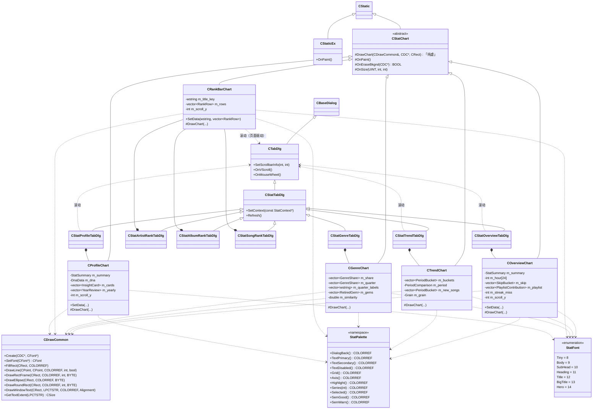
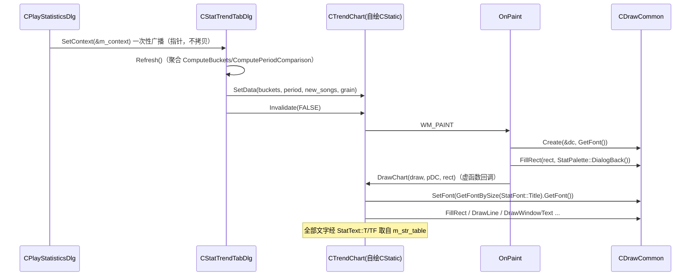

# 播放统计界面层重写设计（按项目既有规范）

> 架构师：高见远　日期：2026-09-17
> 工程：`Z:\small\Music-gw2`　基线 HEAD：`549e50e`
> 上游输入：`01-PRD-增量.md`（23 条已完成需求）、`02-架构设计-增量.md`、调研 A（多语言与资源规范）、调研 B（字体/DPI/颜色/自绘/列表规范）
> 文档性质：**纯设计（不改源码）**。只重写**界面实现层**，保留已完成的 23 条需求的功能与聚合逻辑。
> 全文简体中文，无 emoji；所有结论给出 `文件:行号` 或调研编号作为依据。
> 行号基准：当前 `MusicPlayer2/` 快照（`549e50e`）。

---

## 0. 范围界定（先对齐）

**重写对象（10 个界面单元）**：主对话框 + 8 个已实现页签 + 口径说明对话框。

| 单元 | 文件 | 现状基类 |
|---|---|---|
| 主对话框 | `CPlayStatisticsDlg.h/.cpp` | `CBaseDialog` |
| 概览 | `StatOverviewTabDlg.h/.cpp` | `CStatTabDlg`（→`CTabDlg`→`CBaseDialog`） |
| 趋势 | `StatTrendTabDlg.h/.cpp` | `CStatTabDlg` |
| 歌手 | `StatArtistRankTabDlg.h/.cpp` | `CStatTabDlg` |
| 专辑 | `StatAlbumRankTabDlg.h/.cpp` | `CStatTabDlg` |
| 曲目 | `StatSongRankTabDlg.h/.cpp` | `CStatTabDlg` |
| 流派 | `StatGenreTabDlg.h/.cpp` | `CStatTabDlg` |
| 明细 | `StatSongsTabDlg.h/.cpp` | `CStatTabDlg` |
| 洞察 | `StatProfileTabDlg.h/.cpp` | `CStatTabDlg` |
| 口径说明 | `StatHelpDlg.h/.cpp` | `CBaseDialog` |

**不在范围**：聚合算法与口径（`CStatAnalysis` 的数学语义、`schema_version=2`、15 秒口径、四个 `Compute*`/十三个 `Compute*` 的数值结果）、`PlayStatistics` 落盘格式、`MusicPlayer2.rc` 的资源结构（IDD/控件/布局已合规，见 §1 证据）、`CTabCtrlEx`（`CalSubWindowSize` 多行修正已完成，`CTabCtrlEx.cpp:117-126`）。**热力图页（IDD 700）与报告页（IDD 703）本次不实现**（仅预留在 `resource.h`，无对应 `.cpp`，见文件全量清单），故不属本次重写对象。

**一句话重写原则**：**用项目既有的标准设施（`CBaseDialog`/`CTabDlg`/`CStatic`+`CDrawCommon` 自绘 / `m_font_set` / `CPlayerUIHelper::GetUIColors` / `CListCtrlEx` 默认样式 / `m_str_table` 语言表）替换统计页自创的一套（owner-draw + 父窗口 `OnDrawItem`、`CreatePointFont`+`"Microsoft YaHei"`、自建 `StatTheme` 调色板、对话框级深色、手写滚动条、中文字面量），功能与数值零变化。**

---

## 1. 重写原则 + 与项目规范的对齐表（违规点 → 目标做法 → 证据）

### 1.1 违规点清单（已回源码复核）

| # | 违规点 | 现状证据 | 目标做法 | 依据 |
|---|---|---|---|---|
| V1 | 自绘路线自创：`SS_BLACKFRAME→SS_OWNERDRAW` + 父窗口 `OnDrawItem` | 7 个 `Stat*TabDlg` 全部如此（`StatTrendTabDlg.cpp:50-51`、`StatArtistRankTabDlg.cpp:47-48`、`StatAlbumRankTabDlg.cpp:43-44`、`StatSongRankTabDlg.cpp:44-45`、`StatGenreTabDlg.cpp:49-50`、`StatProfileTabDlg.cpp:36-37`、`StatOverviewTabDlg.cpp:35-36`）；全项目仅统计页如此 | **改写为自绘 `CStatic` 派生控件**（仿 `CStaticEx.h:4-26`，控件自己在 `OnPaint` 里用 `CDrawCommon` 画）；删除全部 `SetWindowLongPtr(...SS_OWNERDRAW...)` 与 `ON_WM_DRAWITEM` | 调研 B「自绘路线」；`StaticEx.cpp:50-87` 为正例 |
| V2 | 自创字体路径：`CreatePointFont(NN*10, "Microsoft YaHei")` | 全项目 38 处，**37 处在统计页**（实测 `CreatePointFont` 计数），非统计仅 `CortanaLyric.cpp:110` | 统一 `theApp.m_font_set.GetFontBySize(n).GetFont()`，**n 收敛到 8~16 整数档**，字体名一律来自 `m_font_set` | 调研 B「字体」；`CommonData.h:121-137`、`CommonData.cpp:51-70` |
| V3 | 自建调色板 `StatTheme`（28 字段） | `StatTheme.h:7-32`、`StatTheme.cpp:13-52`；仅统计页使用 | **删除 `StatTheme.h/.cpp`**；图表取色改走 `CPlayerUIHelper::GetUIColors()` + `theApp.m_app_setting_data.theme_color`（与 `CListCtrlEx` 默认取色同源） | 调研 B「颜色」；`CPlayerUIHelper.h:34`、`ColorConvert.h:5` |
| V4 | 引入对话框级深色模式（新增路径） | `CStatTheme::ApplyDialog`（`StatTheme.cpp:81-89`）给对话框设背景 + 给列表套深色 | **统计页不引入对话框级深色**；对话框背景一律沿用 `CTabDlg` 已设的统一背景（`TabDlg.cpp:116`），删除 `ApplyDialog` | 调研 B「对话框背景 / dark_mode」：全仓无任何普通 `CBaseDialog` 派生对话框跟随 `dark_mode` |
| V5 | 覆盖列表默认主题：`SetThemeColors` | `ListCtrlEx.h:24`、`ListCtrlEx.cpp:299`；**唯一调用点** `StatTheme.cpp:61` | **删除 `SetThemeColors` 调用**，让 `CListCtrlEx` 默认主题色/斑马纹生效；该 API 无残余调用点则**连同 `m_theme_custom` 一并从 `ListCtrlEx` 移除**，使基类回到改动前 | 调研 B「CListCtrlEx 默认已很好」；`ListCtrlEx.cpp:431-441`（`PreSubclassWindow` 默认样式）、`324-363`（默认斑马纹）；`test_stats_verify/diff_ListCtrlEx.txt` |
| V6 | 重复造滚动轮子：手写 `WS_VSCROLL`+`SCROLLINFO`+自绘 `OnVScroll`/`OnMouseWheel` | 5 个文件各自手写（概览/歌手/专辑/曲目/洞察）；例 `StatOverviewTabDlg.cpp:92-172`、`StatArtistRankTabDlg.cpp:120-231` | **统一走 `CTabDlg::SetScrollbarInfo(nPage,nMax)` + 已实现的 `OnVScroll`/`OnMouseWheel`**（`TabDlg.cpp:27-55/149-202`） | 调研 B「CTabDlg 已内置滚动机制」；先例 `OptionsDlg.cpp:108/165` |
| V7 | 中文字面量硬编码（用户可见文案不走语言表） | 统计页 `LoadText` 命中 **0 次**（实测 `LoadText` 计数=0）；中文字面量约 **308 处** | 全部用户可见文本走 **`theApp.m_str_table.LoadText/LoadTextFormat`**；自绘文字取串后再画 | 调研 A；先例 `CListenTimeStatisticsDlg.cpp:34-43`、`MusicPlayerDlg.cpp:2223-2228` |
| V8 | 覆盖基类本地化：`SetDlgItemTextW(IDCANCEL,L"关闭")` | `CPlayStatisticsDlg.cpp:78` | 删除；标准按钮由 `CBaseDialog::OnInitDialog` 自动翻译（`BaseDialog.cpp:361-366`）；非标准控件用 `SetDlgControlText(id,L"TXT_…")`（`BaseDialog.cpp:261-266`） | 调研 A「CBaseDialog::OnInitDialog 会自动翻译全部控件」 |
| V9 | 列表列宽设定时机不一致 | 歌手/曲目在 `OnInitDialog` 设死宽（`StatArtistRankTabDlg.cpp:41-43`、`StatSongRankTabDlg.cpp:40-42`）；明细/专辑在 `Refresh` 设（`StatSongsTabDlg.cpp:53-61`、`StatAlbumRankTabDlg.cpp:64-66`） | **统一为「`OnInitDialog` 只建列，列宽在 `Refresh` 按 `theApp.DPI()` 设」** | 旧文档 `播放统计标准化设计文档.md:210`；见 §9 Q3 结论 |
| V10 | 自绘文字用 `CreatePointFont` 直接建临时字体，未复用 `m_font_set` | 见 V2 | 同上，改 `GetFontBySize` | 调研 B |

> 复核结果：`LoadText` 在 `Stat*.cpp` 中命中 **0 次**（事实核对通过）；`CreatePointFont` 在 `Stat*.cpp` 中命中 **37 次**（事实核对通过）。调研 A/B 的数字可信。

### 1.2 已合规、**不需要返工**的部分（避免误改）

| 项 | 证据 |
|---|---|
| 主对话框 `AFX_DIALOG_LAYOUT` | `MusicPlayer2.rc:1060-1078`（15 控件各 1 行，行数=控件数，正确） |
| 子页 `AFX_DIALOG_LAYOUT` | `MusicPlayer2.rc:2665-2713`（8 个子页 + help 均有） |
| 控件 ID 分配 | `resource.h:1092-1154`，统计专用 1400~1444，无冲突 |
| `CTabDlg` 子页统一背景 | `TabDlg.cpp:116`（Win11 `RGB(249,249,249)`） |
| `CTabCtrlEx::CalSubWindowSize` 多行兜底 | `CTabCtrlEx.cpp:117-126`（已按「所有 item 最大 bottom」算表头高） |
| `.rc` 资源编码 | UTF-16LE+BOM+CRLF（复核 `FF FE` 前缀）；本次**不改 `.rc`**（见 §2 说明） |

---

## 2. 新增 / 删除 / 修改文件清单

> 相对路径以 `MusicPlayer2/` 为根。**".rc 不用改"是本次设计的核心简化**：8 个页签与主对话框的 IDD/控件/布局已全部存在且合规，重写只发生在 `.cpp/.h` 实现层。

### 2.1 新增文件

| 文件 | 一句话职责 |
|---|---|
| `StatChart.h` | 统计页自绘控件基类 `CStatChart` + 取色入口 `StatPalette` + 字号档位 `StatFont` + 文本/格式辅助 `StatText`/`StatFormat`（全部为统计页内部设施） |
| `StatChart.cpp` | `CStatChart` 的 `OnPaint`/`OnEraseBkgnd`/`OnSize` 实现 + `StatPalette` 取色实现 |

> 说明：仅**新增 1 组**（`.h/.cpp`）共享设施文件，避免为每个图表控件新建头文件造成文件爆炸。各图表控件类（`COverviewChart` 等）**内联定义在各页 `.h` 中**（它们是该页专用，无跨页复用价值），只复用 `CStatChart` 基类。

### 2.2 删除文件

| 文件 | 删除理由 |
|---|---|
| `StatTheme.h` | D3/D4：自建 28 字段调色板 + 对话框级深色，改为标准取色入口后无引用（唯一调用者 `ListCtrlEx::SetThemeColors` 同步移除） |
| `StatTheme.cpp` | 同上（`StatTheme.cpp:61` 是 `SetThemeColors` 唯一调用点） |

### 2.3 修改文件

| 文件 | 改动要点 |
|---|---|
| `ListCtrlEx.h` / `ListCtrlEx.cpp` | 移除 `SetThemeColors` 声明/实现（`ListCtrlEx.h:24`、`ListCtrlEx.cpp:299-302`）与 `m_theme_custom` 等 4 个成员（`ListCtrlEx.h:76-80`）及 `OnNMCustomdraw` 中对应分支（`ListCtrlEx.cpp:365-366`），回到改动前状态 |
| `StatOverviewTabDlg.h/.cpp` | 改自绘控件；去 owner-draw；滚动走 `CTabDlg::SetScrollbarInfo`；字体走 `GetFontBySize`；取色走 `StatPalette`；文本走语言表 |
| `StatTrendTabDlg.h/.cpp` | 同上 |
| `StatGenreTabDlg.h/.cpp` | 同上；"其他"流派走语言表 |
| `StatArtistRankTabDlg.h/.cpp` | 改自绘控件；列表列头本地化；列宽时机统一；文本本地化 |
| `StatAlbumRankTabDlg.h/.cpp` | 同上；"未知专辑"走语言表 |
| `StatSongRankTabDlg.h/.cpp` | 同上 |
| `StatSongsTabDlg.h/.cpp` | 列表列头本地化；列宽时机统一（保持 `Refresh` 设定，补 `InsertColumn` 在 `OnInitDialog`）；结果词本地化 |
| `StatProfileTabDlg.h/.cpp` | 改自绘控件；滚动走 `CTabDlg`；徽章/DNA/洞察/年度文案走语言表；去 `GenerateInsights`（见 §9 Q1） |
| `StatHelpDlg.h/.cpp` | 口径说明内容改为从语言表组装（`BuildContent` 不再硬编码中文） |
| `CPlayStatisticsDlg.h/.cpp` | `InitializeControls` 全面改用 `SetDlgControlText`/`LoadText`；预设下拉/粒度/更新至/导出按钮/消息框/CSV 表头/CSV 标题本地化；Tab 标题本地化 |
| `StatAnalysis.h/.cpp` | 仅限**文本结构化**（Option A）：`StatSummary::Badge` 改携带 key+参数；`GenreShare`/`AlbumRankItem`/`PlaylistContribution` 增「其他/未知」标志位；`FormatDuration` 迁移说明见 §9 Q1。**数学与数值字段一律不动** |
| `StatAiInsight.h/.cpp` | 返回 key+参数而非成品文案（`BuildDnaReport`→结构化；`GenerateInsightCards`→卡片 key+参数；`BuildDriftNarrative`→结构化）；废弃 `GenerateInsights`（被卡片接口取代） |
| `MusicPlayer2.vcxproj` / `.vcxproj.filters` | 登记 `StatChart.h/.cpp`；移除 `StatTheme.h/.cpp` 登记（`<ClCompile>`/`<ClInclude>` 两处） |
| `MusicPlayer2.rc` | **不改**（见 §2.4） |
| `resource.h` | **不改**（IDD/IDC 已齐备） |

### 2.4 为什么 `.rc` 不改（重要）

- 8 个页签的 IDD（694~699、701、702）与主对话框（693）、口径说明（704）**已存在**，控件与 `AFX_DIALOG_LAYOUT` 已合规（§1.2）。
- 本次重写**不新增控件**：自绘控件复用现有 `IDC_STAT_*_CHART`（`Static` 类型），列表现有 `SysListView32` 不变；滚动改由 `CTabDlg` 承载，**不需要在 rc 里加 `WS_VSCROLL`**。
- 标题/按钮文案在 `InitializeControls()` 运行时从语言表覆盖，rc 里的英文占位（如 `CAPTION "Play Statistics"`、`PUSHBUTTON "Export CSV"`）**无需改动**。
- 由此**彻底规避 D8 的 `.rc` 编码风险**（不改二进制 UTF-16 文件）。若后续批次（热力图/报告页）需要新增 IDD，才按 D8 脚本纪律执行。

---

## 3. 图表自绘控件基类设计

### 3.1 设计要点（回答开放问题 4 的"基类如何设计/如何兼容布局"）

1. **继承 `CStatic`**（与 `CStaticEx` 同族），在 `OnPaint` 里自建 `CDrawCommon` 画图——**这是项目唯一的自绘静态控件正例路线**（`StaticEx.cpp:50-87`）。
2. **不再是 owner-draw**：删除 `SetWindowLongPtr(...SS_OWNERDRAW...)` 与父窗口 `ON_WM_DRAWITEM`。控件通过 `DDX_Control` 子类化，MFC 消息映射把 `WM_PAINT` 路由到本类。
3. **与 rc + `AFX_DIALOG_LAYOUT` 的兼容方式**：控件仍是 rc 里声明的**普通子窗口**（`Static` 类型，`SS_BLACKFRAME|SS_NOTIFY`）；位置/尺寸**完全交给 `CMFCDynamicLayout`（`AFX_DIALOG_LAYOUT`）**。基类**绝不调用 `MoveWindow`/`SetWindowPos`**，因此与动态布局零冲突（避免踩"手动 OnSize 与 CMFCDynamicLayout 打架"的坑）。`OnSize` 仅 `Invalidate(FALSE)`。
4. **与 `CDrawCommon` 配合**：基类 `OnPaint` 里 `draw.Create(&dc, GetFont())`（`GetFont()` 已被 `CBaseDialog::OnInitDialog`→`SetDialogFont` 设为 `m_font_set.dlg`=9pt，`BaseDialog.cpp:338-339`），铺背景后调用派生类 `DrawChart(draw, pDC, rect)`；派生类用 `draw.SetFont(&theApp.m_font_set.GetFontBySize(n).GetFont())` 切字号、用 `draw.FillRect/DrawLine/DrawRectFrame/DrawEllipse` 等图元绘制。
5. **背景与子页一致**：基类用 `StatPalette::DialogBack()` 铺底（该值 = `CTabDlg` 所设背景：Win11 `RGB(249,249,249)`，否则白，`TabDlg.cpp:116`），保证图表与子页背景无缝、无"白底贴片"，且**不引入深色**（D4）。
6. **数据由页面喂入**：控件暴露 `SetXxxData(...)`，页面的 `Refresh()` 负责从 `m_stat_ctx` 聚合后 `SetData` + `Invalidate(FALSE)`。控件自身**不做聚合、不访问 `m_stat_ctx`**（保持"控件只画、页面只算"的分工）。

### 3.2 类图



### 3.3 接口签名（可直接照抄编码）

```cpp
// ─────────────────────────── StatChart.h ───────────────────────────
#pragma once
#include "DrawCommon.h"
#include <string>
#include <vector>

// 取色入口：图表专用，统一同源于 CPlayerUIHelper::GetUIColors + theme_color。
// 说明：统计页不引入对话框级深色（D4），故仅提供"浅色（标准对话框）"一套，
//       与 CListCtrlEx 默认取色、其余普通对话框观感一致。
namespace StatPalette
{
    COLORREF DialogBack();       // == CTabDlg 背景：Win11 RGB(249,249,249) / 否则 RGB(255,255,255)
    COLORREF TextPrimary();      // == CPlayerUIHelper::GetUIColors(false).color_text
    COLORREF TextSecondary();    // == color_text_lable
    COLORREF TextDisabled();     // == color_text_disabled
    COLORREF Grid();             // 网格线（GRAY(200) 系）
    COLORREF Axis();             // 坐标轴（GRAY(160) 系）
    COLORREF Highlight();        // == theApp.m_app_setting_data.theme_color.original_color
    COLORREF Series(int i);      // 8 色循环（固有系列色，i % 8）
    COLORREF Selected();         // == color_list_selected
    COLORREF SemGood();          // 语义：完播
    COLORREF SemWarn();          // 语义：跳过
}

// 字号档位：m_font_set 只提供 8~16 整数 pt（CommonData.h:123-124）
namespace StatFont
{
    enum Level { Tiny = 8, Body = 9, SubHead = 10, Heading = 11, Title = 12, BigTitle = 13, Hero = 14 };
}

// 文本辅助：所有用户可见文本经此取串（D7）
namespace StatText
{
    inline std::wstring T(const wchar_t* key)
    {
        return theApp.m_str_table.LoadText(key);
    }
    // 用法：StatText::TF(L"TXT_STAT_HOUR_PEAK", peak, m_hour[peak])
    template<typename... Args>
    inline std::wstring TF(const wchar_t* key, Args&&... args)
    {
        return theApp.m_str_table.LoadTextFormat(key, { CVariant(std::forward<Args>(args))... });
    }
}

// 时长格式化（从聚合层迁出的显示职责，见 §9 Q1）
namespace StatFormat
{
    std::wstring DurationSec(int seconds);   // "1时05分03秒" 通过语言表单位词拼装
}

// 统计页自绘静态控件基类
class CStatChart : public CStatic
{
    DECLARE_DYNAMIC(CStatChart)
public:
    CStatChart() = default;
    virtual ~CStatChart() = default;

protected:
    // 派生类实现：在客户区绘制图表（基类已铺好与子页一致的背景）。
    // - draw：已 Create 好的绘图器（字体=控件默认字体）
    // - pDC ：需要 Pie/SelectClipRgn/DrawText(多行) 等 CDrawCommon 未覆盖的图元时直接用
    virtual void DrawChart(CDrawCommon& draw, CDC* pDC, const CRect& rect) = 0;

    afx_msg void OnPaint();
    afx_msg BOOL OnEraseBkgnd(CDC* pDC);   // 返回 TRUE，避免闪烁
    afx_msg void OnSize(UINT nType, int cx, int cy);   // 仅 Invalidate，不移动控件

    DECLARE_MESSAGE_MAP()
};
```

```cpp
// ─────────────────────── StatChart.cpp 关键实现 ───────────────────────
BEGIN_MESSAGE_MAP(CStatChart, CStatic)
    ON_WM_PAINT()
    ON_WM_ERASEBKGND()
    ON_WM_SIZE()
END_MESSAGE_MAP()

void CStatChart::OnPaint()
{
    CPaintDC dc(this);
    CRect rect;
    GetClientRect(rect);
    if (rect.Width() <= 1 || rect.Height() <= 1)
        return;

    CDrawCommon draw;
    draw.Create(&dc, GetFont());
    draw.FillRect(rect, StatPalette::DialogBack());   // 与 CTabDlg 背景一致（D4：不引入深色）
    dc.SetBkMode(TRANSPARENT);

    DrawChart(draw, &dc, rect);
}

BOOL CStatChart::OnEraseBkgnd(CDC* /*pDC*/)
{
    return TRUE;    // 背景由 OnPaint 统一铺，避免默认擦除造成闪烁
}

void CStatChart::OnSize(UINT nType, int cx, int cy)
{
    CStatic::OnSize(nType, cx, cy);
    Invalidate(FALSE);   // 只重绘，绝不 MoveWindow（与 AFX_DIALOG_LAYOUT 兼容）
}
```

```cpp
// ── 派生控件示例（趋势页，定义于 StatTrendTabDlg.h） ──
class CTrendChart : public CStatChart
{
    DECLARE_DYNAMIC(CTrendChart)
public:
    void SetData(const std::vector<PeriodBucket>& buckets,
                 const PeriodComparison& period,
                 const std::vector<PeriodBucket>& new_songs,
                 Grain grain);
protected:
    virtual void DrawChart(CDrawCommon& draw, CDC* pDC, const CRect& rect) override;
private:
    std::vector<PeriodBucket> m_buckets;
    PeriodComparison m_period;
    std::vector<PeriodBucket> m_new_songs;
    Grain m_grain{ Grain::Day };
};
```

```cpp
// ── 页面侧用法（StatTrendTabDlg） ──
// 头文件：CStatic m_chart;  →  CTrendChart m_chart;
// DoDataExchange：DDX_Control(pDX, IDC_STAT_TREND_CHART, m_chart);
// OnInitDialog ：无需任何 SetWindowLongPtr；直接
//     SetScrollbarInfo(rc.Height(), content_h);            // 需要滚动时（D6）
// Refresh()    ：
//     m_chart.SetData(buckets, period, new_songs, m_stat_ctx->filter.grain);
//     m_chart.Invalidate(FALSE);
// 消息映射     ：删除 ON_WM_DRAWITEM / OnDrawItem 分支
```

### 3.4 调用流（重绘链路）



---

## 4. 每页"改造前 → 改造后"逐页对照

> 通用收口（每页都做）：所有 `CStatTheme::Get()` → `StatPalette::*`；所有 `CreatePointFont(pt,L"Microsoft YaHei",…)`+`SelectObject` → `draw.SetFont(&m_font_set.GetFontBySize(档).GetFont())`；所有中文字面量 → `StatText::T/TF`；`SS_OWNERDRAW`+`OnDrawItem` → `CStatChart` 派生控件。

| 页 | 现状做法（控件/字体/颜色/文本） | 目标做法（控件类/设施/语言表键前缀） | `.rc` | `OnDrawItem` |
|---|---|---|---|---|
| **主对话框** | `CBaseDialog`；过滤条/按钮手写 `SetDlgItemTextW` 中文；`IDCANCEL` 手写"关闭"；`CComboBox` 预设中文；无自绘 | 保持 `CBaseDialog`；`InitializeControls` 改 `SetDlgControlText`/`LoadText`；`IDCANCEL` 交给基类自动翻译；`TITLE_`/`TXT_STAT_`/`MSG_STAT_` | 不改 | 无 |
| **概览** | `CStatic`+`SS_OWNERDRAW`+`OnDrawItem`；`CreatePointFont(76~120)`；`CStatTheme`；`WS_VSCROLL`+`SCOLLINFO`+自写 `OnVScroll/OnMouseWheel` | 新 `COverviewChart : CStatChart`；字体 `StatFont::Tiny~Title`；取色 `StatPalette`；滚动 `CTabDlg::SetScrollbarInfo`；`TXT_STAT_CARD_*/SECTION_*/UNIT_*/STREAK_MISS` | 不改 | 删除 |
| **趋势** | 同上（`IDC_STAT_TREND_CHART`）；`CreatePointFont(78~140)` | 新 `CTrendChart : CStatChart`；滚动 `CTabDlg`；`TXT_STAT_TREND_*` | 不改 | 删除 |
| **歌手** | `CListCtrlEx`+`CStatic`(owner-draw)；列表列头中文、`OnInitDialog` 设死宽；`CreatePointFont(80~100)` | `CListCtrlEx` + 新 `CRankBarChart : CStatChart`；列头本地化；列宽移到 `Refresh`；`TXT_STAT_COL_*/CHART_ARTIST` | 不改 | 删除 |
| **专辑** | 同歌手（`IDC_STAT_ALBUM_RANK_*`） | 同上；空专辑走 `TXT_STAT_UNKNOWN_ALBUM` | 不改 | 删除 |
| **曲目** | 同歌手（`IDC_STAT_SONG_RANK_*`） | 同上；`TXT_STAT_COL_SONG/CHART_SONG` | 不改 | 删除 |
| **流派** | `CStatic`+`SS_OWNERDRAW`；`CreatePointFont(78~110)` | 新 `CGenreChart : CStatChart`；"其他"走 `TXT_STAT_GENRE_OTHER`；`TXT_STAT_GENRE_*` | 不改 | 删除 |
| **明细** | `CListCtrlEx`；列头中文；列宽已在 `Refresh`；结果词中文 | 保持 `CListCtrlEx`；列头/结果词本地化；`TXT_STAT_COL_*/FINISH_*` | 不改 | 无（本无自绘） |
| **洞察** | `CStatic`+`SS_OWNERDRAW`+手写滚动；`CreatePointFont(78~130)`；`CStatAiInsight` 返回成品中文 | 新 `CProfileChart : CStatChart`；滚动 `CTabDlg`；徽章/DNA/洞察改 key+参数后本地化；`TXT_STAT_SECTION_*/DNA_*/BADGE_*/INSIGHT_*/METRIC_*/YEARLY_*` | 不改 | 删除 |
| **口径说明** | `CBaseDialog`；`BuildContent` 硬编码多行中文，写入只读 `EDITTEXT`(`ES_MULTILINE|ES_READONLY`) | 保持 `CBaseDialog`+只读多行 `EDIT`；内容由 `TXT_STAT_HELP_*` 组装；`schema_version`/变更记录仍读 `CStatMeta` | 不改 | 无 |

**关于概览/趋势/流派/洞察仍要画图（柱/折线/环形/色块）的确认**：图表自绘**全部**改为 `CStatChart` 派生控件实现（§3），保留 GDI 图元（`FillRect/Rectangle/Polyline/Pie/Ellipse/RoundRect`），零第三方依赖不变。

---

## 5. 语言表键清单

### 5.1 命名方案

| 前缀 | 语义 | 归属 |
|---|---|---|
| `TITLE_` | 窗口标题 | 主对话框、口径说明 |
| `TXT_STAT_` | 控件文本 / 分区标题 / 列头 / 卡片标签 / 单位 / 编辑性文案模板 | 全统计页 |
| `MSG_STAT_` | 消息框文案 | 主对话框 |
| `TXT_STAT_TAB_` | Tab 标题 | 主对话框 |

- 占位符一律 `<%n%>`（`StrTable.cpp:122-147`），复数/拼接**不做**（用整句模板）。
- **复用已有键**：`TXT_CLOSE`（`English.ini:332`）、`TXT_SERIAL_NUMBER`/`TXT_TITLE`/`TXT_ARTIST`/`TXT_ALBUM`/`TXT_LENGTH` 等列头若语义一致优先复用（下表标注"复用"）。

### 5.2 主对话框与 Tab（30 + 8 = 38 键）

| 键名 | 英文 | 简体中文 | 用途 |
|---|---|---|---|
| TITLE_STAT_PLAY | Play Statistics | 播放统计 | 主窗口标题 |
| TXT_STAT_RANGE_LAST7 | Last 7 days | 近7天 | 预设下拉项 |
| TXT_STAT_RANGE_LAST30 | Last 30 days | 近30天 | 预设下拉项 |
| TXT_STAT_RANGE_LAST90 | Last 90 days | 近90天 | 预设下拉项 |
| TXT_STAT_RANGE_THIS_YEAR | This year | 今年 | 预设下拉项 |
| TXT_STAT_RANGE_LAST_YEAR | Last year | 去年 | 预设下拉项 |
| TXT_STAT_RANGE_ALL | All | 全部 | 预设下拉项 |
| TXT_STAT_RANGE_CUSTOM | Custom | 自定义 | 预设下拉项 |
| TXT_STAT_GRAIN_DAY | Day | 天 | 粒度按钮 |
| TXT_STAT_GRAIN_WEEK | Week | 周 | 粒度按钮 |
| TXT_STAT_GRAIN_MONTH | Month | 月 | 粒度按钮 |
| TXT_STAT_GRAIN_YEAR | Year | 年 | 粒度按钮 |
| TXT_STAT_UPDATED | Updated at <%1%> | 数据更新至 <%1%> | 更新至标注 |
| TXT_STAT_EXPORT_CSV | Export CSV | 导出CSV | 按钮 |
| TXT_STAT_EXPORT_JSON | Export JSON | 导出JSON | 按钮 |
| TXT_STAT_EXPORT_AGG | Export Aggregated CSV | 导出聚合CSV | 按钮 |
| TXT_STAT_REPORT | Generate Report | 生成报告 | 按钮 |
| MSG_STAT_DATE_ORDER_FROM | Start date is later than end date. Please reselect. | 起始日期晚于结束日期，请重新选择。 | 校验提示 |
| MSG_STAT_DATE_ORDER_TO | End date is earlier than start date. Please reselect. | 结束日期早于起始日期，请重新选择。 | 校验提示 |
| MSG_STAT_EXPORT_DONE | Export completed | 导出完成 | 导出结果 |
| MSG_STAT_FILE_FAIL | Cannot create file | 无法创建文件 | 导出失败 |
| MSG_STAT_REPORT_TODO | Report generation will be available in a later version. | 报告生成将在后续版本提供。 | 未实现占位 |
| TXT_STAT_EXPORT_AGG_TITLE | Export aggregated statistics (CSV) | 导出聚合统计 (CSV) | 保存对话框标题 |
| TXT_STAT_CSV_PERIOD | Period | 周期 | 聚合 CSV 表头 |
| TXT_STAT_CSV_PLAYS | Play count | 播放次数 | 聚合 CSV 表头 |
| TXT_STAT_CSV_DURATION | Duration (s) | 播放时长(秒) | 聚合 CSV 表头 |
| TXT_STAT_CSV_COMPLETED | Completed | 完播次数 | 聚合 CSV 表头 |
| TXT_STAT_CSV_SKIPPED | Skipped | 跳过次数 | 聚合 CSV 表头 |
| TXT_STAT_EXPORT_DETAIL_CSV | Export play records (CSV) | 导出播放记录 (CSV) | 保存对话框标题 |
| TXT_STAT_EXPORT_DETAIL_JSON | Export play records (JSON) | 导出播放记录 (JSON) | 保存对话框标题 |
| TXT_STAT_TAB_OVERVIEW | Overview | 概览 | Tab 标题 |
| TXT_STAT_TAB_TREND | Trend | 趋势 | Tab 标题 |
| TXT_STAT_TAB_ARTIST | Artist | 歌手 | Tab 标题 |
| TXT_STAT_TAB_ALBUM | Album | 专辑 | Tab 标题 |
| TXT_STAT_TAB_SONG | Tracks | 曲目 | Tab 标题 |
| TXT_STAT_TAB_GENRE | Genre | 流派 | Tab 标题 |
| TXT_STAT_TAB_SONGS | Detail | 明细 | Tab 标题 |
| TXT_STAT_TAB_PROFILE | Insight | 洞察 | Tab 标题 |

### 5.3 概览页（16 键）

| 键名 | 英文 | 简体中文 | 用途 |
|---|---|---|---|
| TXT_STAT_SECTION_CORE | Core Metrics | 核心指标 | 分区标题 |
| TXT_STAT_CARD_DURATION | Total Duration | 累计时长 | 指标卡 |
| TXT_STAT_CARD_COUNT | Total Plays | 累计次数 | 指标卡 |
| TXT_STAT_CARD_COMPLETION | Completion Rate | 完整收听率 | 指标卡 |
| TXT_STAT_CARD_ACTIVE_DAYS | Active Days | 活跃天数 | 指标卡 |
| TXT_STAT_SECTION_HOUR | 24-Hour Distribution | 24 小时收听分布 | 分区标题 |
| TXT_STAT_HOUR_PEAK | Peak <%1%>:00 (<%2%> plays) | 峰值 <%1%>:00（<%2%> 次） | 峰值标注 |
| TXT_STAT_NO_RECORD | No records | 无记录 | 空态（多页复用） |
| TXT_STAT_SECTION_RESULT | Play Result Distribution | 播放结果分布 | 分区标题 |
| TXT_STAT_RESULT_LINE | Completion <%1%>%%　Skip <%2%>%% | 完整收听率 <%1%>%%　跳过率 <%2%>%% | 结果行 |
| TXT_STAT_STREAK_MISS | Nearly <%1%> days in a row: the last streak broke after <%2%> days. | 差点就连续 <%1%> 天：上一次连续听了 <%2%> 天后中断了。 | 连听提示 |
| TXT_STAT_SECTION_PLAYLIST | Playlist / Source Contribution | 歌单 / 来源贡献 | 分区标题 |
| TXT_STAT_PLAYLIST_LINE | <%1%>　<%2%>　<%3%>%% | <%1%>　<%2%>　<%3%>%% | 来源行 |
| TXT_STAT_UNIT_SONGS | <%1%> tracks | <%1%> 首 | 单位 |
| TXT_STAT_UNIT_TIMES | <%1%> plays | <%1%> 次 | 单位 |
| TXT_STAT_UNIT_DAYS | <%1%> days | <%1%> 天 | 单位 |

### 5.4 趋势页（6 键）

| 键名 | 英文 | 简体中文 | 用途 |
|---|---|---|---|
| TXT_STAT_TREND_TITLE | Play Trend (by <%1%>) | 播放趋势（按<%1%>） | 图标题 |
| TXT_STAT_TREND_MOM | MoM (vs <%1%>): <%2%> plays (<%3%>%%) | 环比（vs <%1%>）：<%2%> 次（<%3%>%%） | 环比 |
| TXT_STAT_TREND_MOM_NODATA | MoM: no previous period | 环比：无上期数据 | 环比空 |
| TXT_STAT_TREND_YOY | YoY (vs <%1%>): <%2%> plays (<%3%>%%) | 同比（vs <%1%>）：<%2%> 次（<%3%>%%） | 同比 |
| TXT_STAT_TREND_NEW | New discoveries: <%1%> total, <%2%> added in <%3%> | 新发现：共 <%1%> 首，<%2%> 新增 <%3%> 首 | 新发现 |
| TXT_STAT_TREND_NEW_NONE | New discoveries: none | 新发现：无 | 新发现空 |

### 5.5 排行页（歌手/专辑/曲目，13 键）

| 键名 | 英文 | 简体中文 | 用途 |
|---|---|---|---|
| TXT_STAT_COL_RANK | # | # | 列头（可保留字面） |
| TXT_STAT_COL_ARTIST | Artist | 歌手 | 列头 |
| TXT_STAT_COL_ALBUM | Album | 专辑 | 列头 |
| TXT_STAT_COL_SONG | Track | 歌曲 | 列头 |
| TXT_STAT_COL_DURATION | Duration | 播放时长 | 列头 |
| TXT_STAT_COL_COUNT | Plays | 播放次数 | 列头 |
| TXT_STAT_CHART_ARTIST | Artist Play Duration | 歌手播放时长 | 图标题 |
| TXT_STAT_CHART_ALBUM | Album Play Duration | 专辑播放时长 | 图标题 |
| TXT_STAT_CHART_SONG | Track Play Count | 歌曲播放次数 | 图标题 |
| TXT_STAT_NO_ALBUM_RECORD | No album records | 暂无专辑记录 | 空态 |
| TXT_STAT_UNKNOWN_ALBUM | Unknown album | 未知专辑 | 空专辑名（替代分析层字面量） |
| TXT_STAT_VAL_DUR_COUNT | <%1%> / <%2%> plays | <%1%> / <%2%>次 | 专辑列值 |
| TXT_STAT_VAL_COUNT | <%1%> plays | <%1%>次 | 曲目列值 |

### 5.6 明细页 + 播放结果（7 + 4 键）

| 键名 | 英文 | 简体中文 | 用途 |
|---|---|---|---|
| TXT_STAT_COL_INDEX | No. | 序号 | 列头 |
| TXT_STAT_COL_TIME | Played at | 播放时间 | 列头 |
| TXT_STAT_COL_TITLE | Title | 标题 | 列头 |
| TXT_STAT_COL_PLAY_DUR | Duration | 播放时长 | 列头 |
| TXT_STAT_COL_SONG_LEN | Length | 歌曲长度 | 列头 |
| TXT_STAT_COL_RESULT | Result | 结果 | 列头 |
| TXT_STAT_COL_SOURCE | Source | 来源 | 列头 |
| TXT_STAT_FINISH_COMPLETED | Completed | 播完 | 结果词 |
| TXT_STAT_FINISH_SKIPPED | Skipped | 跳过 | 结果词 |
| TXT_STAT_FINISH_STOPPED | Stopped | 停止 | 结果词 |
| TXT_STAT_FINISH_ERROR | Error | 出错 | 结果词 |

（明细页的专辑/歌手/标题列头复用 §5.5 与 `TXT_TITLE/TXT_ARTIST/TXT_ALBUM`。）

### 5.7 流派页（9 键）

| 键名 | 英文 | 简体中文 | 用途 |
|---|---|---|---|
| TXT_STAT_GENRE_TITLE | Genre Distribution | 流派分布 | 图标题 |
| TXT_STAT_GENRE_EMPTY | No genre data (FLAC usually has no genre tag) | 暂无流派数据（FLAC 通常不含流派标签） | 空态 |
| TXT_STAT_GENRE_OTHER | Other | 其他 | 合并桶（替代分析层字面量） |
| TXT_STAT_GENRE_DRIFT | Taste Drift (recent quarters) | 口味漂移（近季度主导流派） | 子标题 |
| TXT_STAT_GENRE_DRIFT_HINT | Not enough records to show taste drift | 记录还不足以看出口味漂移 | 空态 |
| TXT_STAT_GEMS | Hidden Gems (replayed but never finished): | 遗珠（反复听却从未完整听完）： | 子标题 |
| TXT_STAT_GEM_LINE | · <%1%> - <%2%> (<%3%> plays) | · <%1%> - <%2%>（<%3%> 次） | 遗珠行 |
| TXT_STAT_GEM_UNKNOWN_ARTIST | Unknown artist | 未知艺术家 | 空艺术家 |
| TXT_STAT_SIMILARITY | Taste consistency: <%1%>%% (genre similarity between the two periods) | 口味一致性：<%1%>%%（前后两段时间的流派相似度） | 一致性 |

### 5.8 洞察页结构键（19 键）

| 键名 | 英文 | 简体中文 | 用途 |
|---|---|---|---|
| TXT_STAT_SECTION_DNA | Your Music DNA | 你的音乐 DNA | 分区标题 |
| TXT_STAT_SECTION_BADGES | Your Profile | 你的听歌档案 | 分区标题 |
| TXT_STAT_SECTION_INSIGHTS | AI Insights | AI 洞察 | 分区标题 |
| TXT_STAT_SECTION_METRICS | Deep Numbers | 深度数字 | 分区标题 |
| TXT_STAT_SECTION_YEARLY | Yearly Review | 年度回顾 | 分区标题 |
| TXT_STAT_CARD_TODAY | Today | 今日 | 头部卡 |
| TXT_STAT_CARD_WEEK | This Week | 本周 | 头部卡 |
| TXT_STAT_CARD_MONTH | This Month | 本月 | 头部卡 |
| TXT_STAT_CARD_TOTAL_DUR | Total Duration | 累计时长 | 头部卡（复用 §5.3） |
| TXT_STAT_METRIC_AVG | Avg / Day | 日均播放 | 指标 |
| TXT_STAT_METRIC_COMPLETION | Completion | 完整收听率 | 指标 |
| TXT_STAT_METRIC_STREAK | Current Streak | 连续听歌 | 指标 |
| TXT_STAT_METRIC_LONGEST | Longest Streak | 最长连续 | 指标 |
| TXT_STAT_METRIC_NIGHT | Late-night % | 深夜占比 | 指标 |
| TXT_STAT_METRIC_GOLDEN_HOUR | Golden Hour | 黄金时段 | 指标 |
| TXT_STAT_METRIC_REPEAT | On Repeat | 反复循环 | 指标 |
| TXT_STAT_METRIC_NEW_SONGS | New This Month | 本月新歌 | 指标 |
| TXT_STAT_BADGES_EMPTY | Keep listening to unlock your profile | 继续听歌，解锁你的专属听歌档案 | 徽章空态 |
| TXT_STAT_YEARLY_LINE | In <%1%> you listened to <%2%> tracks (<%3%>) | <%1%> 年你听了 <%2%> 首歌（<%3%>） | 年度行 |

### 5.9 编辑性文案键（58 键）

**徽章（12）**：`TXT_STAT_BADGE_{NIGHT_OWL,STREAK_MASTER,COMPLETE_LISTENER,LOYAL,LOOP_KING,EXPLORER}` 6 个标题 + 对应 `_DESC` 6 个说明（例：NIGHT_OWL=夜猫子，`_DESC`="Deep-night listening: <%1%>"）。
**音乐 DNA（25）**：
- 空态 3：`TXT_STAT_DNA_EMPTY_TITLE`(等待激活) / `TXT_STAT_DNA_EMPTY_TEXT` / `TXT_STAT_DNA_TEXT`（整句模板 `<%1%>~<%6%>`）
- 作息 5：`TXT_STAT_DNA_PERSONA_{NIGHT,DAWN,AFTERNOON,DUSK,ALLDAY}`（深夜型/清晨型/午后型/黄昏型/全时段型）
- 流派家族 8：`TXT_STAT_DNA_FAMILY_{ELECTRONIC,ROCK,FOLK,CLASSICAL,JAZZ,POP,HIPHOP,DIVERSE}`（电子系/摇滚系/民谣系/古典系/爵士系/流行系/嘻哈系/多元）
- 场景 7：`TXT_STAT_DNA_SCENE_{COMMUTER,SOLITARY,NIGHTWALKER,TRAVELER,THINKER,WANDERER,WATCHER}`
- 标签 2：`TXT_STAT_DNA_TAG_FAVORITE`(偏爱「<%1%>」) / `TXT_STAT_DNA_TAG_TASTE_COUNT`(口味<%1%>次)
**洞察卡片（19）**：`TXT_STAT_INSIGHT_EMPTY_{TITLE,TEXT}`、`TXT_STAT_INSIGHT_TREND_{TITLE,TEXT,TEXT_NOACTIVE}`、`TXT_STAT_INSIGHT_TASTE_{TITLE,TEXT_BOTH,TEXT_GENRE,TEXT_ARTIST,TEXT_NONE}`、`TXT_STAT_INSIGHT_HABIT_{TITLE,TEXT,TEXT_NOHOUR}`、`TXT_STAT_INSIGHT_FRESH_{TITLE,TEXT}`、`TXT_STAT_INSIGHT_SUGGEST_{TITLE,TEXT_SKIP,TEXT_NIGHT,TEXT_DEFAULT}`。
**口味漂移叙述（2）**：`TXT_STAT_DRIFT_CHANGE` / `TXT_STAT_DRIFT_STABLE`。

### 5.10 口径说明（14 键）

`TITLE_STAT_HELP`（统计口径说明） + `TXT_STAT_HELP_*`：标题行、统计口径小节、4 条口径正文（含 fini sh_reason 四态，引用 §5.6 结果词）、数据存储位置 2 行、隐私承诺、版本行（`<%1%>`）、最近变更行 ×2（有/无）。组装时用 `\r\n` 连接。

### 5.11 数量汇总与写入顺序

| 分组 | 键数 |
|---|---|
| 主对话框 + Tab | 38 |
| 概览 | 16 |
| 趋势 | 6 |
| 排行（歌手/专辑/曲目） | 13 |
| 明细 + 结果词 | 11 |
| 流派 | 9 |
| 洞察结构 | 19 |
| 编辑性（徽章/DNA/洞察/漂移） | 58 |
| 口径说明 | 14 |
| **合计（新增键）** | **184** |

> 注：`TXT_STAT_UNIT_*`、`TXT_STAT_COL_ARTIST/ALBUM`、`TXT_STAT_CARD_TOTAL_DUR`、`TXT_STAT_NO_RECORD` 在多页复用，已在首次出现处分组计数，不重复计。

**写入顺序（必须严格）**：
1. `language/English.ini`（**内嵌进 exe 作兜底**，`MusicPlayer2.rc:2881`——**必须最先加**，否则打包后缺键回落 `<error>`）。
2. `language/Simplified_Chinese.ini`（本次主语言）。
3. `language/Traditional_Chinese.ini`。
4. `language/Russian.ini`。

四套均为 **UTF-8+BOM**，段落在 `[text]`（`English.ini:7`）。缺键回落英文；两处都缺才返回 `L"<error>"` 并记日志（`MusicPlayer2.cpp:760-767`）。

---

## 6. 任务列表（按实施批次）

> 硬约束：**每批结束必须 `msbuild Release|x64` 通过、可运行、可验证**。批次按"改动耦合度"切分，而非单文件。共 **4 批 / 6 个任务**。
> 每个任务均含完成判据。REQ 列标注受影响的需求（本重写不新增需求，标注"覆盖的既有 REQ 的界面实现"）。

### 批次 1（T01）共享基建与列表/主题归位

| 字段 | 内容 |
|---|---|
| 任务 ID | T01 |
| 任务名 | 自绘控件基座 + 取色/字号入口 + 列表回归默认 + 删除 StatTheme |
| 涉及文件 | `StatChart.h`(新)、`StatChart.cpp`(新)、`ListCtrlEx.h/.cpp`、删除 `StatTheme.h/.cpp`、`MusicPlayer2.vcxproj`/`.filters`、以及 10 个统计界面文件的**最小替换**（去 `#include "StatTheme.h"`、`CStatTheme::Get().x`→`StatPalette::x()`、删 `CStatTheme::ApplyDialog` 调用） |
| 依赖 | 无 |
| 覆盖 REQ | REQ-005（主题接入，改为标准入口） |
| 语言键 | 0 |
| 完成判据 | Release\|x64 通过；全仓 `grep -n "CStatTheme\|StatTheme.h\|SetThemeColors"` 命中 **0**（源码）；列表恢复默认斑马纹；打开统计页不崩 |

> 本批是"去耦合批"：因 `StatTheme.cpp:61` 是 `SetThemeColors` 唯一调用点，删除 `StatTheme` 与回退 `ListCtrlEx` 必须同批；因此本批需一次性触碰 10 个界面文件（但仅做机械替换，不改绘图结构）。

### 批次 2（T02）纯自绘图表页（概览 / 趋势 / 流派）

| 字段 | 内容 |
|---|---|
| 任务 ID | T02 |
| 任务名 | 概览/趋势/流派页迁移到 `CStatChart` 派生控件 + 本地化 |
| 涉及文件 | `StatOverviewTabDlg.h/.cpp`、`StatTrendTabDlg.h/.cpp`、`StatGenreTabDlg.h/.cpp`、`StatAnalysis.h/.cpp`（仅 `GenreShare` 增 `is_other` + `PlaylistContribution` 增 `is_unknown`；`FormatDuration` 保留待批 4 清理） |
| 依赖 | T01 |
| 覆盖 REQ | REQ-101/104/102/110/111/106/115/113/112/109 |
| 语言键 | §5.3(16) + §5.4(6) + §5.7(9) + 单位词 3 = **34** |
| 完成判据 | 三页无 `OnDrawItem`/`SS_OWNERDRAW`；滚动走 `CTabDlg::SetScrollbarInfo`；无 `CreatePointFont`/`"Microsoft YaHei"`/中文字面量；切粒度/缩放无残影；QA 重跑 208 断言**仅 TC6、TC13 两条按预期变更** |

### 批次 3（T03）列表 + 图表页（歌手 / 专辑 / 曲目 / 明细）

| 字段 | 内容 |
|---|---|
| 任务 ID | T03 |
| 任务名 | 排行三页迁移到 `CRankBarChart` + 明细页列头本地化 + 列宽时机统一 |
| 涉及文件 | `StatArtistRankTabDlg.h/.cpp`、`StatAlbumRankTabDlg.h/.cpp`、`StatSongRankTabDlg.h/.cpp`、`StatSongsTabDlg.h/.cpp`、`StatAnalysis.h/.cpp`（仅 `AlbumRankItem` 增 `is_unknown`） |
| 依赖 | T02（复用 `CRankBarChart`） |
| 覆盖 REQ | REQ-105/201（列表展示部分，不含跳转）/116（明细导出界面） |
| 语言键 | §5.5(13) + §5.6(7) = **20** |
| 完成判据 | 四页无 owner-draw；列头/结果词本地化；列宽统一在 `Refresh`；QA 重跑**仅 TC8 一条按预期变更** |

### 批次 4（T04）洞察页 + 分析/洞察层文本结构化 + 主对话框/口径说明本地化 + 收尾

| 字段 | 内容 |
|---|---|
| 任务 ID | T04a |
| 任务名 | 洞察页迁移 + `StatAiInsight`/`StatSummary::Badge` 文本结构化（Option A） |
| 涉及文件 | `StatProfileTabDlg.h/.cpp`、`StatAiInsight.h/.cpp`、`StatAnalysis.h/.cpp`（`Badge` 改 key+参数；`FormatDuration` 移除，全量迁移到 `StatFormat::DurationSec`） |
| 依赖 | T02（Overview 已用 `StatFormat`）、T03 |
| 覆盖 REQ | REQ-118/119/120/207/211/212/214 |
| 语言键 | §5.8(19) + §5.9(58) = **77** |
| 完成判据 | 洞察页无 owner-draw/滚动手写；无 `GenerateInsights` 残余引用；徽章/DNA/洞察文案随语言切换；QA 数值断言不变 |

| 字段 | 内容 |
|---|---|
| 任务 ID | T04b |
| 任务名 | 主对话框 + 口径说明对话框本地化 + 全链路收尾 |
| 涉及文件 | `CPlayStatisticsDlg.h/.cpp`、`StatHelpDlg.h/.cpp` |
| 依赖 | T04a |
| 覆盖 REQ | REQ-001/003/004/006（界面文案本地化） |
| 语言键 | §5.2(38) + §5.10(14) = **52** |
| 完成判据 | 主对话框/口径说明无中文字面量、无 `LoadText` 缺失；切语言重启后标题/按钮/列头/提示/CSV 表头全部跟随；`IDCANCEL` 用基类自动翻译（无手写）；四套 ini 键数一致 |

**键数校验**：34 + 20 + 77 + 52 = **183**（与 §5.11 的 184 差 1，因 `TXT_STAT_CARD_TOTAL_DUR` 在 §5.8 与 §5.3 复用去重后归属批 4；实现时以"首次出现批"为准，总数 184）。

### 依赖图


---

## 7. 共享知识（跨文件硬约定）

1. **字号档位表（强制）**：统计页**禁止** `CreatePointFont`；一律 `theApp.m_font_set.GetFontBySize(n)`，`n ∈ {8..16}`，语义档：

   | 档 | pt | 用途 |
   |---|---|---|
   | `StatFont::Tiny` | 8 | 轴标签、卡片小标题、说明、图例 |
   | `StatFont::Body` | 9 | 正文、指标标签 |
   | `StatFont::SubHead` | 10 | 区块标题、图标题、中号数值 |
   | `StatFont::Heading` | 11 | 页内主标题 |
   | `StatFont::Title` | 12 | 卡片大数值 |
   | `StatFont::BigTitle` | 13 | DNA 主标题 |
   | `StatFont::Hero` | 14 | 趋势页主标题 |

   字体名来自 `m_font_set`（**禁止**写 `L"Microsoft YaHei"` 字面量）。实现：`draw.SetFont(&theApp.m_font_set.GetFontBySize(n).GetFont());`

2. **取色入口（强制）**：图表取色一律 `StatPalette::*`（内部 = `CPlayerUIHelper::GetUIColors(false, …)` + `theApp.m_app_setting_data.theme_color`）；**禁止**在统计页出现 `RGB(252,252,255)`/`RGB(180,180,180)` 等硬编码浅色；**禁止**引入对话框级深色（D4）。

3. **自绘控件用法（强制）**：图表 = `CStatChart` 派生控件，`OnPaint` 里 `CDrawCommon` 自绘；**禁止** `SS_OWNERDRAW` / `SetWindowLongPtr(GWL_STYLE)` / 父窗口 `ON_WM_DRAWITEM`；**禁止**在控件里 `MoveWindow`（布局交给 `AFX_DIALOG_LAYOUT`）；基类背景用 `StatPalette::DialogBack()`。

4. **语言表用法（强制）**：用户可见文本经 `StatText::T(key)` / `StatText::TF(key, args...)`；新增键**必须先加 `English.ini`**；键前缀 `TITLE_/TXT_STAT_/MSG_STAT_`。

5. **滚动用法（强制）**：Tab 子页滚动**统一** `CTabDlg::SetScrollbarInfo(nPage, nMax)`；**禁止**手写 `WS_VSCROLL`+`SCROLLINFO`+`OnVScroll`/`OnMouseWheel`（`TabDlg.cpp:27-55/149-202` 已实现）。

6. **列宽纪律（强制）**：`OnInitDialog` **只** `InsertColumn`（宽度 0）；列宽在 `Refresh()` 按 `theApp.DPI(n)` 设（见 §9 Q3）。

7. **尺寸纪律（强制）**：所有像素常量走 `theApp.DPI()`（NFR-4）；`SetMinSize` 例外（参数含边框，`BaseDialog.h:71`）。

8. **`.rc` 编码纪律**：本批**不改 `.rc`**。若未来必须改：UTF-16LE+BOM+CRLF，只允许 `read bytes → decode('utf-16') → 精确块 replace(...,1) → encode('utf-16') → write bytes`（D8）；新增 IDD 必须在「定义段」与「`AFX_DIALOG_LAYOUT` 段」**成对**出现。

9. **ID 分配**：下一个 **IDD=705**（`resource.h:1160`）、**IDC=1445**（`resource.h:1162`）；本批不新增 ID。现有统计 ID 1400~1444（`resource.h:1092-1154`）不得复用/覆盖。

10. **口径单一入口（D9 边界，强制）**：15 秒过滤只允许经 `CStatAnalysis::IsCounted`；时间范围过滤只在 `CPlayStatisticsDlg::ApplyFilter`。**界面层禁止**出现 `if (play_duration_sec < 15)` 或按 `played_at` 比较日期。

11. **新增源文件必须登记工程**：`StatChart.h/.cpp` 必须**同时**加入 `MusicPlayer2.vcxproj`（`<ClCompile>`/`<ClInclude>`）与 `MusicPlayer2.vcxproj.filters`，否则不参与编译。

12. **GDI 对象纪律**：`SelectObject` 后必须还原；临时 `CPen/CFont/CBrush/HFONT` 必须 `DeleteObject` 或依赖析构（现有页面已做到，继续保持）。

---

## 8. 风险与返工量评估

### 8.1 D9 边界（208 条断言）影响面（**核心结论**）

断言源：`test_stats_verify/test_main_stats2.cpp`（QA 自写，编译真实 `StatAnalysis.cpp` + sha256 校验）。逐条核对后：

| 类别 | 断言数量级 | 本重写是否影响 | 说明 |
|---|---|---|---|
| 数值字段（count/duration/percent/key/completed/skipped/year…） | 约 150+ | **不影响** | 聚合数学零改动 |
| `label` 字段（`Day[0].label`=12-29、`Week`=2025-W52、`Month`/`Year`、`0~25%`、`2025Q4`、`03-15`） | 约 20 | **不影响** | 这些是**语言中立**的日期/百分比/季度格式，**保留在分析层**（不本地化、不迁移） |
| `FormatBucketLabel` 返回值 | 11 | **不影响** | 同上 |
| 中文占位词 `L"其他"`（TC6） | 1 | **影响（预期变更）** | `GenreShare` 增 `is_other`，该桶 `genre=""`；断言改为校验 `is_other==true` |
| 中文占位词 `L"未知专辑"`（TC8） | 1 | **影响（预期变更）** | `AlbumRankItem` 增 `is_unknown` |
| 中文占位词 `L"未知来源"`（TC13） | 1 | **影响（预期变更）** | `PlaylistContribution` 增 `is_unknown` |
| `FormatDuration` / `Badge` / `DnaReport` / `Insight` | 0（harness 未调用/未编译 `StatAiInsight.cpp`） | **不影响** | 移出分析层零断言影响 |

**结论：共 3 条断言需按预期更新（TC6/TC8/TC13），全部是"字符串→标志位"的等价替换，数值语义零变化；其余 205 条不受影响。** 更新位置与批次：TC6/TC13 → 批 2，TC8 → 批 3。**为何 `label` 不迁出**：一旦把 `label` 也挪到界面层，将额外打断 TC1/TC2/TC5/TC9/TC10/TC15 约 20 条断言，且这些格式本就无需翻译——故明确保留在聚合层。

### 8.2 `ListCtrlEx` / `CTabCtrlEx` 回到原状的验证方法

- **`ListCtrlEx`**：`test_stats_verify/diff_ListCtrlEx.txt` 已留存改动前 diff 基线。验证：`git diff 549e50e -- MusicPlayer2/ListCtrlEx.h MusicPlayer2/ListCtrlEx.cpp` 应**为空**（或仅剩注释差异）。等价判据：全仓 `grep -n "SetThemeColors\|m_theme_custom"` 命中 0。
- **`CTabCtrlEx`**：本批不动（多行修正属既有批次产物）。验证：`git diff 549e50e -- MusicPlayer2/CTabCtrlEx.*` 为空。
- 两者的回归风险：`CListCtrlEx` 被 **37 个文件**共用（全仓引用），任何行为改动都会外溢；故 D5 要求"回到改动前"，本设计严格执行（连 `SetThemeColors` 这个新增 API 一并删除）。

### 8.3 三个最大风险（回传 team-lead 用）

1. **去 `StatTheme` 的跨文件耦合（T01）**：因 `StatTheme.cpp:61` 是 `SetThemeColors` 唯一调用点，删 `StatTheme` 与回退 `ListCtrlEx` 必须同批，且需一次性清理 10 个界面文件的 `CStatTheme` 引用。**漏一处即编译失败或残留黑底/白底**。缓解：T01 完成判据要求全仓 grep 命中 0；机械替换、不改结构，降低出错面。
2. **自绘 `CStatic` 基类的"背景/闪烁/布局"三重相容**：背景色必须与 `CTabDlg` 完全一致（否则"贴片感"）；`OnPaint` 若误 `MoveWindow` 会与 `AFX_DIALOG_LAYOUT` 打架；切 Tab/缩放若不全量重绘会出现残影。缓解：`OnEraseBkgnd` 返回 TRUE、`OnSize` 只 `Invalidate(FALSE)`、背景统一 `StatPalette::DialogBack()`；验证"缩放 + 连续切 10 次 Tab 无残影/错位"。
3. **Option A 文本结构化对断言的连带**：改 `StatAnalysis.h` 的 `Badge/GenreShare/AlbumRankItem/PlaylistContribution` 是**接口形状变化**。若把语言中立的 `label` 误当"文案"挪出分析层，会从"3 条受影响"扩大到"~23 条"。缓解：严格区分"语言中立格式（留在分析层）"与"自然语言（移出）"；逐批同步 QA 断言。

### 8.4 返工量估算

| 项 | 估算 |
|---|---|
| 新增代码 | `StatChart.h/.cpp` 约 120~180 行；5 个图表控件类约 600~800 行（多为迁移既有绘制逻辑） |
| 修改代码 | 10 个界面文件 + `ListCtrlEx`(删) + `StatAnalysis`(结构) + `StatAiInsight`(结构) + `vcxproj` |
| 删除代码 | `StatTheme.h/.cpp`（约 150 行）+ 各页 `OnDrawItem`/滚动样板（合计约 400~600 行） |
| QA 断言更新 | 3 条（TC6/TC8/TC13），等价替换 |
| 语言键 | 184 键 × 4 套 ini（英文/简中必做，繁中/俄文可后补） |
| 净增代码量 | **大致持平或略减**（删样板 ≈ 增基座 + 控件包装） |

---

## 9. 开放问题结论（回传 team-lead 的核心部分）

### Q1　`StatAnalysis` / `StatAiInsight` 生成的中文文本怎么本地化

**结论：采用方案 A（分析层只返回数字/枚举/键名+参数，文本拼装全部移到界面层），但"外科手术式"执行，明确保住数值语义。**

**分层判据（本设计自定，用于区分两类字段）**：
- **语言中立格式**（日期/百分比/季度/编号）：`PeriodBucket.label`、`PeriodComparison.*.label`、`ComputeNewSongTrend` 标签、`SkipBucket.label`、季度标签 `2025Q4`、`FormatBucketLabel` 返回值 → **保留在分析层**（本就是 `"12-29"/"2025-W52"/"0~25%"/"2025Q4"`，跨语言相同）。
- **自然语言**（含中文词的成品文案）→ **移出分析层**，分析层只返回 `key + 参数`：
  1. `StatSummary::Badge`：`{key,title,text}` → `{key, int va, int vb}`；UI 用 `TXT_STAT_BADGE_<KEY>` / `_DESC` + `LoadTextFormat` 组装。
  2. `GenreShare`：增 `bool is_other`；合并桶 `genre=""`、`is_other=true`。
  3. `AlbumRankItem`：增 `bool is_unknown`；空专辑名 `album=""`、`is_unknown=true`。
  4. `PlaylistContribution`：增 `bool is_unknown`；空来源 `source=""`、`is_unknown=true`。
  5. `CStatAnalysis::FormatDuration`（产出"X小时X分X秒"）→ **迁移到界面层** `StatFormat::DurationSec()`（单位词走语言表）；分析层不再有单位词。
  6. `CStatAiInsight`：`BuildDnaReport` 返回 `{persona_key, family_key, scene_index, total_count, duration_sec, active_days, completed_rate, first_hour}`；`GenerateInsightCards` 返回 `{key, target_tab, 参数…}`；`BuildDriftNarrative` 返回结构化项；**废弃 `GenerateInsights`**（被卡片接口取代）。

**对 D9 的影响面（关键）**：见 §8.1。**仅 3 条断言（TC6/TC8/TC13）需按预期更新为标志位检查，数值语义零变化**；`label` 系列与 `FormatBucketLabel` 断言**全部不动**（因为它们保留在分析层）。

**为何不选方案 B**：B 会让聚合层依赖界面层语言表（`CStatAnalysis` 反向依赖 `m_str_table`），破坏"聚合层无 UI 依赖、可被 AI 与界面共用"的分层（现有 `StatAnalysis.cpp` 已证明其可独立编译，见 harness）。A 维护了该可测试性。

### Q2　字号档位映射表 & 层级是否丢失

**结论：不会丢失视觉层级**。原字号共 14 个离散值（7.6/7.8/8/8.2/8.4/8.8/9/9.2/9.5/10/11/12/13/14），映射到 8~16 整数档：

| 原 pt | 出现场景 | 目标档 |
|---|---|---|
| 7.6 / 7.8 | 轴刻度、最小说明 | `Tiny`=8 |
| 8.0 / 8.2 / 8.4 | 卡片小标题、图例、说明 | `Tiny`=8 |
| 8.8 / 9.0 / 9.2 | 正文、指标标签 | `Body`=9 |
| 9.5 | 中号数值（大数值的回退字号） | `SubHead`=10 |
| 10.0 | 区块标题、图标题 | `SubHead`=10 |
| 11 | 页内主标题 | `Heading`=11 |
| 12 | 卡片大数值 | `Title`=12 |
| 13 | DNA 主标题 | `BigTitle`=13 |
| 14 | 趋势页主标题 | `Hero`=14 |

**层级分析**：原字号天然聚成 4 级——微小(≤8.4)、正文(8.8~9.2)、小标题(9.5~10)、标题(11~14)。映射后 4 级完整保留（{8}/{9}/{10}/{11~14}）。被合并的差值均 <0.5pt（96dpi 下亚像素），视觉上本无区别，合并属**去重**而非降级。唯一"跨档同值"是 9.5 与 10.0 都归 10（仅在"大数值溢出回退"与"小标题"两处，语义不同、位置不同，不构成冲突）。因此**层级不丢失**。

### Q3　列表列宽设置时机：`OnInitDialog` vs 填充数据时

**结论：在"绝对 DPI 宽度"前提下，二者等价；但仍统一采用"填充数据时（`Refresh`）设列宽"。**

**依据**：
- 统计页列宽全部是**绝对像素**（`theApp.DPI(n)`，如 `StatArtistRankTabDlg.cpp:41-43`），**不读取列表客户区宽度**，因此与"列表控件此刻多大"无关。`OnInitDialog`（子页客户区 = 资源初始尺寸，子页尺寸由 `CTabCtrlEx::AdjustTabWindowSize` 在父对话框初始化后期 `MoveWindow`，`CTabCtrlEx.cpp:82-88`）与 `Refresh`（尺寸已定型）算出的列宽**数值相同** → **等价**。
- 旧文档 `播放统计标准化设计文档.md:210` 的约束针对的是**比例列宽**（依赖客户区宽度的场景）；`theApp.DPI()` 在启动后固定（`m_dpi` 无 `WM_DPICHANGED` 处理），进一步保证等价。
- **为何仍统一到 `Refresh`**：(a) 与 B3 既有约定一致（工程一致性）；(b) 若将来某列改为比例宽度则自动正确；(c) 与 `CBaseDialog` 的"与实际窗口尺寸相关的初始化放派生类 `OnInitDialog` 之后"注释（`BaseDialog.cpp:370-379`）语义对齐。**故：`OnInitDialog` 只 `InsertColumn`（宽度 0），列宽在 `Refresh` 设。**

### Q4　每页改造前后对照

见 §4（含 `.rc`：全部"不改"；`OnDrawItem`：全部"删除"；图表自绘统一改 `CStatChart` 派生控件，保留 GDI 图元与零依赖）。

### Q5　`StatHelpDlg`（口径说明）

- **现状**：是 `CBaseDialog` 派生（`StatHelpDlg.h:5`）。IDD 704 内为**只读多行文本**：`EDITTEXT IDC_STAT_HELP_TEXT,... ES_MULTILINE|ES_AUTOVSCROLL|ES_READONLY|WS_VSCROLL`（`MusicPlayer2.rc:1136`）。内容由 `BuildContent()` 硬编码多行中文（`StatHelpDlg.cpp:23-62`）后 `SetDlgItemTextW(IDC_STAT_HELP_TEXT, m_content)`（`StatHelpDlg.cpp:70`）。
- **规范做法**：保持 `CBaseDialog`+只读多行 `EDIT`（**不**改列表、**不**改自绘）；`BuildContent()` 改为从语言表组装：段落/条目各取 `TXT_STAT_HELP_*`，`schema_version` 仍读 `CStatMeta::GetSchemaVersion()`、变更记录读 `CStatMeta::GetChangelog()`，用 `\r\n` 连接。标题改用 `TITLE_STAT_HELP`；`IDOK` 按钮由基类自动翻译（删除 `StatHelpDlg.cpp:67` 的手写 `SetDlgItemTextW(IDOK,L"关闭")`）。

### Q6　批次切分

见 §6：4 批 / 6 任务，每批可编译可验证；键数 34 / 20 / 77 / 52（合计 183，去重后总 184）。

---

## 10. 待明确事项

1. **`FormatDuration` 的最终归属**：本设计主张迁移到界面层 `StatFormat::DurationSec`（批 4 删除分析层旧函数）。若 team-lead 希望保留 `CStatAnalysis::FormatDuration` 作为兼容外壳，则它必须改为从语言表取单位词（即对该函数退化为方案 B）——请确认采用哪种（默认：迁移）。
2. **`GenerateInsights` 是否保留**：本设计主张废弃（被 `GenerateInsightCards` 取代，`StatProfileTabDlg.cpp:362` 是唯一调用点）。若有外部调用预期，请说明。
3. **繁体中文 / 俄文 ini 的翻译交付方**：批 4 只需保证英文+简中齐全；繁中/俄文可先回落英文，后续补齐。是否要求同批齐？
4. **`TXT_STAT_COL_RANK`（"#"）等符号类文本**是否纳入语言表：本设计倾向保留字面（跨语言相同），如需统一管理可纳入。
5. **自绘控件是否启用 `CDrawDoubleBuffer` 双缓冲**：当前各页用 `Invalidate(FALSE)` 已无明显闪烁；若缩放/切 Tab 出现残影，可在 `CStatChart::OnPaint` 内加双缓冲（`DrawCommon.h:169` 已提供），无需接口改动。默认先不加，观察后再定。

---

（本文件结束）
