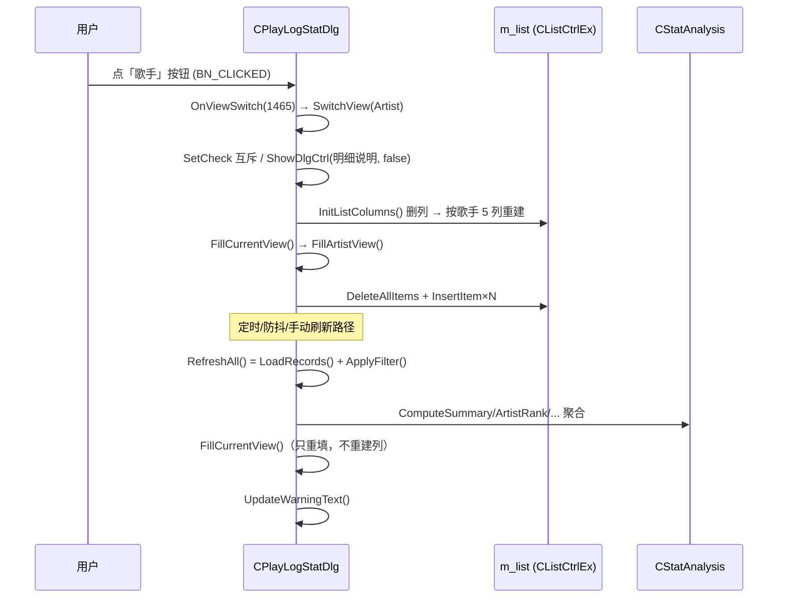

# 07 · 歌曲详细记录页面重构 —— 增量设计（架构师 高见远）

> 适用范围：只动「歌曲详细记录」这一个页面（`CPlayLogStatDlg`）。
> 目标：**去掉嵌套的子对话框/弹窗**，5 类数据用一个主列表 + 顶部一排视图按钮切换展示，字段一个不丢。
> 本文只给设计与可执行结论，不含业务代码。工程师照着做即可。

---

## 0. 先说结论（30 秒版）

| 项 | 结论 |
|---|---|
| 页面结构 | 顶部工具栏行 → 视图切换按钮行 → 单个大列表 → 说明/警示行 → 底部按钮行。**一个窗口，零子对话框** |
| Tab | `SysTabControl32` + 5 个 `IDD_PLAYLOG_STAT_*_DLG` **全部删除** |
| 「?」说明框 | 按钮 + `CPlayLogStatHelpDlg` + `IDD_PLAYLOG_STAT_HELP_DLG` **全部删除** |
| 视图切换 | 5 个 `BS_AUTORADIOBUTTON \| BS_PUSHLIKE` 按钮（原生下沉态表示选中）+ 选中项加粗字体 |
| 列表 | 主对话框内 1 个 `SysListView32`（`CListCtrlEx`），切视图时删列重建 + 重填 |
| 下拉框 | `CComboBox` → `CMyComboBox`（配色对齐时在本页派生一个薄子类，**不改 MyComboBox.cpp**） |
| 日期控件 | 保留 `SysDateTimePick32`，只做配色对齐（对话框级 `OnCtlColor`，失败再上子类 `NM_CUSTOMDRAW`） |
| 文件 | 删 `PlayLogStatTabDlg.h/.cpp`；**不新建任何文件**，5 个视图的填充逻辑全进 `PlayLogStatisticsDlg.cpp` |
| 新资源 ID | 6 个：`IDC_PLAYLOG_VIEW_OVERVIEW/DETAIL...`（1464~1468）+ `IDC_PLAYLOG_MAIN_LIST`（1469） |

---

## 1. 目标形态说明

重构后整个页面就是**一个对话框**，从上到下四行：

1. **顶部工具栏行**（y=7，h=14）：`范围` 标签 + 范围下拉 + 起始日期 + `~` + 结束日期 + `刷新` 按钮（右贴齐）。
2. **视图切换行**（y=25，h=16）：`概览 / 歌手 / 专辑 / 曲目 / 明细` 五个并排按钮，等宽 62 DLU，左起 x=7，右到 x=333。当前视图的按钮是「按下（下沉）」状态 + 文字加粗。
3. **主列表区**（y=45，h=137）：**唯一一个** `CListCtrlEx`。切视图时把列全删掉重建、再重新填充；数据刷新时只重填、不重建列。
4. **说明/警示行**（y=186，h=8）+ **底部按钮行**（y=196，h=14）：左边是「日志损坏/读取失败」提示（沿用 `IDC_PLAYLOG_WARN_LABEL`），右边是明细页专属说明「本页展示全部原始记录，含未计入统计的短播放」（复用 `IDC_PLAYLOG_DETAIL_NOTICE`，只在明细视图显示）；按钮行是 `生成网页报告` + `关闭`。

一句话：**所有信息都摊平在同一个窗口里，用户点顶部按钮换数据，不再有任何「窗口里套窗口」**。

---

## 2. `.rc` 改动方案

> `.rc` 是 **UTF-16LE + BOM(FF FE) + CRLF**，只能二进制读写。
> 读：`open(p,'rb').read().decode('utf-16')`；写：`open(p,'wb').write(txt.encode('utf-16'))`（`encode('utf-16')` 会自动补回 `FF FE`，`decode('utf-16')` 会自动吃掉 BOM）。
> **严禁**用「全文件 `str.replace` 改某条 STYLE 行」。改完必须 `git diff --numstat` 核对。

### 2.1 主对话框最终定义段（替换原来的 `IDD_PLAY_LOG_STATISTICS_DLG`）

对话框尺寸从 **340 × 200** 改成 **340 × 218**（多了说明行 8 DLU + 间距）。

```
IDD_PLAY_LOG_STATISTICS_DLG DIALOGEX 0, 0, 340, 218
STYLE DS_SETFONT | DS_MODALFRAME | WS_MAXIMIZEBOX | WS_POPUP | WS_CAPTION | WS_SYSMENU | WS_THICKFRAME
CAPTION "歌曲详细记录"
FONT 9, "微软雅黑", 400, 0, 0x0
BEGIN
    LTEXT           "范围",IDC_PLAYLOG_LABEL_RANGE,7,10,22,8
    COMBOBOX        IDC_PLAYLOG_RANGE_PRESET,32,7,72,80,CBS_DROPDOWNLIST | WS_VSCROLL | WS_TABSTOP
    CONTROL         "",IDC_PLAYLOG_DATE_FROM,"SysDateTimePick32",WS_TABSTOP,110,7,58,14
    LTEXT           "~",IDC_PLAYLOG_LABEL_TILDE,171,10,8,8
    CONTROL         "",IDC_PLAYLOG_DATE_TO,"SysDateTimePick32",WS_TABSTOP,181,7,58,14
    PUSHBUTTON      "刷新",IDC_PLAYLOG_BTN_REFRESH,293,7,40,14
    CONTROL         "概览",IDC_PLAYLOG_VIEW_OVERVIEW,"Button",BS_AUTORADIOBUTTON | BS_PUSHLIKE | WS_GROUP | WS_TABSTOP,7,25,62,16
    CONTROL         "歌手",IDC_PLAYLOG_VIEW_ARTIST,"Button",BS_AUTORADIOBUTTON | BS_PUSHLIKE | WS_TABSTOP,73,25,62,16
    CONTROL         "专辑",IDC_PLAYLOG_VIEW_ALBUM,"Button",BS_AUTORADIOBUTTON | BS_PUSHLIKE | WS_TABSTOP,139,25,62,16
    CONTROL         "曲目",IDC_PLAYLOG_VIEW_SONG,"Button",BS_AUTORADIOBUTTON | BS_PUSHLIKE | WS_TABSTOP,205,25,62,16
    CONTROL         "明细",IDC_PLAYLOG_VIEW_DETAIL,"Button",BS_AUTORADIOBUTTON | BS_PUSHLIKE | WS_TABSTOP,271,25,62,16
    CONTROL         "",IDC_PLAYLOG_MAIN_LIST,"SysListView32",LVS_REPORT | LVS_ALIGNLEFT | WS_BORDER | WS_TABSTOP,7,45,326,137
    LTEXT           "",IDC_PLAYLOG_WARN_LABEL,7,186,165,8
    LTEXT           "本页展示全部原始记录，含未计入统计的短播放",IDC_PLAYLOG_DETAIL_NOTICE,177,186,156,8
    PUSHBUTTON      "生成网页报告",IDC_PLAYLOG_BTN_REPORT,190,196,84,14
    DEFPUSHBUTTON   "关闭",IDCANCEL,283,196,50,14
END
```

逐条说明（**坐标都是 `x,y,w,h`，单位 DLU**）：

| 控件 | ID | x,y,w,h | 样式 | 备注 |
|---|---|---|---|---|
| 范围标签 | `IDC_PLAYLOG_LABEL_RANGE` | 7,10,22,8 | `LTEXT` | 不动 |
| 范围下拉 | `IDC_PLAYLOG_RANGE_PRESET` | 32,7,72,80 | `CBS_DROPDOWNLIST \| WS_VSCROLL \| WS_TABSTOP` | 不动（h=80 是下拉展开高度） |
| 起始日期 | `IDC_PLAYLOG_DATE_FROM` | 110,7,58,14 | `"SysDateTimePick32"` + `WS_TABSTOP` | 不动 |
| `~` | `IDC_PLAYLOG_LABEL_TILDE` | 171,10,8,8 | `LTEXT` | 不动 |
| 结束日期 | `IDC_PLAYLOG_DATE_TO` | 181,7,58,14 | `"SysDateTimePick32"` + `WS_TABSTOP` | 不动 |
| 刷新 | `IDC_PLAYLOG_BTN_REFRESH` | **293**,7,40,14 | `PUSHBUTTON` | 原 244 → 293，右边缘 333 与「关闭」对齐（「?」删了，右侧空出来） |
| 视图按钮 ×5 | `IDC_PLAYLOG_VIEW_*` | y=25, w=62, h=16；x = **7 / 73 / 139 / 205 / 271** | `BS_AUTORADIOBUTTON \| BS_PUSHLIKE` + `WS_TABSTOP`，**第一个额外加 `WS_GROUP`** | 5×62 + 4×4 = 326，正好铺满 7..333 |
| 主列表 | `IDC_PLAYLOG_MAIN_LIST` | **7,45,326,137** | `SysListView32` + `LVS_REPORT \| LVS_ALIGNLEFT \| WS_BORDER \| WS_TABSTOP` | 照抄原子页列表的样式；`WS_BORDER` 与 `WS_TABSTOP` **都要** |
| 警示标签 | `IDC_PLAYLOG_WARN_LABEL` | 7,186,165,8 | `LTEXT`（文本留空，代码里填） | 原 7,183,180,8 |
| 明细说明 | `IDC_PLAYLOG_DETAIL_NOTICE` | **177,186,156,8** | `LTEXT` | 复用旧 ID（1462），只在明细视图显示 |
| 生成网页报告 | `IDC_PLAYLOG_BTN_REPORT` | 190,196,84,14 | `PUSHBUTTON` | 只改 y：179 → 196 |
| 关闭 | `IDCANCEL` | 283,196,50,14 | `DEFPUSHBUTTON` | 只改 y：179 → 196 |

**删除项**（在定义段里直接不写）：
- `PUSHBUTTON "?",IDC_PLAYLOG_BTN_HELP,302,7,14,14`
- `CONTROL "",IDC_PLAYLOG_TAB,"SysTabControl32",0x0,7,25,326,152`

> ⚠️ 若 rc 编译报 `BS_PUSHLIKE` 未定义，把 `BS_PUSHLIKE` 换成数字 `0x1000L`（`BS_AUTORADIOBUTTON` 工程里已用了 38 次，肯定可用）。

### 2.2 `AFX_DIALOG_LAYOUT` 段（完整替换）

四个数字 = 水平移动% / 垂直移动% / 水平缩放% / 垂直缩放%。**行序严格按上面 BEGIN 里的声明顺序**，首行必须是 `0,`。

```
IDD_PLAY_LOG_STATISTICS_DLG AFX_DIALOG_LAYOUT
BEGIN
    0,
    0, 0, 0, 0,        // 1  IDC_PLAYLOG_LABEL_RANGE   范围标签：不动
    0, 0, 0, 0,        // 2  IDC_PLAYLOG_RANGE_PRESET  范围下拉：不动
    0, 0, 0, 0,        // 3  IDC_PLAYLOG_DATE_FROM     起始日期：不动
    0, 0, 0, 0,        // 4  IDC_PLAYLOG_LABEL_TILDE   ~：不动
    0, 0, 0, 0,        // 5  IDC_PLAYLOG_DATE_TO       结束日期：不动
    100, 0, 0, 0,      // 6  IDC_PLAYLOG_BTN_REFRESH   刷新：右贴靠
    0, 0, 0, 0,        // 7  IDC_PLAYLOG_VIEW_OVERVIEW 视图按钮：不动
    0, 0, 0, 0,        // 8  IDC_PLAYLOG_VIEW_ARTIST
    0, 0, 0, 0,        // 9  IDC_PLAYLOG_VIEW_ALBUM
    0, 0, 0, 0,        // 10 IDC_PLAYLOG_VIEW_SONG
    0, 0, 0, 0,        // 11 IDC_PLAYLOG_VIEW_DETAIL
    0, 0, 100, 100,    // 12 IDC_PLAYLOG_MAIN_LIST     主列表：横向 + 纵向都跟着窗口长
    0, 100, 0, 0,      // 13 IDC_PLAYLOG_WARN_LABEL    警示：贴底，不缩放（原来写了 100 缩放，会无限拉宽，这里改掉）
    100, 100, 0, 0,    // 14 IDC_PLAYLOG_DETAIL_NOTICE 明细说明：右下贴靠
    100, 100, 0, 0,    // 15 IDC_PLAYLOG_BTN_REPORT   生成网页报告：右下贴靠
    100, 100, 0, 0     // 16 IDCANCEL                 关闭：右下贴靠
END
```

### 2.3 需要删除的 6 个对话框（精确定位）

已核实：**这 6 个 IDD 在 rc 里各只出现 2 次（1 次定义段 + 1 次 layout 段），没有任何别处引用**（无字符串表、无 DESIGNINFO、无 `AFX_DIALOG_LAYOUT` 以外的残留）。而且它们**在文件里是连续的**，所以可以一次切掉。

| IDD | 定义段字符偏移 | layout 段字符偏移 | rc 行号（定义段起始） |
|---|---|---|---|
| `IDD_PLAYLOG_STAT_OVERVIEW_DLG` | 63300 ~ 63587 | 63589 ~ 63678 | 1051 |
| `IDD_PLAYLOG_STAT_ARTIST_DLG` | 63680 ~ 63961 | 63963 ~ 64050 | 1064 |
| `IDD_PLAYLOG_STAT_ALBUM_DLG` | 64052 ~ 64330 | 64332 ~ 64418 | 1077 |
| `IDD_PLAYLOG_STAT_SONG_DLG` | 64420 ~ 64695 | 64697 ~ 64782 | 1090 |
| `IDD_PLAYLOG_STAT_DETAIL_DLG` | 64784 ~ 65147 | 65149 ~ 65255 | 1103 |
| `IDD_PLAYLOG_STAT_HELP_DLG` | 65257 ~ 65611 | 65613 ~ 65719 | 1118 |

**连续区间：字符 `txt[63300 : 65719]` = rc 第 1051 ~ 1132 行。**

### 2.4 一键改 rc 的可执行脚本（推荐工程师直接用）

```python
# -*- coding: utf-8 -*-
p = r"Z:\small\Music-gw2\MusicPlayer2\MusicPlayer2.rc"
txt = open(p, 'rb').read().decode('utf-16')        # 自动吃 BOM

# ── 边界自检（改之前必须全过）──
assert txt[62041:].startswith('IDD_PLAY_LOG_STATISTICS_DLG DIALOGEX 0, 0, 340, 200')
assert txt[63298:63300] == '\r\n'                  # 主对话框 layout END 后的空行
assert txt[63300:].startswith('IDD_PLAYLOG_STAT_OVERVIEW_DLG DIALOGEX')
assert txt[65717:65723] == '\r\n\r\n\r\n'          # 6 段整体之后的两个空行
for k in ('IDD_PLAYLOG_STAT_OVERVIEW_DLG', 'IDD_PLAYLOG_STAT_ARTIST_DLG',
          'IDD_PLAYLOG_STAT_ALBUM_DLG', 'IDD_PLAYLOG_STAT_SONG_DLG',
          'IDD_PLAYLOG_STAT_DETAIL_DLG', 'IDD_PLAYLOG_STAT_HELP_DLG'):
    assert txt.count(k) == 2, k

NEW_MAIN = (                                        # 行尾统一 \r\n
    'IDD_PLAY_LOG_STATISTICS_DLG DIALOGEX 0, 0, 340, 218\r\n'
    'STYLE DS_SETFONT | DS_MODALFRAME | WS_MAXIMIZEBOX | WS_POPUP | WS_CAPTION | WS_SYSMENU | WS_THICKFRAME\r\n'
    'CAPTION "歌曲详细记录"\r\n'
    'FONT 9, "微软雅黑", 400, 0, 0x0\r\n'
    'BEGIN\r\n'
    '    LTEXT           "范围",IDC_PLAYLOG_LABEL_RANGE,7,10,22,8\r\n'
    '    COMBOBOX        IDC_PLAYLOG_RANGE_PRESET,32,7,72,80,CBS_DROPDOWNLIST | WS_VSCROLL | WS_TABSTOP\r\n'
    '    CONTROL         "",IDC_PLAYLOG_DATE_FROM,"SysDateTimePick32",WS_TABSTOP,110,7,58,14\r\n'
    '    LTEXT           "~",IDC_PLAYLOG_LABEL_TILDE,171,10,8,8\r\n'
    '    CONTROL         "",IDC_PLAYLOG_DATE_TO,"SysDateTimePick32",WS_TABSTOP,181,7,58,14\r\n'
    '    PUSHBUTTON      "刷新",IDC_PLAYLOG_BTN_REFRESH,293,7,40,14\r\n'
    '    CONTROL         "概览",IDC_PLAYLOG_VIEW_OVERVIEW,"Button",BS_AUTORADIOBUTTON | BS_PUSHLIKE | WS_GROUP | WS_TABSTOP,7,25,62,16\r\n'
    '    CONTROL         "歌手",IDC_PLAYLOG_VIEW_ARTIST,"Button",BS_AUTORADIOBUTTON | BS_PUSHLIKE | WS_TABSTOP,73,25,62,16\r\n'
    '    CONTROL         "专辑",IDC_PLAYLOG_VIEW_ALBUM,"Button",BS_AUTORADIOBUTTON | BS_PUSHLIKE | WS_TABSTOP,139,25,62,16\r\n'
    '    CONTROL         "曲目",IDC_PLAYLOG_VIEW_SONG,"Button",BS_AUTORADIOBUTTON | BS_PUSHLIKE | WS_TABSTOP,205,25,62,16\r\n'
    '    CONTROL         "明细",IDC_PLAYLOG_VIEW_DETAIL,"Button",BS_AUTORADIOBUTTON | BS_PUSHLIKE | WS_TABSTOP,271,25,62,16\r\n'
    '    CONTROL         "",IDC_PLAYLOG_MAIN_LIST,"SysListView32",LVS_REPORT | LVS_ALIGNLEFT | WS_BORDER | WS_TABSTOP,7,45,326,137\r\n'
    '    LTEXT           "",IDC_PLAYLOG_WARN_LABEL,7,186,165,8\r\n'
    '    LTEXT           "本页展示全部原始记录，含未计入统计的短播放",IDC_PLAYLOG_DETAIL_NOTICE,177,186,156,8\r\n'
    '    PUSHBUTTON      "生成网页报告",IDC_PLAYLOG_BTN_REPORT,190,196,84,14\r\n'
    '    DEFPUSHBUTTON   "关闭",IDCANCEL,283,196,50,14\r\n'
    'END\r\n'
    '\r\n'
    'IDD_PLAY_LOG_STATISTICS_DLG AFX_DIALOG_LAYOUT\r\n'
    'BEGIN\r\n'
    '    0,\r\n'
    '    0, 0, 0, 0,\r\n'
    '    0, 0, 0, 0,\r\n'
    '    0, 0, 0, 0,\r\n'
    '    0, 0, 0, 0,\r\n'
    '    0, 0, 0, 0,\r\n'
    '    100, 0, 0, 0,\r\n'
    '    0, 0, 0, 0,\r\n'
    '    0, 0, 0, 0,\r\n'
    '    0, 0, 0, 0,\r\n'
    '    0, 0, 0, 0,\r\n'
    '    0, 0, 0, 0,\r\n'
    '    0, 0, 100, 100,\r\n'
    '    0, 100, 0, 0,\r\n'
    '    100, 100, 0, 0,\r\n'
    '    100, 100, 0, 0,\r\n'
    '    100, 100, 0, 0\r\n'
    'END\r\n'
)

# 一步到位：替换主对话框（含 layout），并连带吃掉后面 6 个待删段 + 1 个多余空行
txt = txt[:62041] + NEW_MAIN + txt[65721:]
open(p, 'wb').write(txt.encode('utf-16'))           # 自动补回 FF FE BOM
print('ok')
```

改完自检：

```
git diff --numstat        # MusicPlayer2.rc 应只有 -74 行左右的变化
python -c "t=open(r'Z:\small\Music-gw2\MusicPlayer2\MusicPlayer2.rc','rb').read().decode('utf-16');\
print([t.count(k) for k in ('IDD_PLAYLOG_STAT_OVERVIEW_DLG','IDD_PLAYLOG_STAT_HELP_DLG','IDC_PLAYLOG_TAB','IDC_PLAYLOG_BTN_HELP')])"
# 期望 [0, 0, 0, 0]
```

**对 rc 其他部分无影响**：这 6 段前后都是完整独立的对话框块，删掉后 `IDD_PLAY_LOG_STATISTICS_DLG`（layout 段结束）直接接 `IDD_MEDIA_LIB_DIALOG`，中间的对话框数量少 6 个，其余字节一个没动。

### 2.5 主列表控件的类名与样式

```
CONTROL "",IDC_PLAYLOG_MAIN_LIST,"SysListView32",LVS_REPORT | LVS_ALIGNLEFT | WS_BORDER | WS_TABSTOP,7,45,326,137
```

- 类名 `SysListView32`，**必须** `LVS_REPORT`（报表模式）。
- `WS_BORDER` **要**：跟原先子页列表一致，列表有自己的边框，跟周围的按钮/日期控件视觉上分开。
- `WS_TABSTOP` **要**：能 Tab 进来。
- 不要 `LVS_OWNERDATA`（我们不用 `SetListData` 虚拟列表模式）、不要 `LVS_SINGLESEL`、不要 `LVS_SHOWSELALWAYS`（可选）。
- 扩展样式在代码里加：`LVS_EX_FULLROWSELECT | LVS_EX_GRIDLINES | LVS_EX_LABELTIP`，另外建议加 `LVS_EX_DOUBLEBUFFER`（明细 2 万行，减少闪烁；comctl32 v6 才有，没有也不会报错）。

---

## 3. 资源 ID 分配表（已核实真实水位）

我打开了 `MusicPlayer2\resource.h` 亲自核对（不是拍脑袋）：

```
_APS_NEXT_RESOURCE_VALUE        712      (第 1123 行)
_APS_NEXT_COMMAND_VALUE         33516    (第 1124 行)
_APS_NEXT_CONTROL_VALUE         1464     (第 1125 行)
```

已用最高值实测：`IDD` 最大 = **711**（`IDD_PLAYLOG_STAT_HELP_DLG`）、`IDC` 最大 = **1463**（`IDC_PLAYLOG_HELP_EDIT`）、命令最大 = **33515**（`ID_PLAY_LOG_STATISTICS`）。

**新增（只需要 6 个控件 ID，不需要新 IDD、不需要新命令 ID）：**

| ID 名 | 数值 | 用途 |
|---|---|---|
| `IDC_PLAYLOG_VIEW_OVERVIEW` | **1464** | 视图切换按钮「概览」（`ON_CONTROL_RANGE` 的起始 ID） |
| `IDC_PLAYLOG_VIEW_ARTIST` | **1465** | 视图切换按钮「歌手」 |
| `IDC_PLAYLOG_VIEW_ALBUM` | **1466** | 视图切换按钮「专辑」 |
| `IDC_PLAYLOG_VIEW_SONG` | **1467** | 视图切换按钮「曲目」 |
| `IDC_PLAYLOG_VIEW_DETAIL` | **1468** | 视图切换按钮「明细」（`ON_CONTROL_RANGE` 的结束 ID） |
| `IDC_PLAYLOG_MAIN_LIST` | **1469** | 主列表控件（`CListCtrlEx`） |

> 5 个视图 ID 必须**连续**（`ON_CONTROL_RANGE` 要求），1464~1468 天然连续。

**同时把这些废弃定义从 `resource.h` 删掉**（保留 `IDC_PLAYLOG_DETAIL_NOTICE 1462` 复用）：

```
删：IDD_PLAYLOG_STAT_OVERVIEW_DLG 706 / _ARTIST_ 707 / _ALBUM_ 708 / _SONG_ 709 / _DETAIL_ 710 / _HELP_ 711
删：IDC_PLAYLOG_BTN_HELP 1452、IDC_PLAYLOG_TAB 1454
删：IDC_PLAYLOG_OVERVIEW_LIST 1457、_ARTIST_LIST 1458、_ALBUM_LIST 1459、_SONG_LIST 1460、_DETAIL_LIST 1461、IDC_PLAYLOG_HELP_EDIT 1463
改：_APS_NEXT_CONTROL_VALUE  1464 → 1470
```

> 已删除的号段（1452/1454/1457~1461/1463、706~711）**不要复用**，避免万一有遗漏引用时悄悄撞上。

---

## 4. 视图切换机制设计

### 4.1 按钮控件类型（结论：`BS_AUTORADIOBUTTON | BS_PUSHLIKE`）

先回答「工程里有没有现成做法可参考」：**没有**。

- `UIElement/Button.h`、`UIElement/ToggleButton.h` 这些是**主窗口自绘 UI 元素**（`UiElement::Element` 派生，靠 `Draw()` 画），不是对话框控件，没法直接塞进 `.rc`。
- `CTabCtrlEx` 是 Tab 容器 —— 正是这次要去掉的东西。
- 全工程 `.rc` 里搜不到 `BS_PUSHLKE` 之类的分段控件写法。

所以选**最土但最可靠**的方案：

```
CONTROL "概览",IDC_PLAYLOG_VIEW_OVERVIEW,"Button",BS_AUTORADIOBUTTON | BS_PUSHLIKE | WS_GROUP | WS_TABSTOP,7,25,62,16
```

- `BS_AUTORADIOBUTTON` → Windows 原生帮你做「互斥选中」，不用自己维护状态机。
- `BS_PUSHLIKE` → 外观是普通按钮，**选中时是「按下/下沉」状态**，这就是「当前选中态」的视觉表达。零自绘、零维护。
- `WS_GROUP` 只加在第一个（概览）上，5 个按钮声明顺序连续 → 自动成组。

**增强（P1，10 行代码）**：选中项文字加粗。在 `OnInitDialog` 里造一个加粗字体：
```cpp
LOGFONT lf{};
theApp.m_font_set.dlg.GetFont().GetLogFont(&lf);
lf.lfWeight = FW_BOLD;
m_view_bold_font.CreateFontIndirect(&lf);
```
切换时 `m_view_btn[i].SetFont(i == idx ? &m_view_bold_font : &theApp.m_font_set.dlg.GetFont());`
（注意：`CBaseDialog::OnInitDialog` 里 `CCommon::SetDialogFont` 会统一设字体，那之后我们再单独给选中的按钮设加粗字体，不会被覆盖。）

**可选（P2）**：给 5 个按钮也设图标，把原来 Tab 上的图标找回来 —— `SetButtonIcon(IDC_PLAYLOG_VIEW_OVERVIEW, IconMgr::IconType::IT_Statistics)`、`歌手 IT_Music`、`专辑 IT_Playlist`、`曲目 IT_Music`、`明细 IT_Edit`。`CBaseDialog::SetButtonIcon` 只是 `BM_SETIMAGE`，不改按钮尺寸，安全。

### 4.2 切视图时列表怎么重建

一个 `SwitchView()` 干三件事：**设按钮选中态 → 删列重建 → 重填**。

```cpp
void CPlayLogStatDlg::InitListColumns()
{
    // 1) 删掉所有旧列（MFC 没有 DeleteAllColumns，从后往前删）
    if (CHeaderCtrl* pHeader = m_list.GetHeaderCtrl())
    {
        for (int n = pHeader->GetItemCount(); n > 0; --n)
            m_list.DeleteColumn(n - 1);
    }
    m_list.DeleteAllItems();

    // 2) 按当前视图建列（见第 5 节的 width[] 代码片段）
    CRect rect;
    m_list.GetWindowRect(rect);
    switch (m_cur_view) { case PlayLogStatView::Overview: ... }
}

void CPlayLogStatDlg::SwitchView(PlayLogStatView view)
{
    if (view == m_cur_view) return;         // 重复点同一个按钮：直接忽略
    m_cur_view = view;

    for (int i = 0; i < kViewCount; ++i)
        m_view_btn[i].SetCheck(i == static_cast<int>(view) ? BST_CHECKED : BST_UNCHECKED);

    ShowDlgCtrl(IDC_PLAYLOG_DETAIL_NOTICE, view == PlayLogStatView::Detail);

    InitListColumns();      // 删列 + 重建列
    FillCurrentView();      // 立刻填当前数据（不再有脏标记机制，必须主动填）
}
```

关键点：

- **不再有 `SetData / OnTabEntered / m_dirty`**。数据刷新（`ApplyFilter`）后只调 `FillCurrentView()` —— 只重填当前可见的那一屏，**不重建列**（避免列宽跳变、避免 2 万行重建两次）。
- `FillCurrentView()` 内部：`m_list.DeleteAllItems();` 然后 `switch (m_cur_view)` 分发到 5 个 `FillXxxView()`。
- 明细视图 2 万行，填充前后包一层 `m_list.SetRedraw(FALSE); ... m_list.SetRedraw(TRUE);`（否则 60 秒定时刷新时会明显卡一下）。
- `LVS_EX_*` 扩展样式**只在 `OnInitDialog` 里设一次**，不要在 `InitListColumns` 里反复设。

### 4.3 消息映射（结论：5 个按钮共用一个处理函数）

```cpp
ON_CONTROL_RANGE(BN_CLICKED, IDC_PLAYLOG_VIEW_OVERVIEW, IDC_PLAYLOG_VIEW_DETAIL, &CPlayLogStatDlg::OnViewSwitch)
```

```cpp
void CPlayLogStatDlg::OnViewSwitch(UINT nID)
{
    SwitchView(static_cast<PlayLogStatView>(nID - IDC_PLAYLOG_VIEW_OVERVIEW));
}
```

比 5 条 `ON_BN_CLICKED` 省 4 行且不会写错 ID；`SwitchView` 开头的 `if (view == m_cur_view) return;` 顺手吃掉「点已选中的按钮」和「radio 组切换时可能重复触发」的情况。

> 注意 `ON_CONTROL_RANGE` 的处理函数签名必须是 `afx_msg void OnViewSwitch(UINT nID);`。

### 4.4 调用时序



---

## 5. 列宽规则表（照 `CPlayStatisticsDlg::OnInitDialog` 的写法）

统一套路：`CRect rect; m_list.GetWindowRect(rect);` → 固定列 `theApp.DPI(n)` 写死 → 主列 `= rect.Width() - 其余各列之和 - theApp.DPI(20) - 1`。

> `rect` 来自 `GetWindowRect`（含边框），减 `DPI(20)` 是经验补偿（垂直滚动条 + 左右边框），照抄就行。
> 唯一一处**刻意保留**的偏离：给主列留了最小值保护（原实现也有）。窗口能拖窄，不加保护时主列可能算出负数，`InsertColumn` 传负宽度会出怪事。

### 5.1 概览（2 列）—— 单独说

只有 2 列：`统计项`（固定 150）+ `数值`（吃满剩余）。**没有名次列**。

```cpp
CRect rect;
m_list.GetWindowRect(rect);
int width[2];
width[0] = theApp.DPI(150);                                        // 统计项（固定）
width[1] = rect.Width() - width[0] - theApp.DPI(20) - 1;           // 数值（主列，吃剩余）
if (width[1] < theApp.DPI(120)) width[1] = theApp.DPI(120);
m_list.InsertColumn(0, L"统计项", LVCFMT_LEFT, width[0]);
m_list.InsertColumn(1, L"数值",   LVCFMT_LEFT, width[1]);
```

**分组标题行**：`【基本统计】【播放行为】【听歌习惯】【最常听】` 这 4 个是**插在列表里的普通数据行**（第 0 列写组名，第 1 列写空串），不是分组控件、不是表头。这点必须原样保留 —— 实现上沿用 `AddOverviewRow(group, item, value)`：`group` 变了就先插一行组名，再插数据行；`m_overview_row` / `m_overview_group` 两个计数器每次填充前归零（`m_overview_row = 0; m_overview_group = -1;`）。

### 5.2 歌手（5 列）—— 主列 = 歌手

```cpp
CRect rect;
m_list.GetWindowRect(rect);
int width[5];
width[0] = theApp.DPI(40);   // 名次（固定）
width[2] = theApp.DPI(90);   // 播放时长（固定）
width[3] = theApp.DPI(60);   // 次数（固定）
width[4] = theApp.DPI(70);   // 曲目数（固定）
width[1] = rect.Width() - width[0] - width[2] - width[3] - width[4] - theApp.DPI(20) - 1;  // 歌手（主列）
if (width[1] < theApp.DPI(80)) width[1] = theApp.DPI(80);
m_list.InsertColumn(0, L"名次",     LVCFMT_LEFT, width[0]);
m_list.InsertColumn(1, L"歌手",     LVCFMT_LEFT, width[1]);
m_list.InsertColumn(2, L"播放时长", LVCFMT_LEFT, width[2]);
m_list.InsertColumn(3, L"次数",     LVCFMT_LEFT, width[3]);
m_list.InsertColumn(4, L"曲目数",   LVCFMT_LEFT, width[4]);
```

### 5.3 专辑（4 列）—— 主列 = 专辑

```cpp
CRect rect;
m_list.GetWindowRect(rect);
int width[4];
width[0] = theApp.DPI(40);   // 名次（固定）
width[2] = theApp.DPI(90);   // 播放时长（固定）
width[3] = theApp.DPI(60);   // 次数（固定）
width[1] = rect.Width() - width[0] - width[2] - width[3] - theApp.DPI(20) - 1;  // 专辑（主列）
if (width[1] < theApp.DPI(80)) width[1] = theApp.DPI(80);
m_list.InsertColumn(0, L"名次",     LVCFMT_LEFT, width[0]);
m_list.InsertColumn(1, L"专辑",     LVCFMT_LEFT, width[1]);
m_list.InsertColumn(2, L"播放时长", LVCFMT_LEFT, width[2]);
m_list.InsertColumn(3, L"次数",     LVCFMT_LEFT, width[3]);
```

### 5.4 曲目（6 列）—— 标题与歌手按 5:3 分剩余

```cpp
CRect rect;
m_list.GetWindowRect(rect);
int width[6];
width[0] = theApp.DPI(40);   // 名次（固定）
width[3] = theApp.DPI(50);   // 次数（固定）
width[4] = theApp.DPI(90);   // 累计时长（固定）
width[5] = theApp.DPI(80);   // 最后播放（固定）
int rest = rect.Width() - width[0] - width[3] - width[4] - width[5] - theApp.DPI(20) - 1;
width[1] = rest * 5 / 8;     // 标题（主列）
width[2] = rest * 3 / 8;     // 歌手
if (width[1] < theApp.DPI(80)) width[1] = theApp.DPI(80);
if (width[2] < theApp.DPI(60)) width[2] = theApp.DPI(60);
m_list.InsertColumn(0, L"名次",     LVCFMT_LEFT, width[0]);
m_list.InsertColumn(1, L"标题",     LVCFMT_LEFT, width[1]);
m_list.InsertColumn(2, L"歌手",     LVCFMT_LEFT, width[2]);
m_list.InsertColumn(3, L"次数",     LVCFMT_LEFT, width[3]);
m_list.InsertColumn(4, L"累计时长", LVCFMT_LEFT, width[4]);
m_list.InsertColumn(5, L"最后播放", LVCFMT_LEFT, width[5]);
```

### 5.5 明细（9 列）—— 标题与歌手按 5:3 分剩余

```cpp
CRect rect;
m_list.GetWindowRect(rect);
int width[9];
width[0] = theApp.DPI(40);    // 序号（固定）
width[1] = theApp.DPI(110);   // 播放时间（固定）
width[4] = theApp.DPI(110);   // 专辑（固定）
width[5] = theApp.DPI(70);    // 本次播放（固定）
width[6] = theApp.DPI(70);    // 曲目总长（固定）
width[7] = theApp.DPI(45);    // 结果（固定）
width[8] = theApp.DPI(50);    // 计入统计（固定）
int rest = rect.Width() - width[0] - width[1] - width[4] - width[5] - width[6] - width[7] - width[8] - theApp.DPI(20) - 1;
width[2] = rest * 5 / 8;      // 标题（主列）
width[3] = rest * 3 / 8;      // 歌手
if (width[2] < theApp.DPI(80)) width[2] = theApp.DPI(80);
if (width[3] < theApp.DPI(60)) width[3] = theApp.DPI(60);
m_list.InsertColumn(0, L"序号",     LVCFMT_LEFT, width[0]);
m_list.InsertColumn(1, L"播放时间", LVCFMT_LEFT, width[1]);
m_list.InsertColumn(2, L"标题",     LVCFMT_LEFT, width[2]);
m_list.InsertColumn(3, L"歌手",     LVCFMT_LEFT, width[3]);
m_list.InsertColumn(4, L"专辑",     LVCFMT_LEFT, width[4]);
m_list.InsertColumn(5, L"本次播放", LVCFMT_LEFT, width[5]);
m_list.InsertColumn(6, L"曲目总长", LVCFMT_LEFT, width[6]);
m_list.InsertColumn(7, L"结果",     LVCFMT_LEFT, width[7]);
m_list.InsertColumn(8, L"计入统计", LVCFMT_LEFT, width[8]);
```

> ⚠️ 旧代码里变量名有坑：`w2 = DPI(110)` 其实是给**专辑（第 4 列）**用的，不是歌手。上面已经按「列号 = 数组下标」重写，别照抄旧的变量名。

**列数/列名对照（QA 用）**：概览 2 / 歌手 5 / 专辑 4 / 曲目 6 / 明细 9。

---

## 6. 代码结构方案

### 6.1 `PlayLogStatisticsDlg.h` —— 最终类声明

```cpp
#pragma once
#include "BaseDialog.h"
#include "ListCtrlEx.h"
#include "MyComboBox.h"
#include "StatCommon.h"        // RangePreset / StatFilter / 各种 RankItem（原 PlayLogStatTabDlg.h 里的）
#include "StatAnalysis.h"
#include "StatHtmlReport.h"

// 视图（索引与 IDC_PLAYLOG_VIEW_OVERVIEW..DETAIL 一一对应）
enum class PlayLogStatView { Overview = 0, Artist, Album, Song, Detail };
static constexpr int kViewCount = 5;

// 数据快照（从 PlayLogStatTabDlg.h 原样搬过来，一个字段都不改）
struct PlayLogStatData
{
    const std::vector<PlayRecord>* records{ nullptr };
    StatFilter     filter;
    StatSummary    summary;
    FinishBreakdown finish;
    std::vector<ArtistRankItem> artists;
    std::vector<AlbumRankItem>  albums;
    std::vector<SongRankItem>   songs;
    std::vector<PeriodBucket>   day_buckets;
    int            hour_hist[24]{};
    int            first_ymd{ 0 };
    int            last_ymd{ 0 };
    int            broken_lines{ 0 };
    int            failed_files{ 0 };
    bool           load_ok{ false };
    bool           valid{ false };
};

// 范围下拉：只为「配色对齐」而存在的薄子类（不改 MyComboBox.cpp，不影响其它页面）
class CStatRangeComboBox : public CMyComboBox
{
public:
    DECLARE_MESSAGE_MAP()
    afx_msg HBRUSH OnCtlColor(CDC* pDC, CWnd* pWnd, UINT nCtlColor);
private:
    CBrush m_bk_brush;
};

class CPlayLogStatDlg : public CBaseDialog
{
    DECLARE_DYNAMIC(CPlayLogStatDlg)
public:
    CPlayLogStatDlg(CWnd* pParent = nullptr);
    virtual ~CPlayLogStatDlg();

#ifdef AFX_DESIGN_TIME
    enum { IDD = IDD_PLAY_LOG_STATISTICS_DLG };
#endif

private:
    enum TimerId { TIMER_PERIODIC = 1, TIMER_DEBOUNCE = 2 };

protected:
    // ── 控件 ──
    CStatRangeComboBox m_range_combo;               // 原 CComboBox
    CDateTimeCtrl  m_date_from;
    CDateTimeCtrl  m_date_to;
    CListCtrlEx    m_list;                          // 新增：唯一的主列表
    CButton        m_view_btn[kViewCount];          // 新增：5 个视图切换按钮
    CFont          m_view_bold_font;                // 新增：选中按钮的加粗字体
    CBrush         m_ctl_bk_brush;                  // 新增：下拉/日期控件的背景刷

    // ── 数据 ──
    std::vector<PlayRecord> m_all_records;
    std::vector<PlayRecord> m_filtered;
    PlayLogStatData m_data;

    PlayLogStatView m_cur_view{ PlayLogStatView::Overview };

    int  m_broken_lines{ 0 };
    int  m_failed_files{ 0 };
    bool m_date_ctrl_enabled{ false };
    bool m_syncing_date{ false };

    int  m_overview_row{ 0 };       // 概览页填表游标（原在 OverviewTabDlg 里）
    int  m_overview_group{ -1 };

protected:
    virtual CString GetDialogName() const override;   // 必须保留，返回 _T("PlayLogStatDlg")
    virtual bool InitializeControls() override;
    virtual void DoDataExchange(CDataExchange* pDX) override;

    // ── 数据流水线（全部保留）──
    void LoadRecords();
    void ApplyFilter();
    void RefreshAll();
    void UpdateWarningText();
    void SetRangePreset(RangePreset preset);
    void SyncDateControls();
    void EnableDateControls(bool enable);
    int  YmdFromCtrl(CDateTimeCtrl& ctrl) const;

    // ── 视图（新增）──
    void SwitchView(PlayLogStatView view);
    void InitListColumns();
    void FillCurrentView();
    void FillOverviewView();
    void FillArtistView();
    void FillAlbumView();
    void FillSongView();
    void FillDetailView();
    void AddOverviewRow(int group, const wchar_t* item, const std::wstring& value);
    void ShowEmptyRow(const wchar_t* text);

    DECLARE_MESSAGE_MAP()

public:
    virtual BOOL OnInitDialog() override;
    afx_msg void OnDestroy();
    afx_msg void OnTimer(UINT_PTR nIDEvent);
    afx_msg void OnBnClickedRefresh();
    afx_msg void OnBnClickedReport();
    afx_msg void OnCbnSelchangeRangePreset();
    afx_msg void OnDatetimeChange(NMHDR* pNMHDR, LRESULT* pResult);
    afx_msg void OnViewSwitch(UINT nID);                        // 新增
    afx_msg HBRUSH OnCtlColor(CDC* pDC, CWnd* pWnd, UINT nCtlColor);   // 新增
    afx_msg LRESULT OnRecordAppended(WPARAM wParam, LPARAM lParam);
};
```

**保留**：`GetDialogName` / `InitializeControls` / `LoadRecords` / `ApplyFilter` / `RefreshAll` / `UpdateWarningText` / `SetRangePreset` / `SyncDateControls` / `EnableDateControls` / `YmdFromCtrl` / `OnDestroy` / `OnTimer` / `OnBnClickedRefresh` / `OnBnClickedReport` / `OnCbnSelchangeRangePreset` / `OnDatetimeChange` / `OnRecordAppended`，以及文件顶部的匿名 namespace（`kRangeText[]` / `TodayYmd` / `YmdOfTime` / `TimeFromYmd` / `RangeOfPreset`）+ 两个静态小工具 `PctText` / `CountText`。

**删除**：`CTabCtrlEx m_tab`、5 个 `CPlayLogStat*TabDlg` 成员、`OnBnClickedHelp`、`CPlayLogStatHelpDlg` 整个类（含 `IMPLEMENT_DYNAMIC` / `GetDialogName` / `DoDataExchange` / `OnInitDialog` 和那段口径说明长文本）、`#include "CTabCtrlEx.h"`、`#include "PlayLogStatTabDlg.h"`。

**新增**：见上面注释标「新增」的部分。

### 6.2 `PlayLogStatData` 放哪 / `PlayLogStatTabDlg` 删不删

- **`PlayLogStatData` 挪到 `PlayLogStatisticsDlg.h`**（放在 `CPlayLogStatDlg` 之前）。理由：它唯一的消费者就是主对话框，没有理由单独占一个头文件。
- **`PlayLogStatTabDlg.h` / `.cpp` 整个删除**。理由：里面只有 `PlayLogStatData` + `CPlayLogStatTabDlg` 基类 + 5 个子页类，重构后**一个都用不上**；`CPlayLogStatTabDlg` 继承 `CTabDlg`（`CTabDlg::OnInitDialog` 里有 `SetBackgroundColor` 那一套），留着就是死代码。

  已核实引用点（全工程 grep 只有这些，删完编译就干净）：
  1. `PlayLogStatisticsDlg.h:4` `#include "PlayLogStatTabDlg.h"` → 换成 `StatCommon.h` + `StatAnalysis.h`
  2. `PlayLogStatisticsDlg.h:31-35` 5 个子页成员 → 删
  3. `PlayLogStatisticsDlg.cpp` `OnInitDialog` 里 5 个 `Create()` + 5 个 `m_tab.AddWindow()` + `SetItemSize/AdjustTabWindowSize/SetCurTab` → 删
  4. `PlayLogStatisticsDlg.cpp` `ApplyFilter` 里 5 个 `SetData()` + `dynamic_cast<CTabDlg*>(m_tab.GetCurrentTab())->OnTabEntered()` → 换成 `FillCurrentView()`
  5. `MusicPlayer2.vcxproj:274` / `:528`
  6. `MusicPlayer2.vcxproj.filters:684` / `:1427`
  7. `PlayLogStatisticsDlg.cpp` 里用到的 `IDC_PLAYLOG_*_LIST`、`IDD_PLAYLOG_STAT_*_DLG` 常量 → 随 rc 一起没了

### 6.3 5 个视图的填充逻辑怎么组织

**结论：`FillCurrentView()` 做 `DeleteAllItems` + `switch`，分发到 5 个私有 `FillXxxView()`。**

```cpp
void CPlayLogStatDlg::FillCurrentView()
{
    m_list.SetRedraw(FALSE);
    m_list.DeleteAllItems();
    switch (m_cur_view)
    {
    case PlayLogStatView::Overview: FillOverviewView(); break;
    case PlayLogStatView::Artist:   FillArtistView();   break;
    case PlayLogStatView::Album:    FillAlbumView();    break;
    case PlayLogStatView::Song:     FillSongView();     break;
    case PlayLogStatView::Detail:   FillDetailView();   break;
    }
    m_list.SetRedraw(TRUE);
    m_list.Invalidate();
    m_list.UpdateWindow();
}
```

5 个 `FillXxxView()` 的**函数体直接从 `PlayLogStatTabDlg.cpp` 的 `RefreshView()` 原样搬过来**（第 109/220/277/338/408 行），只改两处：
1. `m_list` 现在是主对话框的成员（名字一样，其实不用改）；
2. `m_data` 从 `const PlayLogStatData*` 变成值成员，`m_data->` 要改成 `m_data.`，`m_data == nullptr || !m_data->valid` 改成 `!m_data.valid`。

`AddOverviewRow` 和 `ShowEmptyRow` 也一并搬过来（`ShowEmptyRow` 里 `list.GetHeaderCtrl()->GetItemCount() > 1` 的判断保留）。

### 6.4 范围下拉改 `CMyComboBox`

- **成员类型**：`CComboBox m_range_combo;` → `CStatRangeComboBox m_range_combo;`（本页头文件里定义的 `CMyComboBox` 薄子类）。
- **`DoDataExchange`**：`DDX_Control` 的参数是 `CWnd&`，任何 `CWnd` 派生类都能传，**签名不用改**，直接把变量类型换了就行：
  ```cpp
  DDX_Control(pDX, IDC_PLAYLOG_RANGE_PRESET, m_range_combo);
  ```
- **`OnCbnSelchangeRangePreset` 不受影响**。原因：`CMyComboBox` 用的是 `ON_CONTROL_REFLECT_EX(CBN_SELCHANGE, ...)`，它的 `OnCbnSelchange()` **返回 FALSE**，反射处理返回 FALSE = 消息继续冒泡给父窗口，所以父窗口的 `ON_CBN_SELCHANGE` 照旧触发。`GetCurSel()` / `SetCurSel()` / `AddString()` 全是从 `CComboBox` 继承的，一行都不用改。
- **建议加一行**：`m_range_combo.SetMouseWheelEnable(false);` —— 防止鼠标滚轮滑过下拉框时把「近 30 天」滚成「去年」。这是 `CMyComboBox` 已有的能力，白捡。
- `SetReadOnly` / `SetEditReadOnly` **不要调**（我们是 `CBS_DROPDOWNLIST`，不可编辑）。

### 6.5 日期控件配色对齐（分两级，先易后难）

先说清楚现状：本页**没有**调过 `SetBackgroundColor`，所以 `CBaseDialog::m_brBkgr` 是空的（`m_brBkgr` 还是 **private**，派生类摸不到），`CBaseDialog::OnCtlColor` 那套透传在本页根本不生效；对话框背景就是系统的 `COLOR_BTNFACE`。而 ComboBox / DTP 顶着 `COLOR_WINDOW`（白）→ 所以看着像两块白膏药。

**做法：背景用 `::GetSysColor(COLOR_BTNFACE)`，文字用 `::GetSysColor(COLOR_BTNTEXT)`。** 这样跟对话框底色和周围静态文字是同一套，不引入主题色变量、不引入 `IsAppThemed()` 判断，最稳。

**L1（必做，对话框级 `OnCtlColor`）**：

```cpp
// .h 里加：afx_msg HBRUSH OnCtlColor(CDC* pDC, CWnd* pWnd, UINT nCtlColor);
// 消息映射加：ON_WM_CTLCOLOR()

HBRUSH CPlayLogStatDlg::OnCtlColor(CDC* pDC, CWnd* pWnd, UINT nCtlColor)
{
    HBRUSH hbr = CBaseDialog::OnCtlColor(pDC, pWnd, nCtlColor);   // 先走基类，别抢 Static/Button 的处理

    if (m_ctl_bk_brush.GetSafeHandle() == NULL)
        m_ctl_bk_brush.CreateSolidBrush(::GetSysColor(COLOR_BTNFACE));

    HWND hwnd = (pWnd != nullptr ? pWnd->GetSafeHwnd() : NULL);
    bool is_date_ctrl = (hwnd == m_date_from.GetSafeHwnd() || hwnd == m_date_to.GetSafeHwnd());
    if (is_date_ctrl || nCtlColor == CTLCOLOR_EDIT || nCtlColor == CTLCOLOR_LISTBOX)
    {
        pDC->SetBkMode(TRANSPARENT);
        pDC->SetTextColor(::GetSysColor(COLOR_BTNTEXT));
        return (HBRUSH)m_ctl_bk_brush.GetSafeHandle();
    }
    return hbr;
}
```

**L2（L1 跑起来发现下拉框还是白底时再做）**：`CStatRangeComboBox`（上面 6.1 已定义）—— 派生类的 `ON_WM_CTLCOLOR()` 条目在自己的消息映射里，**MFC 从最派生类开始查表，所以会盖掉 `CMyComboBox::OnCtlColor`**：

```cpp
BEGIN_MESSAGE_MAP(CStatRangeComboBox, CMyComboBox)
    ON_WM_CTLCOLOR()
END_MESSAGE_MAP()

HBRUSH CStatRangeComboBox::OnCtlColor(CDC* pDC, CWnd* pWnd, UINT nCtlColor)
{
    HBRUSH hbr = CMyComboBox::OnCtlColor(pDC, pWnd, nCtlColor);   // 保留基类的「已修改显主题色」逻辑
    if (m_bk_brush.GetSafeHandle() == NULL)
        m_bk_brush.CreateSolidBrush(::GetSysColor(COLOR_BTNFACE));
    pDC->SetBkMode(TRANSPARENT);
    pDC->SetTextColor(::GetSysColor(COLOR_BTNTEXT));
    return (HBRUSH)m_bk_brush.GetSafeHandle();
}
```

**L3（L1 也搞不定 DTP 时的兜底）**：把 `m_date_from/m_date_to` 换成头文件里 15 行的 `CDateTimeCtrl` 子类，`ON_NOTIFY_REFLECT(NM_CUSTOMDRAW, ...)`，在 `CDDS_PREPAINT` 阶段 `FillSolidRect(pcd->rc, ::GetSysColor(COLOR_BTNFACE))` 后返回 `CDRF_NOTIFYITEMDRAW`（文本仍交给系统画，保住原生外观）。

**为什么不动 `CBaseDialog`**：`CBaseDialog::OnCtlColor` 是全工程所有对话框共用的，往里加 ComboBox/DTP 分支会一次性影响几十个页面，回归面不可控；而且 `m_brBkgr` 是 private，改起来要动 `BaseDialog.h` 的访问级别。收益（2 个控件）和风险（全工程）完全不成比例。

---

## 7. 文件增删清单

| 绝对路径 | 动作 | 说明 |
|---|---|---|
| `Z:\small\Music-gw2\MusicPlayer2\PlayLogStatisticsDlg.h` | **改** | 重写：去 Tab/子页/HelpDlg，加视图枚举 + `PlayLogStatData` + `CStatRangeComboBox` + 列表/按钮成员 + 视图方法 |
| `Z:\small\Music-gw2\MusicPlayer2\PlayLogStatisticsDlg.cpp` | **改** | 重写：删 HelpDlg 实现，搬入 5 个 `FillXxxView()`，加 `SwitchView/InitListColumns/FillCurrentView/OnViewSwitch/OnCtlColor` |
| `Z:\small\Music-gw2\MusicPlayer2\PlayLogStatTabDlg.h` | **删** | 整个文件 |
| `Z:\small\Music-gw2\MusicPlayer2\PlayLogStatTabDlg.cpp` | **删** | 整个文件 |
| `Z:\small\Music-gw2\MusicPlayer2\MusicPlayer2.rc` | **改** | 主对话框重写 + 删 6 个对话框块（字符 63300~65721 / 行 1051~1133） |
| `Z:\small\Music-gw2\MusicPlayer2\resource.h` | **改** | 删废弃 ID（见第 3 节）+ 加 6 个新 ID + `_APS_NEXT_CONTROL_VALUE` 改 1470 |
| `Z:\small\Music-gw2\MusicPlayer2\MusicPlayer2.vcxproj` | **改** | 摘掉 2 条（下面） |
| `Z:\small\Music-gw2\MusicPlayer2\MusicPlayer2.vcxproj.filters` | **改** | 摘掉 2 组（下面） |

**不需要新建任何文件** —— 5 个视图的填充逻辑全塞进现有的 `PlayLogStatisticsDlg.cpp`（预计 454 行 → 约 720 行）。这样能绕开「新文件必须补 UTF-8 BOM」「新文件必须同时登记 vcxproj + filters」两个高频翻车点，也和之前「不为一个薄页面单独开一对文件」的做法一致。

### vcxproj / filters 需要摘除的条目

`MusicPlayer2.vcxproj`：
```xml
<!-- 第 274 行，整行删 -->
    <ClInclude Include="PlayLogStatTabDlg.h" />
<!-- 第 528 行，整行删 -->
    <ClCompile Include="PlayLogStatTabDlg.cpp" />
```

`MusicPlayer2.vcxproj.filters`：
```xml
<!-- 第 684~686 行，整块删 -->
    <ClInclude Include="PlayLogStatTabDlg.h">
      <Filter>对话框类\PlayStatisticsDlg</Filter>
    </ClInclude>
<!-- 第 1427 行起，整块删（<ClCompile Include="PlayLogStatTabDlg.cpp"> 到对应 </ClCompile>） -->
```

---

## 8. 风险点与规避措施

| # | 风险 | 规避 |
|---|---|---|
| 1 | **rc 编码炸了**（UTF-16LE BOM CRLF） | 只能 `decode('utf-16')` / `encode('utf-16')` 二进制读写；改前跑第 2.4 节那 4 条 `assert`；改后 `git diff --numstat` 必须只有 `MusicPlayer2.rc` 一个文件、约 `-74` 行，并确认 `IDD_PLAYLOG_STAT_*` 计数全为 0。**严禁全文件 replace STYLE 行**（历史上误改过 18 个对话框） |
| 2 | **BOM** | 本次不新建 `.cpp/.h`，所以没有 BOM 风险。若工程师临时决定拆新文件，必须 `b=open(f,'rb').read(); open(f,'wb').write(b'\xef\xbb\xbf'+b)` |
| 3 | **ID 冲突** | 新 IDC 从 **1464** 起（已核实 `_APS_NEXT_CONTROL_VALUE=1464`），5 个视图 ID 连续；已删的号段（1452/1454/1457~1461/1463）不复用；加完把水位改成 1470 |
| 4 | **Tab 删除后残留引用** | 必删清单：`#include "CTabCtrlEx.h"`、`m_tab` 成员、5 个子页成员、`IDD_PLAYLOG_STAT_*_DLG`、`IDC_PLAYLOG_TAB`、`IDC_PLAYLOG_*_LIST`、`OnBnClickedHelp`、`CPlayLogStatHelpDlg` 全部实现、`IDC_PLAYLOG_BTN_HELP` 的消息映射条目。**编译错误会全部暴露，逐条清即可，别偷懒留 `#if 0`** |
| 5 | **`CStatHtmlReport::GenerateAndOpen` 依赖 `m_filtered`** | `m_filtered` 成员**原样保留**，`ApplyFilter()` 里照旧 clear+reserve+填充。「生成网页报告」用的是当前筛选范围的**全量**记录（不是列表里显示的行），与当前切到哪个视图无关 —— 这个语义不能变。注意 `m_data.records = &m_filtered;` 这个裸指针只在填充期间用，别在别处长期持有 |
| 6 | **定时刷新 × 视图重建打架** | `TIMER_PERIODIC`(60s) / `TIMER_DEBOUNCE`(3000ms) / 手动刷新 → 统一走 `RefreshAll() = LoadRecords() + ApplyFilter()`；`ApplyFilter()` 末尾只调 `FillCurrentView()`（**不**调 `InitListColumns()`），避免列宽跳变和 2 万行重建两次。明细填充用 `SetRedraw(FALSE/TRUE)` 包裹。`m_syncing_date` 守卫必须保留，否则 `SetTime` 触发的 `DTN_DATETIMECHANGE` 会把范围踢成「自定义」 |
| 7 | **`AFX_DIALOG_LAYOUT` 行数对不上** | 16 行数据（首行 `0,` + 15 个控件）必须和 BEGIN 里 15 个控件的**声明顺序**严格一一对应。少一行/多一行，MFC 动态布局会错位（表现为窗口一放大控件乱飞）。第 2.2 节的注释行可以直接照抄 |
| 8 | **`InitializeControls` 里写了 `SetDlgItemTextW(IDCANCEL, ...)`** | 不要写。`CBaseDialog::OnInitDialog` 在 `InitializeControls` **之前**就已经强制设置了 `IDOK/IDCANCEL/IDCLOSE` 的文本，写了会被覆盖/打架 |
| 9 | **rc 里 `BS_PUSHLIKE` 未定义** | 工程 rc 里从没用过这个符号。若 RC 编译报错，直接把 `BS_PUSHLIKE` 换成 `0x1000L` |
| 10 | **视图按钮的 radio 组行为** | 5 个按钮在 BEGIN 里必须连续声明（Z 序连续），`WS_GROUP` 只给第一个。否则互斥失效（能同时选中两个） |
| 11 | **概览页分组行丢游标** | `m_overview_row` / `m_overview_group` 每次 `FillOverviewView()` 开头必须归零（`0` / `-1`），否则第二次刷新会从头追加一份重复数据 |
| 12 | **旧窗口尺寸缓存** | `GetDialogName()` 返回 `"PlayLogStatDlg"` 必须保留（单例 + 记大小）。老用户本地存的是 200 DLU 高的尺寸，新布局需要 218 —— 动态布局会把列表压扁，不会崩，但首次打开会显得挤。可接受；若不接受可在 `InitializeControls` 里调一次 `SetMinSize(...)` |

---

## 9. 验收标准（给 QA）

### 编译
- [ ] MSVC (VS2022, x64 Debug + Release) **0 error、0 warning**（新修改的代码 0 warning）
- [ ] `git status` 里没有多余文件；`git diff --numstat` 只有 6 个文件（2 改 + 2 删 + rc + resource.h + vcxproj + filters = 实际 7 个文件，其中 2 个是删除）
- [ ] `MusicPlayer2.rc` 的变化约 `-74` 行；`IDD_PLAYLOG_STAT_*` / `IDC_PLAYLOG_TAB` / `IDC_PLAYLOG_BTN_HELP` 在 rc 中计数为 0
- [ ] `MusicPlayer2.vcxproj` / `.filters` 里搜不到 `PlayLogStatTabDlg`

### 结构
- [ ] 「歌曲详细记录」打开后**只有一个窗口**，窗口内**没有任何子对话框、没有 Tab 控件、没有「?」按钮**
- [ ] 顶部有 5 个视图按钮：概览 / 歌手 / 专辑 / 曲目 / 明细；当前视图按钮是**下沉态 + 加粗**，其余是普通态；同一时刻只有一个处于选中
- [ ] 主区域**只有 1 个列表**；切换视图时列表的列会重建
- [ ] 明细视图下右下角出现「本页展示全部原始记录，含未计入统计的短播放」，其它 4 个视图下不出现

### 字段完整性（列数 / 列名逐字对照）
| 视图 | 列数 | 列名（顺序） |
|---|---|---|
| 概览 | 2 | 统计项 / 数值 |
| 歌手 | 5 | 名次 / 歌手 / 播放时长 / 次数 / 曲目数 |
| 专辑 | 4 | 名次 / 专辑 / 播放时长 / 次数 |
| 曲目 | 6 | 名次 / 标题 / 歌手 / 次数 / 累计时长 / 最后播放 |
| 明细 | 9 | 序号 / 播放时间 / 标题 / 歌手 / 专辑 / 本次播放 / 曲目总长 / 结果 / 计入统计 |

- [ ] 概览页 4 个分组标题行仍在，且顺序为 `【基本统计】【播放行为】【听歌习惯】【最常听】`，每组下面的指标项一个不少（基本统计 7 项 / 播放行为 7 项 / 听歌习惯 6 项 / 最常听 4 项）
- [ ] 明细页超过 20000 条时，末尾出现 `…` + `仅显示最近 20000 条`
- [ ] 空数据时，各视图显示原来的空态提示（概览「暂无数据」，其余「所选时间范围内没有记录」）

### 列宽
- [ ] 5 个视图的 `width[]` 全部是「固定列 `theApp.DPI(n)` + 主列 `rect.Width() - Σ固定列 - theApp.DPI(20) - 1`」的写法
- [ ] 没有用 `CreatePointFont`、没有写死像素值（必须走 `theApp.DPI()`）
- [ ] 把窗口拉宽/拉窄，主列跟着变宽/变窄，固定列不动（歌手/专辑/曲目/明细/概览各验一次）

### 交互
- [ ] 范围下拉 7 档（近 7 天 / 近 30 天 / 近 90 天 / 今年 / 去年 / 全部 / 自定义）都在，默认「近 30 天」
- [ ] 两个日期控件在非「自定义」时是禁用的，选「自定义」后启用；手改日期会自动切到「自定义」
- [ ] 「刷新」按钮手动刷新生效
- [ ] 「生成网页报告」仍按当前筛选范围生成（与切到哪个视图无关），空数据时弹提示不生成
- [ ] 播完一首歌后约 3 秒自动刷新（防抖生效，不是每首都刷）
- [ ] 60 秒兜底刷新生效；开着页面不动，切到明细视图，60 秒后列表内容更新且不闪烁、不丢当前滚动位置（尽最大努力）
- [ ] 「关闭」按钮正常关闭
- [ ] 换主题后，范围下拉与两个日期控件的**背景色和周围一致**（不再顶着白底），文字色清晰可读
- [ ] 窗口大小/位置仍能被记住（关掉再打开是上次的大小）
